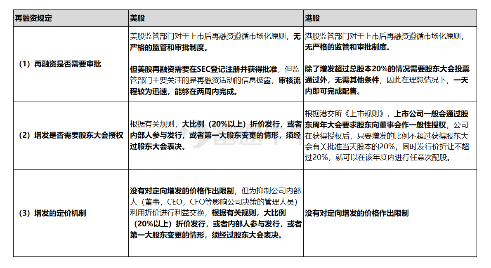

- 现金分红：直接现金分给投资者，不影响股东权益
- 送股：利润转股本，不影响股东权益
- 增股（转股）：资本公积金转股本，不影响股东权益
- 配股：股本会增加，因为配股价都会低于正常股价，所以如果不参加，会损害持股人的权益
- 增发新股：股本会增加，因为配股价都会低于正常股价，会损害持股人的权益

### 前沿

今年，疫情极大的冲击了企业的经营预期，随着全球大放水的宽松货币环境，很多热门头部公司都启动了再融资计划，通过宽松的融资窗口期补充资金准备逆势扩张，A股的宁德时代、药明康德；港股的中教控股、金蝶国际、美股的蔚来、富途控股等等，都相继启动了再融资。

那么问题来了，在普遍跨市场投资的当下，遇到送股，配股，增发，定增，转增股，转配股等与上市公司股权融资相关的词汇，很多投资者都无法准确区分和理解其背后的实质含义。

特别是中概股上市公司进行股权再融资，这里面更是涉及到专业英文词汇隔阂，比如投资者会遇到seasoned equity offering (SEO)，Secondary Offering，RIght issue and bonus, Public offerings, private placement等。

### 一、上市公司的股权再融资方式

当讨论上市公司的股权再融资方式时，要视具体市场而定。在A股，港股，和美股，股权再融资的方式各有不同。

#### A股

对于A股的上市公司，其上市后的再融资行为主要可以分为四类，分别是（1）配股；（2）送红股，简称送股；（3）转增股本，简称转股；（4）增发新股，简称增发。

（1）配股，指的是上市公司面向其现有股东，按持股比例发行新股，对于现有股东而言，其可以选择认购，也可以选择不认购，若不认购，那么现有股东的股份将会被稀释，即在配股后，不参与配股的原股东的持股比例会下降。配股属于发行新股再筹资的手段，股东要按配股价格和配股数量缴纳配股款，完全不同于公司对股东的分红。

比如江苏银行在今年7月10日发布配股预案，按每10股配售不超过3股的比例向全体A股股东配售。为简便起见，假设配股前江苏银行的股本总数为10亿股，配股后，总股本数量将为13亿股。如果投资者A在配股前持有江苏银行1亿股，对应的持股比例为10%；但投资者A不参与本次配股，那么配股后，其持股比例将变为1/13=7.69%，相对于配股前的10%下降了2.31%，这就是稀释的含义，或者通俗地说，分蛋糕的比例下降了。

（2）送红股，指的是上市公司将本年的税后利润留在公司里，发放股票作为红利，从而将利润转化为股本。送红股后，公司的资产、负债、股东权益的总额及结构并没有发生改变，但总股本增大了，同时每股净资产降低了，股价也会相应降低。这种方式比较受A股投资者欢迎，因为虽然其持股比例不变，但其持股数量会增加，在预期股价会逐渐恢复的情况下，投资者会觉得这是较大地利好。

（3）转增股本，简称转股，是指公司将资本公积转化为股本,转增股本并没有改变股东的权益,但却增加了股本规模,因而客观结果与送红股相似。转增股本和送红股的本质区别在于，红股来自于公司的年度税后利润、只有在公司有盈余的情况下,才能向股东送红股；而转增股本却来自于资本公积，它可以不受公司本年度可分配利润的多少及时间的限制，只要将公司账面上的资本公积减少一些、增加相应的注册资本金就可以了，因此从严格意义上来说，转增股本并不是对股东的分红回报。

简而言之，虽然送股和转股这两种方式，客观上都会造成投资者持股数量增加，但是其背后含义完全不同。送股，实质上就是股票股利，要求上市公司产生净利润才能实现，因为增加的股本，来源于税后净利润。

相比之下，转股是非常容易做到的，不要求上市公司是否盈利，只要其拥有足够的资本公积，即可以考虑实施转股，因为增加的股本，是来源于资本公积。

因而，若一家上市公司选择送股，而不是转股，一般意味着这家上市公司的盈利状况相对较好，有足够的净利润可以进行分配。而若一家公司选择考转增股本来代替送股，一般意味着其「打肿脸装胖子」，盈利状况相对一般或者较差，净利润不足以送股。

（4）增发新股，是指上市公司面向社会公众或者特定对象发行新股，如果是面向全体公众发行，那么则属于公开发行；如果是面向特定投资者发行新股，那么则属于非公开发行，也称之为定向增发，简称定增，目前A股上市公司一般采取定增这种方式。

上市公司选择定增的原因有很多种，常见的有：引入战略投资者、项目融资、股权激励、收购资产、补充资金、扩充股本等。下面，在第二部分深入分析定增。

#### 港股

**与A股上市公司相比，港股和美股上市公司的股权再融资方式存在较大差别**。

先来看下港股，首先，港股中的配股与供股，与A股的配股经常会被误用。具体而言，港股的配股，指的是向某些机构定向来发配售，实质上是A股的定增。而港股的供股，则是老千股常用的手段，指的是向全体股东按比例发行新股。详见以下公式：

**（1）A股的定向增发=港股的配股，向某些机构定向来配售**

**（2）A股的配股=港股的供股，向全体股来配售**

另外，港股的配股，可以进一步分为配旧和配新。所谓的配旧，是指公司大股东把自己手中的旧股拿来配股，对公司及其他股东来说，除了股价变动外，没有其它影响，实质上就是大宗股权转让。而配新，指的是由公司发行新股，也是最常见的配股方式。不过由于发行了新股，而新股又不会给现有股东认购，所以配股后也会出现摊薄效应。

至于港股所谓的供股，是很多老千股的最爱。具体怎么操作？大股东持续卖股票，砸低股价，然后在股价低位进行供股，大股东卖股票套现的钱参与供股，从而拿回来更多股票，很多没参与供股的中小股东的股权被稀释。大股东接着再卖股票，然后股价再跌，再供股。股价太低了就来一次合股，反复操作可以让投资者巨亏。因而，投资者对于港股上市公司的供股，尤其是港股创业板上市公司以及股价低于1港元/股的公司，有必要保持足够的警惕。

#### 美股

**而相对于A股与港股市场，美股市场的股权再融资方式又有所不同。**

首先，不像A股上市公司喜欢送股和转股，美股上市公司一般会分发现金股利给股东作为回报。其次，美股上市公司的股权再融资，对应的专业名词是SEO，即seasoned equity offering，而不是secondary offering，两者容易被混用。SEO指是上市后再融资，具体包含（1）一级市场发行，即primary offering和（2）二级市场发行，即secondary offering。

其中（1）primary offering指的是由公司发行新股，在增发完成后，现有股东的持股比例会下降，即对于现有股东会造成股权稀释效应，所以也被称为Dilutive Offerings（译作：稀释发行）。此外，primary offering也可以分为面向（i）一般社会公众，public offering；和（ii）特定投资者，private placement。而（2）secondary offering指的是由现有股东转让老股，实质上类似于港股市场的「配旧」，这个不涉及到新股的发行，不会稀释现有股东的股权，所以也被称之为Non-Dilutive Offerings（非稀释发行）。

综上，当谈及再融资的方式，投资者有必要厘清是基于哪个市场的上市公司。

### 二、如何看待中概股上市公司的定增行为？

#### **1、三地市场再融资的相关规定**

在解读中概股上市公司的定增行为前，投资者有必要对三地市场（A股、港股与美股）的再融资新规有所了解，在对比中，可以更好地理解三地市场监管层对上市公司定增行为的要求。

总的来说，A股市场再融资实行「一次一审」方法，而港股、美股实行「一次授权，多次募集」原则。

具体来看，A股上市公司每次期望进行股权再融资时，均需要经过证监会的核准方可实行。在今年2月证监会发布《再融资新规》前，A股上市公司的再融资的条件非常高，因为主要参照A股首次公开发行的条件设置。不过在《再融资新规》实施后，我国证监会全面放宽了对A股上市公司再融资的各项限制，比如降低创业板再融资条件、调整非公开发行对象数量、放宽非公开发行定价机制、缩短非公开发行锁定期、放开非公开发行减持限制、延长批文有效期、定价基准日更为灵活、放宽非公开发行股票融资规模限制、限制「明股实债」行为等。

资料来源：中国证监会，中金公司

而在美股和港股市场，美股和港股市场依托于证券注册发行制，企业均可采用「一次授权，多次募集」的证券再发行制度。以港股的配售再融资为例，港股市场的配售类似于A股的定向增发，均是向指定的机构或投资人发行新股并募集资金。但与A股定向增发不同的是，当港股上市公司获得一般性授权后，只要增发的比例不超越批准当天股本的20%，同时发行价折让不超过20%，就可在该年度内进行任何次数的配股。

再融资条件方面，港股和美股监管部门对于上市后再融资遵循市场化原则，无严格的监管和审批制度。区别在于，美股再融资需要在SEC登记注册并获得批准，但监管部门主要关注的是再融资活动的信息披露，审核流程较为迅速，能够在两周内完成。而港股方面，除了增发超过总股本20%的情况需要股东大会投票通过外，无需其他条件，因此在理想情况下，一天内即可完成配售。

值得一提的是，美国定增市场并非没有问题。其中争议不休的是「定向折价+做空」相结合形成套利。具体地说，认购定增的投资者（通常是对冲基金）在信息公开前做空股票，当股份经注册获得流通时，用所认购的股份轧平做空仓位。美国还流行过被称为「死亡螺旋」的定增产品。上市公司非公开发行可调整转股价的证券，这种证券能够在股价下跌中用更低的价格转股，从而未认购的原股东股份被摊薄，引发股价进一步下跌。

近年随着监管执法加强、定增股份的流动性改善（因而发行人获得更大的议价能力）等因素，这种模式在美国近年有所收敛。

综上，相对于A股严格的再融资规定，港股的监管层基本采取的是「无为而治」，没有严格的监管和审批制度，基本上依赖于上市公司自身。美股再融资虽然需要在SEC登记注册并获得批准，但监管部门主要关注的是再融资活动的信息披露，一般都会迅速审核通过。另外，在定价机制方面，美股与港股基本没有限制，美股仅要求当定增的价格大比例（20%以上）折价发行时，才需要股东大会表决通过。

### 三、不能简单地给再融资行为下结论

无论是在A股，港股，还是美股，上市公司自身的再融资行为，尤其是增发，很难简单地说利好抑或利空，融资是中性行为，毕竟公司上市就是为了获得更灵活的融资渠道，业务发展离不开资金的支持，特别是互联网公司，机会稍纵即逝。

另一方面，公司有融资需求，也要有资金方愿意支持，增发主要的资金提供方是机构，发行的顺利与否，定价的折溢价情况都反映出机构对于公司的态度，某种程度上来说，折价率低、发行速度快也就意味着机构对于公司的认可。

总体来说，投资者还是有必要结合公司质地，结合再融资的资金用途进行深入分析，方可给出下面三个问题的判断：（1）再融资的目的；（2）再融资的必要性；（3）再融资对上市公司后续盈利能力的影响。唯有在深入了解上述问题的基础上，投资者才不至于被短期情绪所随意影响。

### 参考

[一文讲清：什么是送股，配股，增发，定增，转增股，转配股，高送转...|估值系列](https://news.futunn.com/post/7092303?level=1&data_ticket=1676725335235418)