所有内容都是通过老高与小沫关于手相的视频内容整理的[老高与小沫视频](https://www.bilibili.com/video/BV1fw411e7AP/?spm_id_from=333.337.search-card.all.click&vd_source=f7863c44e26ebb287f2c35e8c863d42c)

### 总结

- 手相不是看男左女右的，而是两只手一起看，常用手的另外一只手显示的是与生俱来的命运，也就是天命，而常用手显示的就是后天的命运，就是需要通过后天努力获得的

- 手相上最重要的三条线，分别呢就是生命线，智慧线和感情线，分别体现出对我们人生最重要的三样东西啊，就是生命力，智力和情感

- **生命线**

  1. 生命线的长短和寿命的长短没有直接的关系，它反映的是生命力的强弱
  2. 强弱通过形状来判断，在食指和中指之间画一条线，垂直向下
     - 无法超过这个中线，就说明你生命力迅速下降，
     - 超过这个中线的话，越往远处抛越好，也就是弧度越大越好，就说明生命力很顽强
  3. 有些人生命线的内侧的可能会有多条生命线，原则上是越多越好，表示生命力越顽强

  *旅行线*

  1. 生命线上如果有分叉，这个分叉就叫做旅行线，有旅行线的人通常认为是运气比较好的，因为可以出门生活长见识机会也就更多。

- **智慧线**

  1. 智慧线和智商的高低没有关系，体现的是一个人的思考方式和脑回路，
  2. 智慧线的长短代表的是一个人思考问题时间的长短
     - 越短越倾向于直觉，通常的反应会比较快一点
     - 长的代表深思熟虑型比较稳重，但是呢比较容易考虑过度想问题，想太深
  3. 智慧线的形状代表一个人的思维方式
     - 智慧线比较直，代表这个人比较理性的思维
     - 比较弯的话，说明这个人倾向于感性思维，他们追求感情共鸣
     - 特别弯的话，就代表这个人就不是感性的问题，属于艺术派哦，思考问题非常理想化
  4. 劈叉的代表就是这个人非常的聪明
  5. 智慧线有两条以上，说明他有多种才能
  6. 生命线和智慧线的起点
     - 起点不在一起，是分开的，说明这个人比较任性任性
     - 连在一起的离得距离越近，代表这个人越通情达理，越顾大体，识大局

- **情感线**

  1. 情感线的长度代表人的情绪，感情线的一般长度是到食指和中指之间
     - 比这个短的人比较容易大喜大悲，容易上头易怒
     - 比这个长的人情绪比较稳定。
  2. 情感线的角度也非常的重要，
     - 如果这个线快速上扬，代表这个人比较容易感情用事，变化快
     - 平缓的人就没有那么容易感情用事
  3. 情感线的末端向下弯折的话，说明比较冷血或者叫酷哈哈哈哈，就是感情对你来说没有那么重要

  *幸运女神线*

  1. 情感线末端出现了分叉，一定要是三叉戟的这种呢叫幸运女神线，会给周围人带来幸运，但是对自己没啥用

  恋爱也是可以参考这条线的，这条线比较短的人就容易一见钟情，容易闪婚之类，这条线比较长的人，他就容易考虑的很多啊，不喜欢轻易告白，但是一旦喜欢了就比较容易长情。

- **命运线**

  1. 命运线、幸运线、成功线、事业线
  2. 命运线就是从手掌中心从下往上穿过了一条直线，这条线不是所有人都有
     - 有：属于领袖型的人生 
     - 没有：没有这条线不是说事业无成，而是说不属于领袖型，属于辅助型的人生
  3. 就算有有的也不是上下贯穿的，在中间就断掉了，只有上半段，只有下半段，也有人是断断续续的
     - 上下贯穿连续且很清晰的话，说明你这个人事业有成，终生会比较幸运。
     - 只有下半段的属于早年运气会比较好，这种人呢应该早年尽可能的努力一些，上学的时候努力一些
     - 只有上半段属于大器晚成型的啊，也就是说早年努力可能机会也不是很多，后半生的机会会多一些。
     - 命运线是不连续的，说明你人生某个阶段的会突然更换职业，改变事业
     - 命运线过于混乱，全是细碎的小段，说明你的命运可能不太稳定，一直处于颠沛流离，不知所措的状态，做什么都无法持久
  4. 少数人会有两条命运线啊，说明你人生中会有两个发展的方向，两个经济来源啊，会挣两份钱
  5. 命运线上如果有分叉的话，说明你有扩展发财的机会啊，分差越多，说明你倾向于多方位的成功
  6. 命运线的末端有一个三叉戟，说明你晚年幸福

  *辅助线*

  1. 命运线旁边有一些并行的细线，这些呢叫做辅助线，表示你命运中的会在特定时期出现贵人相助，他们呢会帮你渡过难关之类的啊，这个辅助线有内外之分

     - 靠近拇指侧的表示这个贵人是你的家人
     - 靠近小指侧的表示这个贵人是外人

     

- **神秘十字线**

  1. 有命运线：在智慧线和情感线之间有一条横线，穿过这个命运线，形成一个十字，
  2. 没有命运线：在你的智慧线和感情线之间，有这么一个小十字也是可以的，只要在这两个线之间有小识字就行，必须得是正十字的，你要是个叉叉不行，
  3. 为什么叫神秘十字纹呢，是因为有这种掌纹的人都会被神秘力量所保护，就算遇到灾难来也有机会幸存的。

- **断掌纹**

  1. 断掌纹，表现为智慧线和情感线连在了一起,，贯穿整个手掌，
  2. 断掌在手相上是非常强势的一种掌纹，通常认为有断掌纹的人呢独立性很强，事业心很重啊，如果努力工作的话，事业成功的可能性非常大
  3. 左右手全部是断掌，手相中的王者呢就称作霸王线，万中无一的手相，适合创业

- **金运线、财运线**

  1. 金运线：如果无名指下面有一条线，这条线叫金运线，金运是用来招财的能力的
  2. 财运线：如果小拇指下面有一条线，这条线叫财运线，财运是守财的能力的
  3. 这两根线的长度决定了你的金钱运动，
     - 不会过情感线，财运不错
     - 穿过感情线和命运线相交，属于霸王线，万中无一的手相，不适合上班，适合创业当老板，哈哈

- **星线**

  1. 星线，就是四根手指的下面，有三条线，或者三条以上线组成的星星，叫幸运星，这个星必须是三条线以上，而且最好是交叉的一点。
  2. 这个星星类似的，叫幸运圈儿的，就不是星星，是一个圈儿，这种幸运圈和幸运星的作用是一样
  3. 这个星座所在的位置不同的意义是不一样的
     - 如果出现在无名指的下面，说明财运有中彩票的命运，
     - 如果出现在食指下面，说明你的愿望将要实现，
     - 如果出现在中指下面，说明你要出名了，或者呢你的恋爱运或者结婚运会比较好，
     - 如果出现在小拇指下面，说明你的工作学习的教育好成绩，不日将金榜题名

- **赌博纹、直觉线**

  1. 赌博纹，在小指下面月球的地方的一条线
  2. 并不是代表你会去赌博，而是说明了你在概率上的运气会比较好

- **所罗门之星**

  所罗门之星，手掌上有一个五角星，任何位置都可以，重要的是清晰的五角星哇，有这种手相的人啊，有改变历史的命运，或者成为历史上知名人士这种可能性。比如说成为世界冠军呢，拿个诺贝尔奖之类的，成为电影明星等。

- **所罗门之环**

  所罗门之环，是指食指下面有一个半圆形的环，这种人呢通常是魅力十足，有人气的一种手相，据说呢迈克尔杰克逊有所罗门之环，有两三条呢，

- **千金门**

- **佛眼**

### 图示

#### 三条线

手相上最重要的三条线，分别呢就是生命线，智慧线和感情线，分别体现出对我们人生最重要的三样东西啊，就是生命力，智力和情感

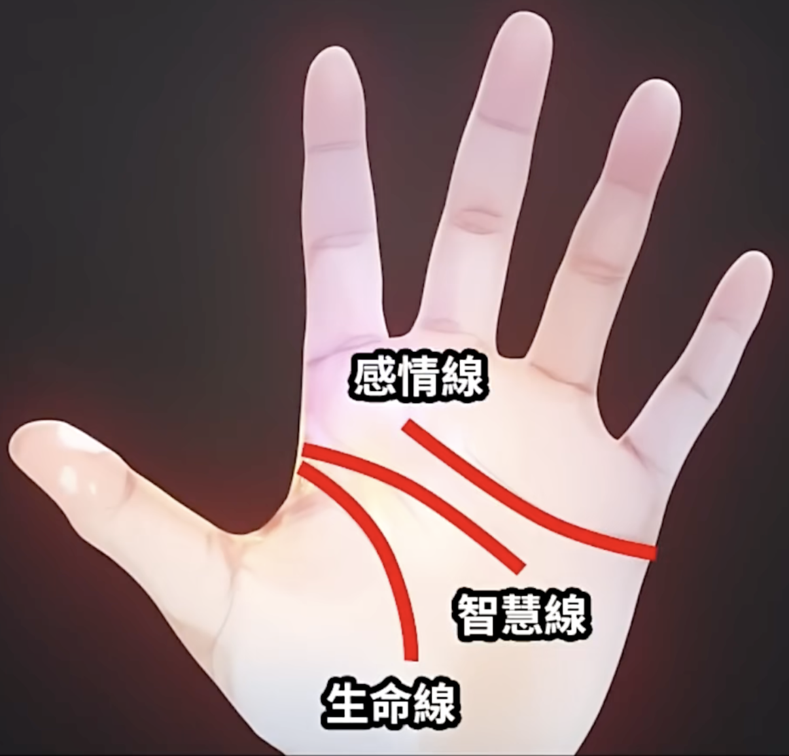

#### 生命线

1. 生命线的长短和寿命的长短没有直接的关系，它反映的是生命力的强弱

2. 强弱通过形状来判断，在食指和中指之间画一条线，垂直向下

   - 无法超过这个中线，就说明你生命力迅速下降，
   - 超过这个中线的话，越往远处抛越好，也就是弧度越大越好，就说明生命力很顽强

   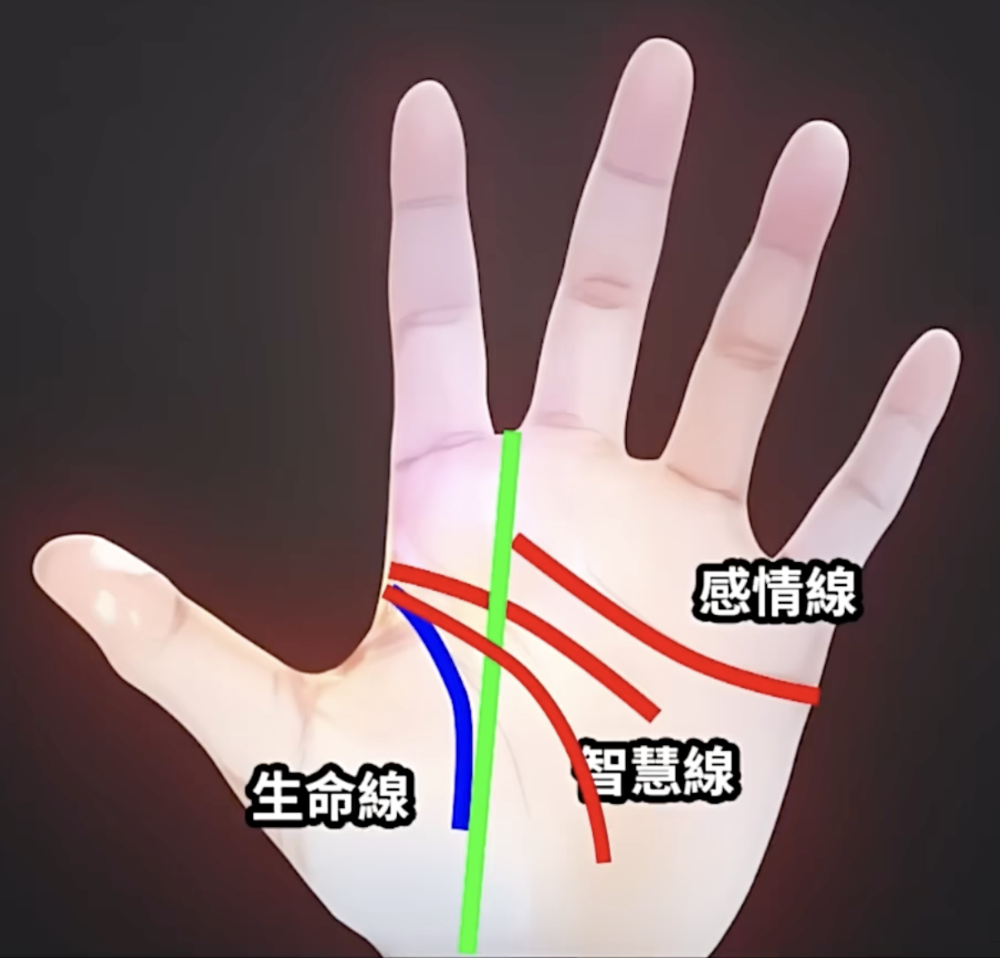

3. 有些人生命线的内侧的可能会有多条生命线，原则上是越多越好，表示生命力越顽强

   

*旅行线*

1. 生命线上如果有分叉，这个分叉就叫做旅行线，有旅行线的人通常认为是运气比较好的，因为可以出门生活长见识机会也就更多。

#### 智慧线

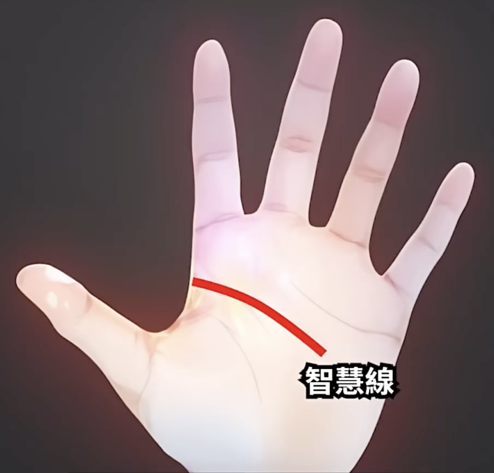

1. 智慧线和智商的高低没有关系，体现的是一个人的思考方式和脑回路，

2. 智慧线的长短代表的是一个人思考问题时间的长短

   - 越短越倾向于直觉，通常的反应会比较快一点
   - 长的代表深思熟虑型比较稳重，但是呢比较容易考虑过度想问题，想太深

3. 智慧线的形状代表一个人的思维方式

   - 智慧线比较直，代表这个人比较理性的思维
   - 比较弯的话，说明这个人倾向于感性思维，他们追求感情共鸣
   - 特别弯的话，就代表这个人就不是感性的问题，属于艺术派哦，思考问题非常理想化

4. 劈叉的代表就是这个人非常的聪明

5. 智慧线有两条以上，说明他有多种才能

   

6. 生命线和智慧线的起点

   - 起点不在一起，是分开的，说明这个人比较任性任性

     

   - 连在一起的离得距离越近，代表这个人越通情达理，越顾大体，识大局

   

#### 情感线

1. 情感线的长度代表人的情绪，感情线的一般长度是到食指和中指之间

   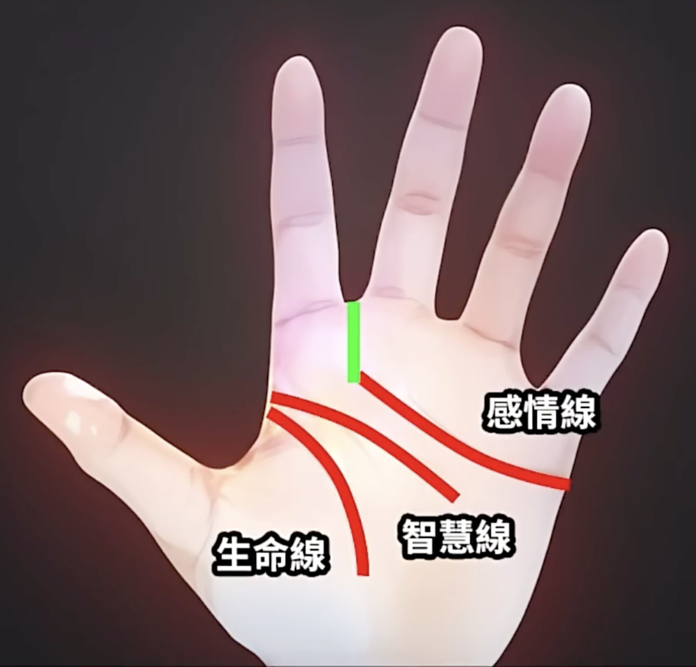

   - 比这个短的人比较容易大喜大悲，容易上头易怒
   - 比这个长的人情绪比较稳定。

2. 情感线的角度也非常的重要，

   - 如果这个线快速上扬，代表这个人比较容易感情用事，变化快

     

   - 平缓的人就没有那么容易感情用事

3. 情感线的末端向下弯折的话，说明比较冷血或者叫酷哈哈哈哈，就是感情对你来说没有那么重要

   

*幸运女神线*

1. 情感线末端出现了分叉，一定要是三叉戟的这种呢叫幸运女神线，会给周围人带来幸运，但是对自己没啥用

   

恋爱也是可以参考这条线的，这条线比较短的人就容易一见钟情，容易闪婚之类，这条线比较长的人，他就容易考虑的很多啊，不喜欢轻易告白，但是一旦喜欢了就比较容易长情。

#### 命运线

1. 命运线、幸运线、成功线、事业线

   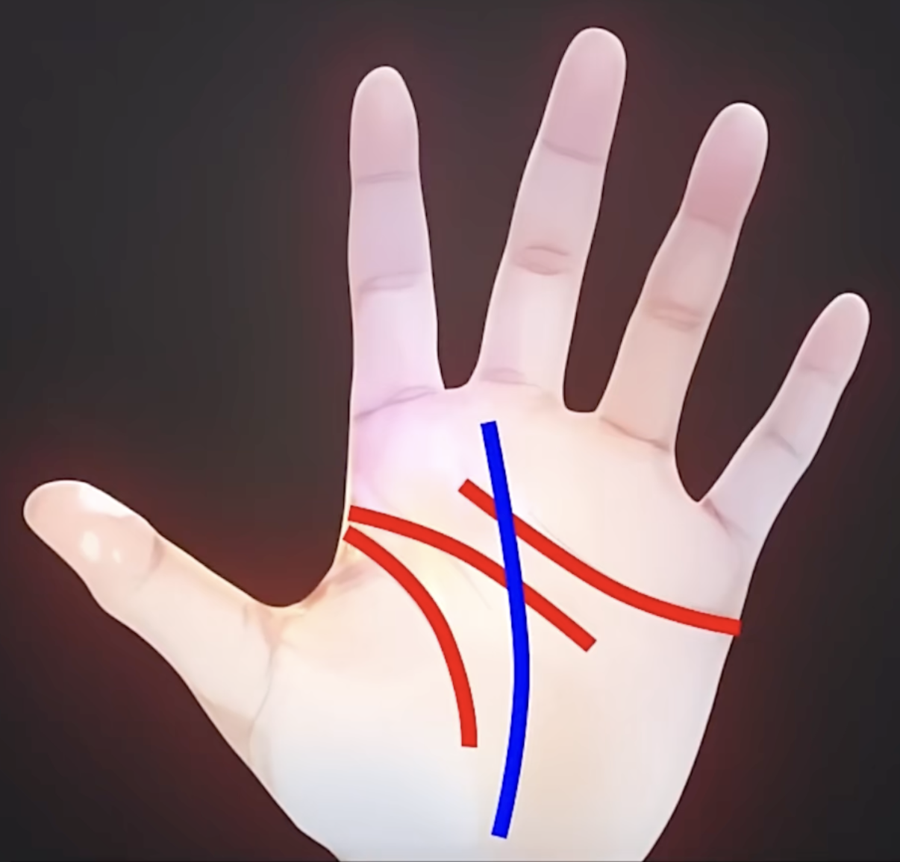

2. 命运线就是从手掌中心从下往上穿过了一条直线，这条线不是所有人都有

   - 有：属于领袖型的人生 
   - 没有：没有这条线不是说事业无成，而是说不属于领袖型，属于辅助型的人生

3. 就算有有的也不是上下贯穿的，在中间就断掉了，只有上半段，只有下半段，也有人是断断续续的

   - 上下贯穿连续且很清晰的话，说明你这个人事业有成，终生会比较幸运。

     

   - 只有下半段的属于早年运气会比较好，这种人呢应该早年尽可能的努力一些，上学的时候努力一些

     

   - 只有上半段属于大器晚成型的啊，也就是说早年努力可能机会也不是很多，后半生的机会会多一些。

     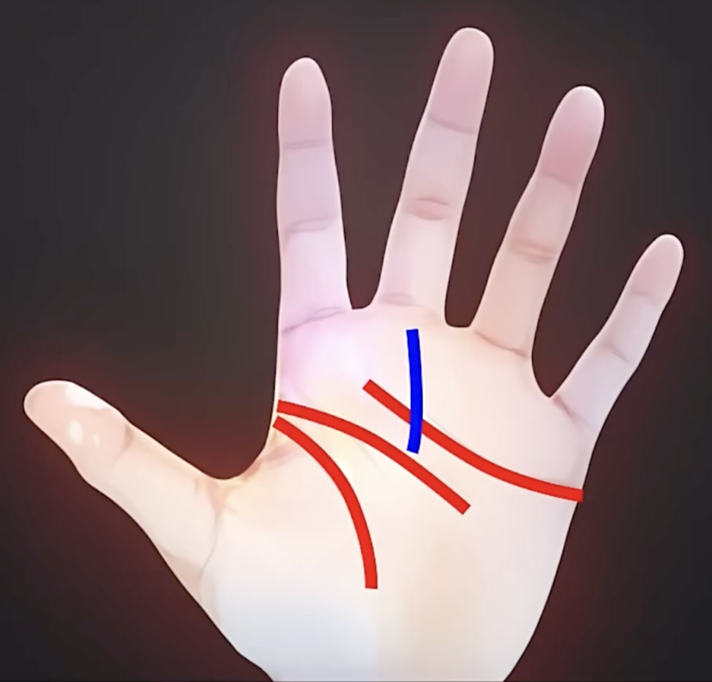

   - 命运线是不连续的，说明你人生某个阶段的会突然更换职业，改变事业

     

     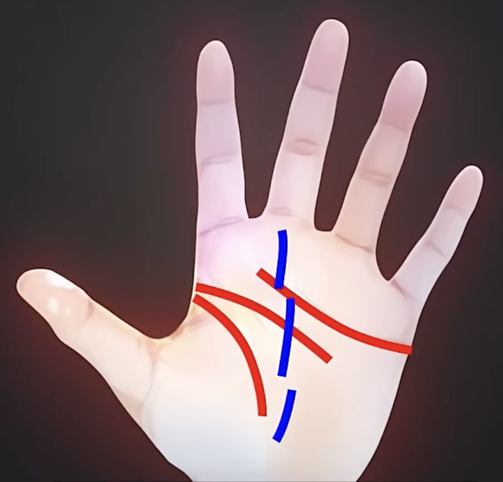

   - 命运线过于混乱，全是细碎的小段，说明你的命运可能不太稳定，一直处于颠沛流离，不知所措的状态，做什么都无法持久

4. 少数人会有两条及以上命运线啊，说明你人生中会有两个发展的方向，两个经济来源啊，会挣两份钱

   

5. 命运线上如果有分叉的话，说明你有扩展发财的机会啊，分差越多，说明你倾向于多方位的成功

   

6. 命运线的末端有一个三叉戟，说明你晚年幸福

   

*辅助线*

1. 命运线旁边有一些并行的细线，这些呢叫做辅助线，表示你命运中的会在特定时期出现贵人相助，他们呢会帮你渡过难关之类的啊，这个辅助线有内外之分

   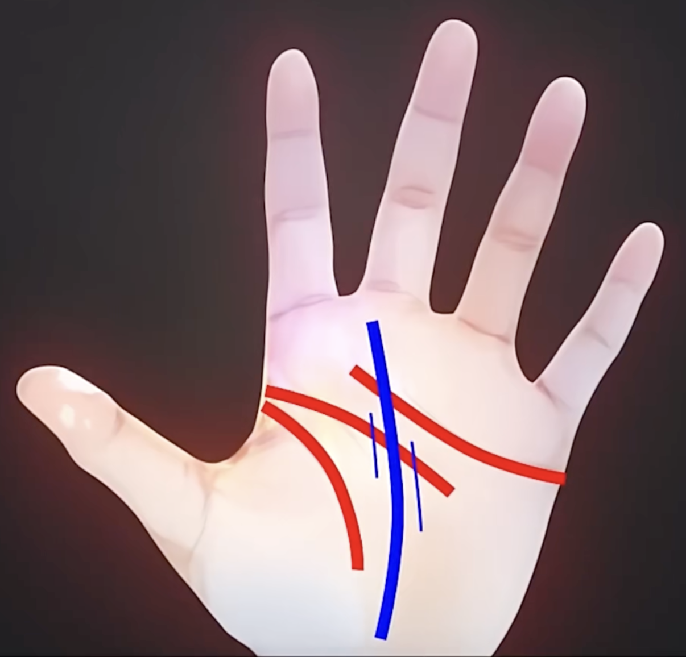

   - 靠近拇指侧的表示这个贵人是你的家人

     

   - 靠近小指侧的表示这个贵人是外人

     

     

#### 神秘十字线

1. 有命运线：在智慧线和情感线之间有一条横线，穿过这个命运线，形成一个十字

   

2. 没有命运线：在你的智慧线和感情线之间，有这么一个小十字也是可以的，只要在这两个线之间有小识字就行，必须得是正十字的，你要是个叉叉不行，

   

3. 为什么叫神秘十字纹呢，是因为有这种掌纹的人都会被神秘力量所保护，就算遇到灾难来也有机会幸存的。

#### 断掌纹

1. 断掌纹，表现为智慧线和情感线连在了一起,，贯穿整个手掌，

2. 断掌在手相上是非常强势的一种掌纹，通常认为有断掌纹的人呢独立性很强，事业心很重啊，如果努力工作的话，事业成功的可能性非常大

3. 左右手全部是断掌，手相中的王者呢就称作霸王线，万中无一的手相，适合创业

   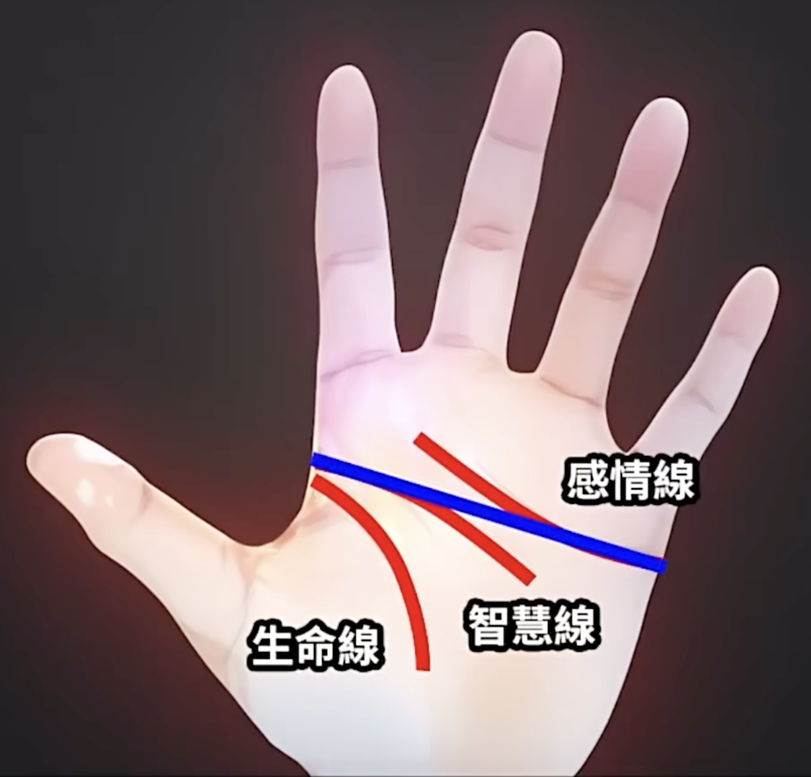

#### 金运线、财运线

1. 金运线：如果无名指下面有一条线，这条线叫金运线，金运是用来招财的能力的

2. 财运线：如果小拇指下面有一条线，这条线叫财运线，财运是守财的能力的

3. 这两根线的长度决定了你的金钱运动，

   - 不会过情感线，财运不错

     

   - 穿过感情线和命运线相交，属于霸王线，万中无一的手相，不适合上班，适合创业当老板，哈哈

     

#### 星线

1. 星线，就是四根手指的下面，有三条线，或者三条以上线组成的星星，叫幸运星，这个星必须是三条线以上，而且最好是交叉的一点。

2. 这个星星类似的，叫幸运圈儿的，就不是星星，是一个圈儿，这种幸运圈和幸运星的作用是一样

3. 这个星座所在的位置不同的意义是不一样的

   - 如果出现在无名指的下面，说明财运有中彩票的命运，

   - 如果出现在食指下面，说明你的愿望将要实现，

     

   - 如果出现在中指下面，说明你要出名了，或者呢你的恋爱运或者结婚运会比较好

     

   - 如果出现在小拇指下面，说明你的工作学习的教育好成绩，不日将金榜题名

     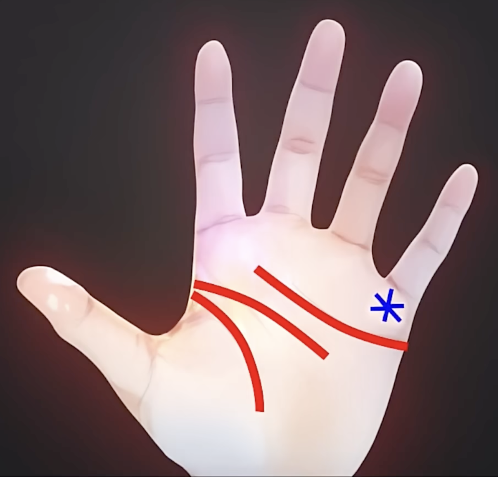

#### 赌博纹、直觉线

1. 赌博纹，在小指下面月球的地方的一条线
2. 并不是代表你会去赌博，而是说明了你在概率上的运气会比较好

#### 无敌手相

赌博纹加霸王线的手相的人，财运拉满再加上运气爆棚，不得了这种人

#### 所罗门之星

所罗门之星，手掌上有一个五角星，任何位置都可以，重要的是清晰的五角星哇，有这种手相的人啊，有改变历史的命运，或者成为历史上知名人士这种可能性。比如说成为世界冠军呢，拿个诺贝尔奖之类的，成为电影明星等。

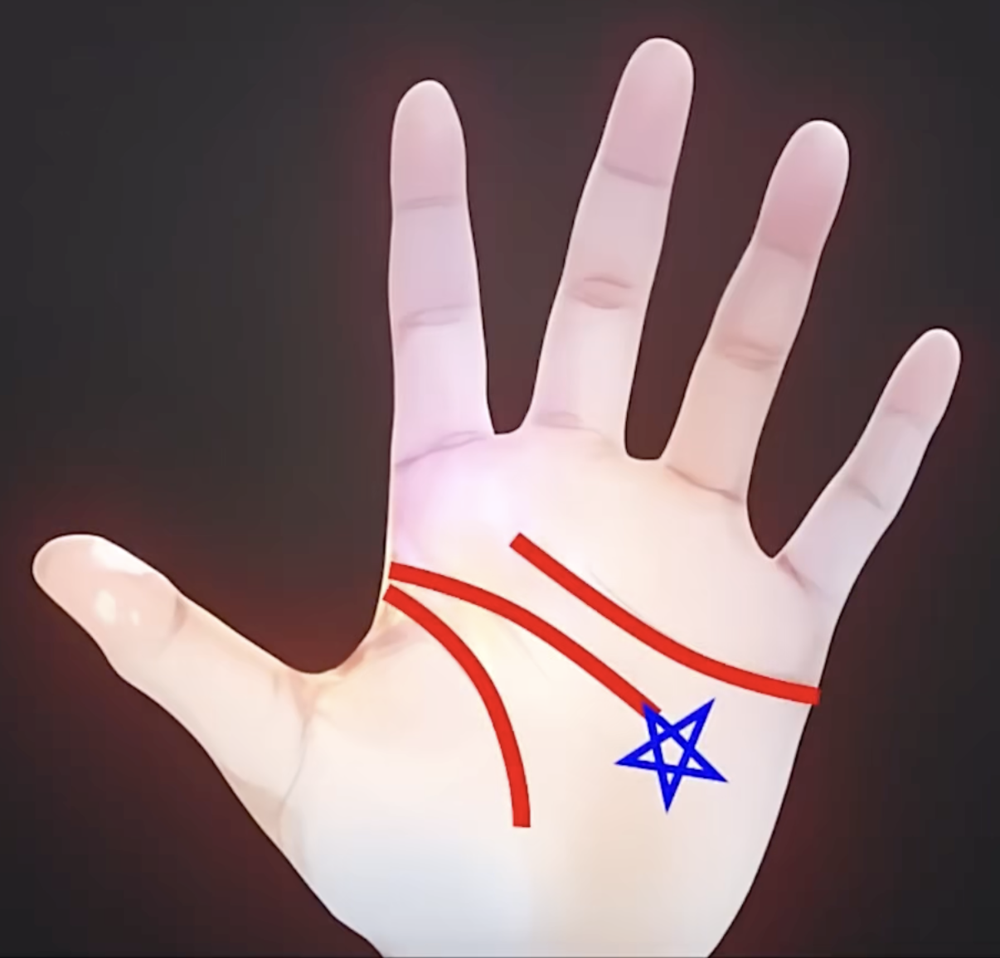

#### 所罗门之环

所罗门之环，是指食指下面有一个半圆形的环，这种人呢通常是魅力十足，有人气的一种手相，据说呢迈克尔杰克逊有所罗门之环，有两三条呢，

#### 千金门

#### 佛眼

### 介绍

其实从手相的角度来说，手上有300多条纹和你的命运性格有关,，而且这个世界上所有的人手纹都是不一样,，即使双胞胎啊，手纹也是完全不一样的，所以命运也是会稍有不同，手相最早大概是4000多年前，说是从印度来的，所以他有4000多年的经验,，能推断你的人生，当然有人觉得用手相来推测人生，可能没什么道理，其实也不是说没道理，就是我们还不清楚其中有什么道理，不知道咱不能说没用是吧，而且呢它是完全符合命定理，应对就是因果论和科学的基础是一样的。希望通过手相， 大家也能重新审视自己的人生啊，自己的命运，说不定你能在其中发现一些机遇,。

看手相应该看哪只手是有讲究的，以前说男左女右这个说法是不对的，为什么有男左女右这说法呢，是因为在古代啊，有一些朝代是以左为尊呢，而且呢还以男性为尊，所以就会说男左女右，而后来有些朝代是以右为尊了，就不存在男左女右这说法啊，所以看手相并不是男左右女右，是两个手都需要看，这两个手是不一样的啊，最主要看的应该是你常用手的另一只手，也就是说别人你右撇子应该看左手，左撇子看右手，右撇子的左手呢反应呢就叫天命啊，这个手相显示的手相是你以生俱来的命运，而另一只手就是你经常用那只手的手相呢，显示你是后天命运，也就是说：**左手呢是你不需要努力就能获得的命运,** **而右手是需要努力才能获得的命运,**右手呢对左手有一定的影响，它只能影响她，让她好一些或糟一些，但是不能彻底改变的，最重要的还是左手对右撇子来说了，就是如果你的天命的生命线比较弱，而后天命的这个生命线比较强的话，就说明你的生活环境比较好哦，你的生命力得到了一定的补充，而反之，如果你左手呢，比如说这个生命线特别的好，而右手的特别弱，就说明你可能生活环境不太好，会影响到你自己的天命的啊，但是这种影响不是绝对性的，只是一种增强或者减弱，而当你的双手合起来之后呢，这才是你的命运，所以两个都很重要好。

接下来呢我们就看手相上最重要的三条线，分别呢就是生命线，智慧线和感情线，分别体现出对我们人生最重要的三样东西啊，就是生命力，智力和情感，当然有些人手上会有四条，五条都非常明显的手纹，这没关系啊，一会儿我们告诉大家这是什么东西啊，接下来我们先看生命线啊,

### 生命线	

首先关于生命线，大家可能会有一个错误的认知，就是说生命线越长就代表寿命越长，这是不对的，它的长短跟寿命的长短没有直接的关系啊，它反映的是生命力的强弱，而且呢长度不是关键，关键是形状，更准确的说就是这个生命线的抛物线的弧度，这生命线最好不要是迅速下降，迅速下降，说明你生命力迅速减弱，快速的耗尽，什么叫迅速下降，大家注意啊,，这个食指和中指之间画一条线，垂直向下，如果你的生命线无法超过这个中线的话，就说明你生命力迅速下降，越平缓越好，所以越往远处抛越好，那么还有一些人在生命线的内侧，会有多一条的生命线，甚至有多两条的，最多的据说有多四条的很多条生命线啊，生命线的原则上是越多越好，表示生命力越顽强哦，那么有些人在生命线上会有分叉，这个分叉是非常好的情况，叫做旅行线，旅行有日耀县的人啊，有可能会到离家很远的地方去生活，但是生活会很好，就是离家远也没有问题啊，因为他们生命力顽强，到哪都可以活得很好，而且呢有旅行线的人通常认为是运气比较好的，那么见识比较多一些，机会也会多一些，那么在这个地方特别提醒大家一下，不要光看左手啊，要看你的右手，就是你如果左手不是很好的最好看的右手，这是你后天的命运好。

### 智慧线

智慧线呢体现的是一个人的思考方式和脑回路，他和智商的高低没有关系，不是越长智商越高，这个智慧线长度其实代表的是一个人思考问题，时间的长短，智慧线越短越倾向于直觉，通常的反应会比较快一点，长的代表深思熟虑型比较稳重，但是呢比较容易考虑过度想问题，想太深，长和短并没有好坏之分啊，都是个性，这个线其实有一个用处，就是你可以通过对方的这条线来判断，如何和对方进行交流，如果对方这条线比较短，就说明他是直觉性的判断问题时间比较短嘛，这种人通常就会想快速知道结论，你最好就不要长篇大论，直接把结果告诉他就好了，如果对方的这条线很长的话，你最好把话说清楚，你直接说结论的话，他可能听不明白，或者说他想听更多，还有呢这条线的形状也是很重要的啊，这个线比较直，代表这个人比较理性的思维，如果比较弯的话，说明这个人倾向于感性思维，他们追求感情共鸣，劈叉的代表就是这个人非常的聪明啊，特别弯的话，就代表这个人就不是感性的问题，属于艺术派哦，思考问题非常理想化啊，当然也有人智慧线有两条以上，说明他有多种才能，那么如果生命线和智慧线的起点不在一起，是分开的，说明这个人呐比较任性任性是吧哈，连在一起的离得距离越近，代表这个人啊越通情达理，越顾大体，识大局，

### 感情线

感情线长度非常的重要，感情线短的人啊容易大喜大悲，容易上头，怎么看长短啊，对感情线的一般长度是到食指和中指之间，这个位置比这个长叫长,，比这个短叫短短的人就比较容易大喜大悲，容易上头易怒啊，那么感情线长的人呢就情绪比较稳定，还有就是感情线的角度也非常的重要，如果这个线呢快速上扬，也代表这个人比较容易感情化快，太快了，平缓的人就没有那么容易感情用事了，相反大家需要注意一点，就是这条感情线长的人啊，虽然他的感情比较稳定，但是这种人啊一般在感情上思虑会比较多一点，所以呢最好不要得罪这种人，他们会记仇，容易大喜大悲的人，他不太记仇，所以大家要小心这一点啊,，还有就是如果你感情线的末端向下弯折的话，说明比较冷血或者叫酷哈哈哈哈，就是感情对你来说没有那么重要啊，还有就是如果你的感情线末端出现了分叉啊，一定要是三叉戟的这种呢叫幸运女神线，说明这个人会给周围的人带来幸运，大家应该多喝，有幸运女神线人来往，男生也会有女神线，这个线就叫幸运女神线，跟男女没有关系啊，会给周围人带来幸运的，对自己没有用，其实感情线是手相中可能最实用的一条线了，它可以非常直观的帮助我们了解别人性格，我们通常要了解别人性格，需要长时间的相处嘛，但其实看一下手相的这个感情线的话，基本上就了解差不多了，比如你是个销售啊，你想把东西卖给一个客户的话，你最好找机会看一下他的感情线啊，如果他的感情线比较短的话，它就比较容易上头嘛，它可能会产生冲动消费，你就应该集中火力啊，尽快把它拿下，但如果他这个感情线比较长的话，你最好就不要显得太积极了，这种人不容易冲动消费啊，所以要给他充分的考虑时间，你可以直接这么说啊，你明天再来也行啊，他会觉得这样会好一些，当然不光是商业上利用，和人相处也是一样，恋爱也是可以参考这条线的，这条线比较短的人就容易一见钟情，容易闪婚之类，这条线比较长的人，他就容易考虑的很多啊，不喜欢轻易告白，但是一旦喜欢了就比较容易长情，还有就是如果你要找男朋友或者女朋友的话，最好找一个感情线和你的感情线非常像的人，你们情感类型是差不多的话，就不太容易产生摩擦嘛，相处起来会比较容易好，

### 命运线

接下来给大家介绍一个特别重要的线啊，可能比刚才我们介绍三条主有限度更为重要，叫命运线，也叫幸运线，也叫成功线，就是从事业线吗，也可以叫事业线，就是从手掌中心从下往上穿过了一条直线啊，那我说这条线很重要，为什么不是三主线之一呢，因为这条线不是所有人都有，而且就算有有的也不是上下贯穿的，在中间就断掉了，只有上半段，只有下半段人都是用的啊，也有人呢是断断续续的，如果你这条线上下贯穿连续且很清晰的话，说明你这个人事业有成，终生会比较幸运。如果你没有这条线也不用担心啊，他不是说你事业无成，而是说你啊不是领袖型，属于辅助性的人生祝贺啊，这个线是从下往上看的，就是从手掌往手指方向看的，代表你一生的开始到结束的命运，所以只有下半段的属于早年运气会比较好，这种人呢应该早年尽可能的努力一些，上学的时候努力一些，只有上半段属于大器晚成型的啊，也就是说早年努力可能机会也不是很多，后半生的机会会多一些啊，那么还有少数人会有两条命运线啊，说明你人生中会有两个发展的方向，两个经济来源啊，会挣两份钱，那么命运线上如果有分叉的话，说明你有扩展发财的机会啊，分差越多，说明你倾向于多方位的成功，如果你的命运线的末端有一个三叉戟，说明你晚年幸福，如果你的命运线是不连续的，说明你人生某个阶段的会突然更换职业，改变事业，那么如果命运线过于混乱，全是细碎的小段啊，说明你的命运可能不太稳定，一直处于颠沛流离，不知所措的状态，做什么都无法持久，这个时候你最好看看右手，说不定有一线生机，如果右手不错的话，就说明你可以通过后天努力改善你命运的状况，如果你的命运线旁边有一些并行的细线，这些呢叫做辅助线，表示你命运中的会在特定时期出现贵人相助，他们呢会帮你渡过难关之类的啊，这个辅助线有内外之分，靠近拇指侧的表示这个贵人是你的家人，如果在外侧的话，就是靠近小指侧的话，表示这个贵人是外人好，

### 神秘十字线

那么和这个命运线相关的，还有一个非常特殊的手相，叫做神秘十字线，就是在你的智慧线和感情线之间有一条横线，穿过这个命运线，形成一个十字，或者是如果你没有命运线，在你的智慧线和感情线之间，有这么一个小十字也是可以的，只要在这两个线之间有小识字就行，必须得识字的正十字的啊，你要是个叉叉不行啊，为什么叫神秘十字纹呢，是因为有这种掌纹的人都会被神秘力量所保护，就算遇到灾难来也有机会幸存的。而且通常有这条线人吸引力法则会比较有效，就说他们想象的事情通常都能实现，所以有这条线的人一定要相信自己的直觉啊，

### 断掌纹

第一个断掌纹,，表现为智慧线和情感线连在了一起,，贯穿整个手掌，据说啊具有这种断掌的人，占总人口的1%到3%左右，断掌在手相上是非常强势的一种掌纹，通常认为有断掌纹的人呢独立性很强，事业心很重啊，如果努力工作的话，事业成功的可能性非常大，所以在古代通常认为男性有断掌比较好，而女性有断掌不太好，因为过于独立和强势啊，那么有更少的人呢是左右手全部是断掌，手相中的王者呢就称作霸王线，万中无一的手相，

### 金运线、财运线

除了命运线之外啊，无名指下面有一条线，小拇指下面有条线都连到这条命运线上，形成了一个像扫帚一样的，或者是一个爪子一样的形状啊，无名指下面这条线叫金运线，小拇指下面这条线叫做财运线，这个金运线和财运线通常的长度是不过感情线，如果你能穿过感情线，最后到命运线了，就属于相当长了，这两根线的长度真的决定了你的金钱运动，金运和财运线有什么区别，金运是用来招财的能力的，财运是守财的能力的，哎有些人赚钱他花的也多啊，他守不住财啊，有些人光了守财，但挣不着钱，通常有霸王线的人呢不适合上班，不适合给别人打工，是个创业，

### 星线

那么还有一种特殊的手纹呢,，叫做星线，大家在自己手上找一找啊，就在四根手指的下面，找到有这种三条线，或者三条以上线组成的星星啊，叫幸运星，大家注意啊，这个星必须是三条线以上，而且最好是交叉的一点，如果是两条线交叉二零，注意是X的啊，那就不是幸运星，据说这个星星啊是有可能发生变化，也就是说不是总有的，当然一直存在这个星就一直好，没有的话，也会有一天突然出现，像我有这么一个想在这无名指下面啊，这个星座所在的位置不同的意义是不一样的，如果这个星座在无名指的下面，像我这样的代表财运有中彩票的命运，如果出现在食指下面，说明你的愿望将要实现，如果出现在中指下面，说明你要出名了，或者呢你的恋爱运或者结婚运会比较好，出现在小拇指下面，说明你的工作学习的教育好成绩，不日将金榜题名，

和这个星星类似的，叫幸运圈儿的，就不是星星，是一个圈儿诶，我没见过那种的啊，但是据说有人有这种一个圈一个圈在手指下面，这种幸运圈和幸运星的作用是一样，

### 赌博纹、直觉线

还有一种比较罕见的手纹呢叫做赌博纹，在小指下面这个月球的地方有这条线呢，并不是代表你会去赌博，而是说明了你在概率上的运气会比较好，你抽签比较容易抽中彩票也比较容易中，中奖的几率会比一般人高一些，但是呢并不一定中大奖，只是小奖不断，能不能中大奖啊，都要看你有没有这个无名指下面的幸运星啊，再看你的金运线和财运线啊，主要看金运线，你要是霸王丸加上这个赌博线的话，你就无敌了，还有就是有赌博线的人啊，它往往只是直觉比较准嘛，他比较容易组彩票，直觉比较准，所以这条线也没有背胶钻直觉线好,

### 所罗门之星

接下来给大家介绍一种最罕见的手相啊，叫所罗门之星，就是如果你手掌上有一个五角星的话，任何位置都可以，重要的是清晰的五角星哇，有这种手相的人啊，有改变历史的命运，或者成为历史上知名人士这种可能性，比如说成为世界冠军呢，拿个诺贝尔奖之类的，成为电影明星，和这个属性名字比较像的，

### 所罗门之环

还有一个叫所罗门之环，所罗门之环呢是指食指下面有一个半圆形的环，这种人呢通常是魅力十足，有人气的一种手相，据说呢迈克尔杰克逊有所罗门之环，有两三条呢，

### 千金门

和这个所罗门之环长得比较像的，有一个手纹叫千金门，它是个大的所罗门之环，这个呢是一夜暴富文，如果你现实生活很不顺利啊，在人生的最低点的话，没关系，你会在一夜之间扭转乾坤的，

### 佛眼

还有一个和神灵相关的手纹啊，叫做佛眼，就是大拇指的第一关节上，有一个像眼睛的纹路啊，有佛眼呢不仅有神灵保护，而且有灵感，体质与神灵相通，这种人特别有灵感，灵性毕加索呢有这个佛眼，

### 其它

但是左手没有，左手没有啊，我们就是后天努力具备了这种能力，后天努力，那我刚才说了这么多，手纹呢，说大家也许事业会顺利啊，也许会中彩票之类啊，这都是可能性啊，为什么是一种可能性，而不是一定呢，是因为手相不光看手纹的形态啊，还要看手纹这个线清清晰，完不完整，原则上手纹越清晰越完整，越能体现对应的命运，因为在手相学上说，命运是在你这个手纹里流淌的哦，你这个手纹越清晰的话，它就越不会往别的地方去啊，就严格按照这个手纹的方向流淌，如果杂乱不堪很浅的话，就不一定留意到什么方向去了啊，以前人不也说嘛，守门多的话就容易操心心思多嘛，就这些原因，你的命啊朝各个方向发展，当然还有就是手相呢，不光看守门，连手掌的厚度，手掌的柔软程度，手掌的长度都看，这也都是手相的一部分啊，手掌厚的人呢一般性格比较大气，手掌柔软的人财运比较好，手指的长度呢也是非常重要的，主要看食指和无名指的长度，通常认为无名指比食指长的人呢，各方面的能力才能都要强一点，而食指长的人通常是苦命之人，就是要不停的工作，不停的劳动才能方面没有了，但是很努力的这种，还有呢就是手的颜色红润有光泽，通常认为生命力比较顽强，大家注意啊，手的这些特征不是一成不变的，甚至手掌的长度都可能随着年龄的变化在变化，据说手纹呢快的话，每三个月可能就会发生一次很大的变化，所以大家要注意观察你手纹上的一些变化，比如说你现在上面没有幸运星诶，说不定三个月之后上面就出现了好几个幸运星，哎，那你就逆天改命了哈，天命守的手纹也会发生变化，变化比较小，主要是右手会发生比较大的变化啊，所以呢大家要随时注意观察，以掌握你命运现在的动态，其实我觉得手相和吸引力法则，这种东西是类似的，就是你如果信的话，他就有可能零啊，如果不信的话，他可能就没有什么作用，是这样一个东西啊，所以你如果属性好的话，你最好细

