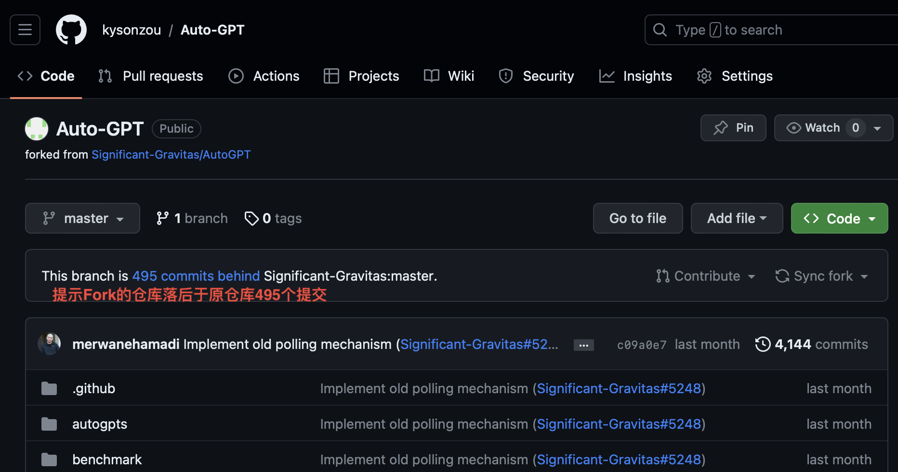
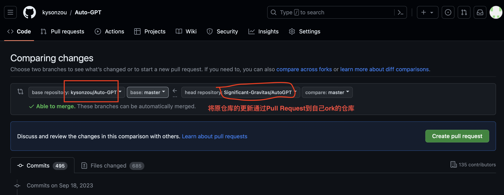

### .DS_Store

.DS_Store 是Mac os 系统自动创建的，存储「访达」打开文件夹时自动显示方式的首选项，以便文件夹以创建者预期的方式显示。在默认情况下，Git会把 DS_Store 文件带入版本控制的范围内，但是我们并不需要对.DS_Store进行版本控制，所以可以手动将其踏入 Git 的版本管理忽略列表（.gitignorel）即可。

### .gitignorel

`.gitignore` 文件是一个文本文件，它告诉 git 不要跟踪特定的文件、目录或文件类型。

通常，可以通过以下两种方式之一获取 `.gitignore` 文件：

- 您自己创建 `.gitignore` 文件并手动将规则添加到文件中

- 从一个与您使用的语言和框架一致的现有项目中的 `.gitignore` 文件复制过来。


### .gitattributes

`.gitattributes` 文件用于配置 Git 仓库中文件的属性，以影响 Git 在处理这些文件时的行为。这些属性可以用于控制文本文件的换行符处理、二进制文件的处理、合并策略和其他文件处理相关的设置。

1. **换行符处理**：在不同的操作系统中，行结束符可以是不同的。Unix 和 Linux 使用 LF（换行），而 Windows 使用 CRLF（回车换行）。这种差异可能会导致在协作开发中出现问题。通过 `.gitattributes` 文件，您可以指定文本文件的换行符处理方式，以确保一致性。

   ```plaintext
   # 1.在.gitattributes中设置换行符规则，Git 自动将文本文件的行结束符转换为适合当前操作系统的格式。
   * text=auto
   
   # 2.告诉git使用lf作为行结束符（Unix 和 Linux 使用）
   *.js text eol=lf
   
   # 3.告诉git使用crlf作为行结束符（ Windows 使用，回车换行）
   *.json text eol=crlf
   ```

2. **二进制文件标记**：有些文件是二进制文件，如图片、音频、视频等。对于这些文件，Git 不应该尝试进行文本差异比较或合并。通过 `.gitattributes` 文件，您可以标记哪些文件是二进制文件。

   ```plaintext
   # 在.gitattributes中标记文件为二进制
   *.jpg binary
   *.png binary
   ```

3. **合并策略**：有时候，您可能需要为特定类型的文件指定合并策略，以控制 Git 在合并分支时如何处理冲突。

   ```plaintext
   # 在.gitattributes中设置合并策略
   *.xml merge=xmlmerge
   ```

   这将告诉 Git 在合并 XML 文件时使用名为 `xmlmerge` 的自定义合并驱动程序。

   常见的合并策略有：

   - **union**：这是 Git 默认的合并策略，它会尝试将两个分支的更改合并到一个新的合并结果中。如果有冲突，它将会标记出来，需要手动解决。
   - **ours**：这个策略会自动接受当前分支的更改，忽略其他分支的更改。这就意味着，如果有冲突，将会选择当前分支的更改，而不是其他分支的更改。
   - **theirs**：这个策略与ours相反，它会自动接受其他分支的更改，忽略当前分支的更改。如果有冲突，将会选择其他分支的更改。
   - **custom**：您还可以自定义合并策略，为其指定一个自定义的合并驱动程序。这需要额外的配置和脚本，以便 Git 知道如何合并特定类型的文件。

4. **diff属性**：您可以使用 `.gitattributes` 文件指定某些文本文件的diff属性，

   ```plaintext
   # 1.算法 diff，使用指定的自定义 diff 算法合并
   *.cpp diff=cpp
   
   # 2.高亮文件的 diff，使用 Pygments 进行 Python 代码的 diff，以改进差异的可读性
   *.py diff=python
   ```

   常见diff算法有：

   - **默认算法**：如果不明确指定 diff 算法，Git 将使用默认的算法。这通常是一种基于行的 diff 算法，它会比较文件的每一行以检测更改。
   - **patience**：Patience diff 算法试图找到一种较好的方式来对待行的重排，以便更容易理解合并冲突。
   - **minimal**：Minimal diff 算法尝试找到最小的差异集，以便更紧凑地表示文件更改。
   - **histogram**：Histogram diff 算法会尝试平衡差异块的大小，以提高可读性。
   - **自定义算法**：

5. **fitter属性**：用于定义 Git 中的过滤器，这些过滤器可以用于处理文件内容，过滤器通常用于对文件进行自动转换、加密、解密或其他自定义操作。

   ```plaintext
   # 1.使用自定义过滤器进行文件内容转换，也可以使用 smudge 和 clean 过滤器来自动压缩和解压缩文件
   *.gz filter=compress
   # 然后，您可以配置 Git 使用自定义的压缩和解压缩脚本来处理这些文件。
   
   # 2.使用加密和解密过滤器，以保护敏感数据。
   secret.txt filter=encrypt diff=encrypt
   # 在这种情况下，您需要编写自定义加密和解密脚本，并将其配置为 Git 过滤器。
   
   # 3.使用自动格式化过滤器，确保提交到仓库的代码始终保持一致的格式
   *.cpp filter=format-cpp
   # 这将要求您创建自定义的代码格式化脚本，并在提交和检出时应用它。
   
   # 4.根据环境使用不同的配置文件，例如，您可以在开发环境和生产环境之间切换不同的数据库连接字符串。
   config.ini filter=config-env
   # 这需要编写自定义脚本以根据环境进行适当的配置。
   
   # 5.对二进制文件应用自定义过滤器，满足特定需求，例如转换图像格式或解密二进制数据。
   *.bin filter=custom-binary-filter
   #这需要编写适用于您的需求的自定义二进制过滤器脚本。
   ```

6. **Git LFS（Large File Storage）配置**：您可以使用 `.gitattributes` 文件来配置 Git LFS，以便管理大文件。这些文件将被存储在 Git LFS 中，而不是直接在 Git 仓库中，以减小仓库大小。

   ```plaintext
   # 配置 Git LFS
   *.jpg filter=lfs diff=lfs merge=lfs -text
   *.mp4 filter=lfs diff=lfs merge=lfs -text
   ```

7. **自定义文件编码**：如果您的项目包含不同的文本文件编码（如 UTF-8 和 ISO-8859-1），您可以在 `.gitattributes` 中指定文件编码。

   ```plaintext
   # 指定编码为 UTF-8
   *.txt encoding=utf-8
   ```

8. **文件清单生成**：您可以使用 `.gitattributes` 文件来生成文件清单，用于自动化任务或生成文档。

   ```plaintext
   # 生成文件清单
   filelist.txt export-subst
   ```

9. **Git属性宏**：您可以在 `.gitattributes` 文件中定义属性宏，以便轻松应用相同的属性规则到多个文件。

   ```plaintext
   # 定义属性宏
   *.html macro
   ```

10. **忽略文件模式**

    ```plaintext
    # 指定要在 .gitignore 中忽略的文件模式
    *.log export-ignore
    ```

通过定制 `.gitattributes` 文件，您可以更好地管理和控制 Git 仓库中的文件，以适应特定的项目需求和开发环境。这有助于确保代码的一致性和可移植性，并减少潜在的合并冲突和问题。

**ChatGPT总结**

```plaintext
# .gitattributes 文件

# 1. 什么是 .gitattributes 文件？
#    - .gitattributes 文件用于配置 Git 仓库中文件的属性，以控制 Git 处理文件时的行为。

# 2. .gitattributes 文件有什么用？
#    - 定义文本文件的换行符处理方式，以确保跨平台协作时的一致性。
#    - 标记二进制文件，防止 Git 尝试对其进行文本差异比较和合并。
#    - 指定合并策略，控制文件合并冲突的处理方式。
#    - 指定文本文件的 diff 算法，影响比较和合并的精确性和性能。

# 3. 如何使用 .gitattributes 文件？
#    - 在 Git 仓库的根目录或子目录中创建一个名为 .gitattributes 的文件。
#    - 在文件中为不同的文件类型或模式定义属性，使用通配符和关键字指定属性。
#    - 提交 .gitattributes 文件到 Git 仓库，以使其生效。

# 4. .gitattributes 文件可以解决什么问题？
#    - 解决跨平台开发中的换行符问题，确保一致的行结束符。
#    - 防止 Git 对二进制文件进行错误的文本差异比较和合并。
#    - 自定义合并策略以处理文件合并冲突。
#    - 控制文本文件比较和合并的精确性和性能。

# 5. 注意事项：
#    - .gitattributes 文件中的规则是按顺序处理的，上面的规则可能会覆盖下面的规则，所以谨慎排序。
#    - 确保您的 .gitattributes 文件符合项目需求和开发环境的要求，以避免潜在的问题。

# 6. 示例：
#    - 下面是一些 .gitattributes 文件的示例：

#    # 设置文本文件的换行符规则
#    * text=auto

#    # 标记文件为二进制
#    *.jpg binary
#    *.png binary

#    # 使用自定义合并策略
#    *.xml merge=xmlmerge

#    # 使用自定义 diff 算法
#    *.cpp diff=cpp
```

**如果你的项目已经存在很久，但是想添加 .gitattributes 文件来统一行尾序列，下面就介绍一下相关方法。**

1. 添加相关的 .gitattributes 文件到项目
2. 运行 `git add .` 添加所有文件
3. 运行 `git commit -m "Saving files before refreshing line endings"` 来保存本次更改
4. 删除所有文件，不包括 .git 目录，`git rm -rf --cached .`
5. 运行 `git reset --hard HEAD`，恢复上一次的提交，这里会得到正确的行尾序列

[.gitattributes 正确使用姿势](https://juejin.cn/post/7084885453920272398)

### GitHub引用单个文件链接

将自己自定义的科学上网的配置文件托管到GitHub上，客户端通过链接引用文件，以后修改就直接修改Github上面的内容，然后客户端更新就可以了，不用和以前一样手动去替换。

一开始以为链接就是简单的仓库链接+文件目录，这样不对，不是有效链接

>https://github.com/kysonzou/Magic-Internet.git/rule/clashX.yaml
>
>Not Found

然后发现Github文件页面有一个permalink（永久链接），这也不对，这是这个页面的链接，不是文件内容的链接

>https://github.com/kysonzou/Magic-Internet/blob/57591bb6c552ebd354299bbf04d42504f1f33590/rule/clashX.yaml
>
>是网页的链接

有个Raw（原始的）表示的是文件原始内容的意思，但是它直接显示的链接也不对

>https://external.github.com/https/raw.githubusercontent.com/kysonzou/Magic-Internet/main/rule/clashX.yaml
>
>在浏览器可以打开，但是在clashX客户端无效，这个地址看着就很奇怪

!< 后来发现不是Raw是错的，而是因为那时候我是通过githubfast去链接的，所以给了一个这么奇怪的地址。Raw的正常链接就是下面的，话说加fast是真的好使 

后来通过对比其它github项目的链接依葫芦画瓢拼成了正确的引用链接

>https://raw.githubusercontent.com/kysonzou/Magic-Internet/main/rule/clashX.yaml 
>
> https://raw.githubusercontent.com/kysonzou/Magic-Internet/main/rule/shadowrocket.conf
>
>和前面的对比其实就是改一下就可以了 


### github的watch、fork、star

GitHub 中的 Watch、Fork 和 Star 都是与项目关联的功能，它们的作用和区别如下：

1. **Watch（关注）：**

   - **作用：**类似于Notification，当你关注一个项目时，你会在项目发生变化时收到通知。这可以帮助你保持对项目的关注，了解项目的更新和动态。
   - **通知类型：** 你可以选择接收关于项目的不同类型通知，包括新的拉取请求、问题、提交等。
   - **区别：** Watch 主要用于跟踪项目的最新动态，并不直接影响你对项目的修改或贡献。

2. **Fork（分叉）：**

   - **作用：** Fork 操作会在你的 GitHub 帐户下创建一个项目的副本，你可以在这个副本上进行修改，独立地管理你自己的版本。

   - **用途：** Fork 主要用于参与协作和贡献开源项目。你可以在你 fork 的项目上进行修改，然后提交拉取请求将你的更改合并回原始项目。pull requests 就是用于提交拉去请求的。

   - **关联性：** Fork 的项目与原始项目有关联性，但是两者独立存在，不会自动同步。同步也是通过pull requests，这个拉去请求是双向的，可以请求自己的副本库合并到原始库里面，也可以请求原始库合并到自己的副本库。

   - **Pull Request**

     

     

3. **Star（点赞）：**

   - **作用：** 当你点赞一个项目时，这表示你对该项目感兴趣或喜欢它。Star 主要用于标记项目并将其保存到你的 GitHub 帐户中。
   - **通知：** 与 Watch 不同，Star 项目并不会直接生成通知或跟踪项目的动态。它只是将项目添加到你的 Starred Repositories（点赞的仓库）列表中，以便稍后查看或找到它们。
   - **区别：** Star 主要是为了个人的项目收藏和标记，而不是为了跟踪项目的变化或参与贡献。

总之，Watch 用于跟踪项目的动态，Fork 用于创建你自己的项目副本以进行修改和贡献，而 Star 主要用于个人标记和收藏项目。这些功能允许GitHub用户更好地与项目互动，根据自己的需求和兴趣来管理和参与GitHub项目。

Pull Requeat截图

### github中的tag、release、package

GitHub 中的 Tag（标签）、Release（发布）和 Package（包）是与项目版本和分发相关的功能，它们各自有不同的作用和区别：

1. **Tag（标签）：**

   - **作用：** 标签是用于标记代码库中特定的提交点，通常表示项目的版本或重要的里程碑。标签可以帮助开发者和维护者在代码库中快速找到特定版本的代码。
   - **用途：** 通过标签，你可以在代码库中的不同提交点之间轻松导航，并查看特定版本的代码。
   - **区别：** 标签仅用于标记提交点，并不包含发布说明、二进制文件或其他分发相关的内容。它属于Git的功能。

2. **Release（发布）：**

   - **作用：** 发布是将项目的特定版本或里程碑打包并发布为一个独立的发布包的过程。每个发布都可以包括二进制文件、源代码、发布说明等内容。
   - **用途：** 发布使开发者能够方便地下载和部署特定版本的软件，同时提供了发布说明以解释该版本的变化和更新。
   - **区别：** 发布包含了与版本分发相关的详细信息和资源，而标签仅用于标记代码库中的提交点。它属于Github的功能。

3. **Package（包）：**

   - **作用：** Package 是 GitHub 的一项功能，用于托管和管理软件包（例如 npm 包、Docker 镜像、Ruby gem 等）。开发者可以将自己的包发布到 GitHub Package Registry 中，并使用它来存储、共享和分发包。
   - **用途：** Package 用于方便地管理和分发软件包，使其可以被其他项目或开发者使用。
   - **区别：** Package 是一种托管和分发软件包的方式，与项目的版本和发布相关，但它更专注于软件包管理，而不仅仅是代码库的版本管理或发布。它属于Github的功能。

在实际项目中，通常的流程是：

- 创建标签来标记重要的提交点，以便轻松找到和浏览特定版本的代码。
- 当准备发布一个版本时，创建一个发布，并在其中包含二进制文件、源代码、发布说明等资源。
- 如果你的项目生成软件包（如 npm 包、Docker 镜像等），你可以使用 GitHub Package Registry 来托管和分发这些包。

这三个功能在GitHub中一起使用，有助于更好地管理和维护你的项目，并使它更容易被其他开发者使用和理解。