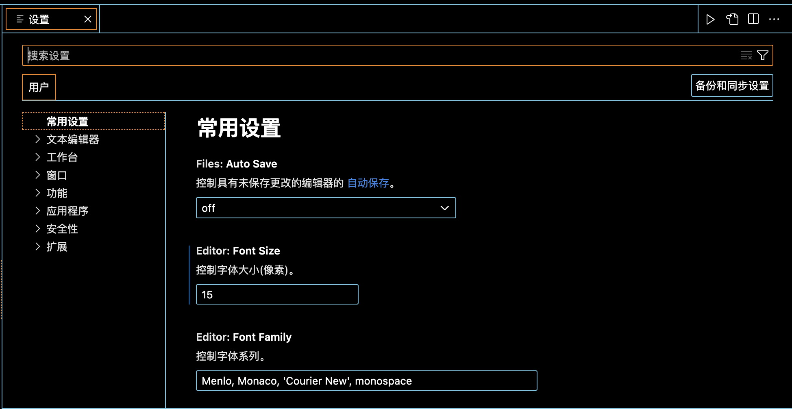
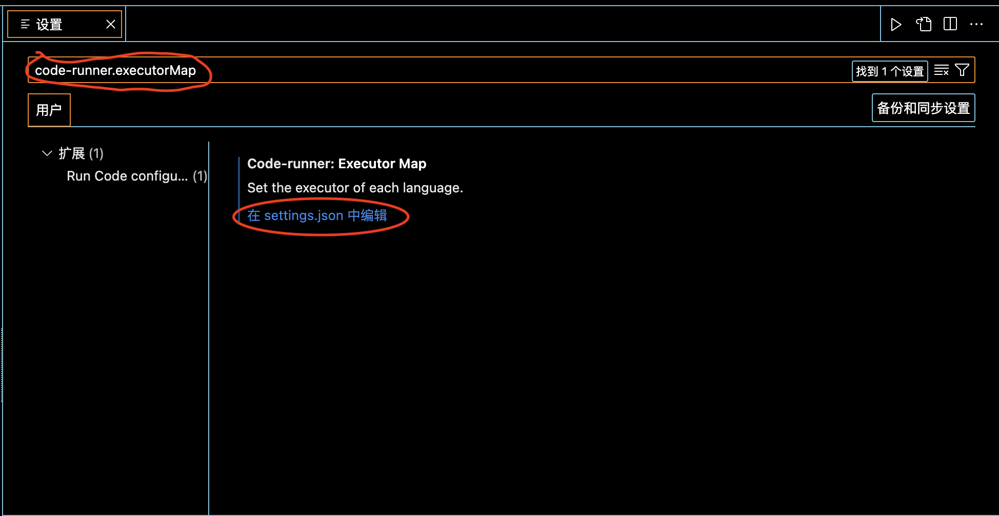
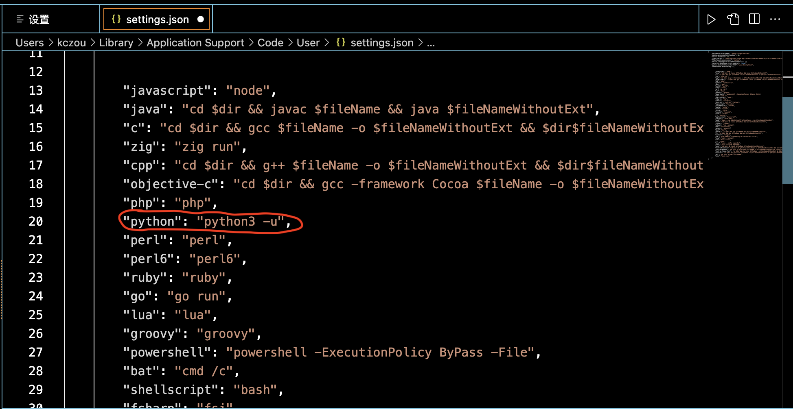

简单记录vscode的使用

#### IDE&语言&编译器（解释器）

- **集成开发环境（IDE）**

  全称是集成开发环境，是用于提供程序开发环境的应用程序，一般包括代码编辑器、编译器、调试器和图形用户界面等工具。IDE可以帮助开发人员提高编程效率和质量，并简化程序开发流程。

- **语言**

  是用于描述计算机程序的一种符号系统。编程语言分为两大类：编译型语言和解释型言。

- **解释器（编译器）**

  是用于解释（编译）和执行编程语言源代码的程序。解释器（编译器）可以是单独的程序，也可以是IDE的一部分。

- **运行环境**

  运行环境是什么我也说不准确，但是运行环境一定是会有编译器或解释器的。所以有时候也就可以简单的认为运行环境就是解释器（编译器）

- Xcode

  Xcode是有苹果开发的运行在Macos上的集成开发环境，支持的计算机语言有：C、C++、Object-C、JAVA、AppleScript、Python、Ruby、Swift，支持的编译器从GCC->LLVM-GCC->LLVM Compiler。

- VSCode

  VSCode是微软开发的支持全平台的集成开发环境，它的设计思路就是开源，用户通过插件的方式去配置自己需要的开发环境，比如我需要Python语言开发，那就添加Python语言扩展，然后配置好Python的运行环境，运行环境一般都是命令行程序，安装在/usr/bin/python3、/usr/bin/swift...

  大概的理解就是，要开发python程序，在vscode中添加python语言扩展，这时候vscode就支持编写python程序了，如果要调试或者运行它的话，就需要有python运行环境才能把代码跑起来。

#### VSCode扩展简体中文

微软提供了官方的IDE语言扩展，其中《Chinese (Simplified) (简体中文) Language Pack for 》就是适用于简体中文的语言包。

#### VSCode支持Swift

vscdoe中有支持swift的扩展包《Swift》，再配置CLI的swift运行环境就可以了

#### VSCode支持Python

微软提供了官方的Python语言扩展包《Python》《Pylance》，再配置CLI的Python运行环境就可以了

>在一开始运行Python的时候遇到了一个错误，/bin/sh: python: command not found ，这个错误的意思就是xcode没有找到python这个运行环境，通过终端查看安装的是python3，所以给出这个错误，其实就是vscode的配置不对，需要将vscode的python的改成python3。
>
>1. 打开vscode的settings面板
>
>   
>
>2. 在settings中查找 code-runner.executorMap
>
>   选择Edit in settings.json 
>
>   
>
>3. 在settings.json中改为 python3 
>
>   
>
>   保存

#### VSCode支持MySQL

vscdoe中有支持数据库的扩展包《MySQL》《SQLTools》《SQLTools MySQL/MariaDB/TiDB》，再配置CLI的MySQL数据库管理软件接可以使用MySQL管理数据库了

vscdoe中的《CodeLLDB》扩展，是由 LLDB 提供支持的本机调试器， 调试 C++、Rust 和其他编译语言。

#### VSCode扩展Runner

vscdoe中的《Code Runner》扩展，支持运行多种语言的代码片段或代码文件，主流语言几乎都已经支持了

#### VSCode扩展Copilot

vscdoe中的《Github copilot》《Github chat》扩展，都属于Github平台推出的代码辅助工具

#### VSCode扩展Markdown 

vscdoe中的《Markdown Preview Enhanced》，支持Markdown文档的预览

#### VSCode扩展postman

vscdoe中的《postman》，支持轻量级的API测试客户端。

