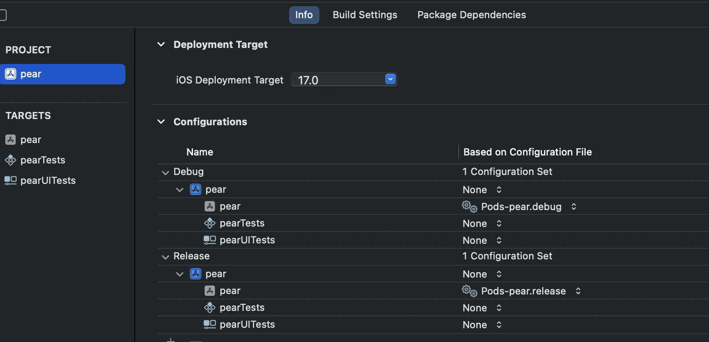

对于cocoapods的详细工作原理暂时不整理，先记录一下怎么把第三方库链接进主工程的

1. Pods install 后，coocapods会创建一个Pods的工程，这个工程会导入所有配置的第三方库放在Pods/Pods 目录中，每个第三方库会新建一个Target对应，也会为目标工程新建一个Target，取名**pod-name**，这个**pod-name**会根据Podfile文件添加依赖第三方库，如下所示：

   > Target > Built Phase > Target Dependencies
   >
   > 

2. Cocoapods创建的所有Target都会被构建成.a静态库文件，放在 Pods/Products 目录中，这里只是引用，实际的文件磁盘目录是在 /Users/kczou/Library/Developer/Xcode/DerivedData/Fruit-foejbgjfwpckaecoorzmkiuybxer/Build/Products/Debug-iphonesimulator/Masonry/libMasonry.a。

3. cocoapods再把 pod-name 编译成 **libpods-name.a** 静态库（所有的Target都会被编译成.a库）放到目标工程的Frameworks目录下，显式引用该文件，这个还应该配置.h文件，在下面会有

4. 目标工程还有一个Pods文件，这个文件里面放了两个配置文件，**Pods-name.debug**、**Pods-name.release**，这两个文件里也配置了目标工程对第三方的引用：

   HEADER_SEARCH_PATHS：头文件的所搜路径

   LIBRARY_SEARCH_PATHS、FRAMEWORK_SEARCH_PATHS：静态库的搜索路径

   OTHER_LDFLAGS：需要链接的库名

   在目标工程的Project > Info > Configuration中配置加上这两个文件，让目标工程在构建的时候按照配置去链接第三方库。如下图所示：

   

5. 目前的理解是3、4两个都是把第三方库添加到目标工程的方式，只是Pod-name.a集成了所有的第三方库的依赖然后显式的引用，通过.xcconfig文件pod_xxx.debug和pod_xxx.release配置是隐式引用。貌似是相同功能，应该有一个就就行吧！需要验证

**白嫖**

[cocoapods官方文档](https://guides.cocoapods.org)

[cocoapods原理总结](https://juejin.cn/post/6844903502829846541)