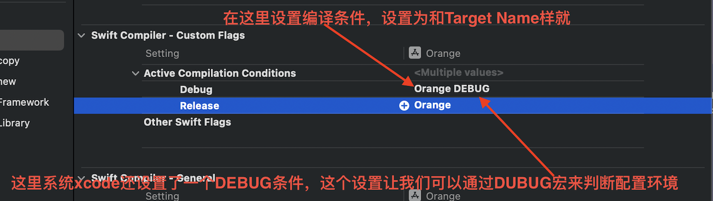

## Xcode相关概念

### Workspace等概念

在Xcode中，workspace、project、target、scheme和product都是关键概念，用于组织和管理iOS、macOS和其他苹果平台应用程序的开发过程。它们之间有一定的关系，下面我会为你解释它们的含义和作用，以及它们之间的关系：

1. **Workspace（工作区）**：
   - **含义**：Workspace是Xcode项目的顶层容器。它允许你组织和管理一个或多个相关项目。
   - **作用**：Workspace用于同时打开和管理多个项目，这对于开发多个相互关联的应用程序、库或框架非常有用。你可以在Workspace中添加、移除和重新排列项目，以便更方便地协同工作。

2. **Project（项目）**：
   - **含义**：Project是Xcode中的单个应用程序、库或框架的项目文件。每个项目都包含了应用程序的源代码、资源文件、配置文件等。
   - **作用**：Project用于组织和管理一个特定的应用程序或库的开发。在项目中，你可以创建多个target，每个target可以构建不同的产品（如应用程序、测试、框架等）。

3. **Target（目标）**：
   - **含义**：Target定义了项目中需要构建的不同产品或执行不同任务的设置和选项。
   - **作用**：每个项目可以有一个或多个target，每个target可以生成一个独立的产品。例如，一个iOS应用程序项目可以有一个主应用程序target和一个单元测试target，每个target都有自己的设置和构建选项。

4. **Scheme（方案）**：
   - **含义**：Scheme是一组构建和执行配置，用于指定如何构建和运行项目的不同方案。每个方案都与一个特定的target关联。
   - **作用**：通过Scheme，你可以指定要构建的目标、构建配置、可执行文件、环境变量和启动参数等信息，以便在Xcode中构建、运行和调试应用程序。

5. **Product（产品）**：
   - **含义**：Product是通过构建项目生成的输出文件。它可以是应用程序、库、框架、测试二进制文件等。
   - **作用**：Product是你的项目最终要交付的结果。你可以在Scheme中指定要构建的产品，并在项目构建完成后在Xcode中找到它。

关系：

- 一个Workspace可以包含一个或多个Project。
- 一个Project可以包含一个或多个Target。
- 一个Scheme用于指定如何构建和运行一个特定的Target。
- Target是用于生成Product的配置，一个Project可以有多个Target，每个Target可以生成不同的Product。
- 通过 scheme 来指定某一时刻哪个 target、哪个 build configuration 是有效的。

### Group和Folder

在 Xcode 中，"group" 和 "folder" 都用于组织和管理项目中的文件，但它们之间有一些重要的区别。让我们来理解它们的不同：

1. **Group（组）**：

   - **虚拟组织**：Group 是 Xcode 中的虚拟组织。它不在文件系统中创建实际的文件夹结构，而是在 Xcode 项目导航器中创建一个可见的文件夹结构，用于组织和管理项目中的文件。

   - **只在 Xcode 中可见**：Group 中的文件和文件夹只在 Xcode 项目中可见，它们不会在磁盘上创建实际的文件夹。这意味着您可以在 Xcode 中创建多个 Group 来组织文件，而不必在磁盘上创建多个文件夹。

   - **逻辑组织**：Group 主要用于逻辑组织文件，使文件更容易在项目中定位和管理。您可以创建 Group 来组织相关文件，例如将所有图像文件放入一个图像 Group，将所有视图控制器放入一个视图控制器 Group，等等。

   - **不会影响编译和文件位置**：Group 的创建不会影响文件的实际编译或文件在磁盘上的位置。编译器和项目构建过程不会考虑 Group 的存在，它们只关注文件在文件系统中的位置。

2. **Folder（文件夹）**：

   - **实际文件夹**：Folder 是实际的文件夹结构，它在磁盘上创建一个文件夹，用于存储项目中的文件。

   - **与文件系统相关**：Folder 直接映射到磁盘上的文件夹，因此在项目中创建一个 Folder 会在磁盘上创建一个相应的文件夹。文件夹中的文件和子文件夹也将在文件系统中存在。

   - **编译和文件位置**：与 Group 不同，文件夹的创建会影响编译和文件在磁盘上的位置。编译器将考虑文件的实际位置，并将编译生成的文件放入相同的文件夹中。

3. 现在的Xcode中，创建Group的时候会有两种方式

   - New Group：Xcode会创建一个虚拟文件夹 ，同时也会在磁盘上创建同名的实际文件夹。
   - New Group Without Folder：不会在磁盘上创建文件夹

4. 在Xcode中Group显示黄色，Folder显示蓝色。

5. 一般使用都是选择Creat Gr

   

6. 看到一个stawoverflow的回答蛮好的

   Xcode中有两种类型的文件夹：组和文件夹引用。您可以使用组来组织项目中的文件，而不会影响它们在实际文件系统上的结构。这对代码来说很棒，因为你只会在Xcode中处理你的代码。另一方面，组对资源文件不是很好。

   在任何相当复杂的项目中，您通常会处理数十个（如果不是数百个）资产文件，这些资产需要由您或设计师从Xcode之外进行修改和操作。将所有资源文件放在一个平面文件夹中是灾难的秘诀。这就是文件夹引用的来源。它们允许您将文件组织到文件系统上的文件夹中，并在Xcode中保留相同的文件夹结构。

总结：

- Group 是 Xcode 中的虚拟组织，用于逻辑组织文件，但不会在磁盘上创建文件夹。
- Folder 是实际的文件夹结构，与文件系统直接相关，用于在磁盘上存储文件，影响编译和文件位置。

在项目中，通常会使用 Group 来进行逻辑组织，使项目结构更清晰，而只有在需要创建实际文件夹时才会使用 Folder。

### Xcode资源引用的理解

Xcode提供了多种引用文件的方式，可以从很多方面总结，这里按文件显式引用和隐式引用来分两类介绍，文件显示引用就是在Xcode的导航器（左边栏）中可以看到的，隐式引用则看不到。

显示引用不代表文件在项目磁盘目录下，也可能引用的是外部文件，一样会在Xcode的导航器中显示。主要是看在添加文件的时候有没有选择 copy items if needed 选项

**显式引用**

- .h文件

  平平无奇，没有什么额外的。

- .m文件

  Xcode会添加到：Target > Bulid Phase  > Complile Souce 中，还会显示文件的磁盘位置。

- 资源文件

  Xcode会添加到：Target >Bulid Phase > copy Bundle Resouecrs 中，资源文件包括Assets、storyboard、图盘等。

- .a文件、.framework文件

  1. Xcode会添加到：Target > Bulid Phase > Link Bianry With Libraries、

     Target > Genera l> Frameworks,Library,and Embedded content中

     同时还会添加搜索路径到 Target  > Library search path中，其实好像不用也可以

  2. 如果是.a文件，还需要添加.h文件的引用

**隐式引用**

- .h文件

  在 Protect Or Target >Build Settings > Header Search Paths中配置文件路径就行

- .m文件

  目前没发现什么方式

- 资源文件

  目前没发现什么方式

- .a文件

  1. 在 Protect Or Target > Build Settings > Library Search Path中配置文件路径

  2. 同时需要添加.a文件的.h文件路径到Protect Or Target >Build Settings > Header Search Paths

  3. 指定链接文件，通过Other Link Flags 中添加-l "xxx" 让编译链接的时候链接它

     >.a文件的格式一般都是libxxx.a，在Other Link Flags 中添加-l "xxx" 的时候千万别加lib，不然链接不到的，正确的是 -l "xxx" 就行

- .framework文件

  1. 在 Protect Or Target > Build Settings > Framework Search Path中配置文件路径
  2. 指定链接文件，通过Other Link Flags 中添加-l "xxx" 让编译链接的时候链接它

**总结**

- .m资源文件只能显示引用
- .h、.a、.framework可以显式也可以隐式，
- .a库隐式引用的时候除了需要配置库文件路径还需要配置.h头文件和指定链接文件
- .framework隐式引用的时候除了需要配置库文件路径还需要指定链接文件

### Scheme

在iOS开发中，Xcode提供了多种构建和调试工具以支持不同的开发和测试需求。以下是这些概念的解释，包括它们的用途和特点：

1. **Debug（调试）**：
   - **用途**：Debug是一种构建配置，用于开发和调试应用程序。它旨在提供更多的调试信息和更高的开发效率。
   - **特点**：
     - 符号化代码：以支持代码调试，会保留符号信息，以便您可以进行代码调试，包括断点设置、单步执行等。
     - 优化级别低：通常不执行代码优化，以便更轻松地跟踪代码执行流程。
     - 开启调试日志：可以查看详细的运行日志和调试信息。
     - 较慢的执行速度：通常较慢，因为不进行优化。

2. **Release（发布）**：
   - **用途**：Release是一种构建配置，用于发布应用程序。它旨在提供最佳性能和最小的二进制文件大小。
   - **特点**：
     - 代码优化：执行更多的代码优化，以提高应用程序的性能。
     - 剥离符号信息：通常剥离符号信息，以减小应用程序的二进制文件大小，同时也增加了逆向工程的难度
     - 禁用调试日志：通常禁用调试日志，以减少日志输出。
     - 更快的执行速度：通常更快，因为进行了优化。

3. **Build（构建）**：
   - **用途**：Build是指将源代码编译为可执行的二进制文件的过程。在Xcode中，您可以使用Build命令来编译项目，但不会运行或部署应用程序。

4. **Run（运行）**：
   - **用途**：Run是指在模拟器或设备上启动应用程序，以进行实际测试和调试。它使用Debug配置来运行应用程序。

5. **Test（测试）**：
   - **用途**：Test是指运行应用程序的单元测试、UI测试或集成测试。Xcode提供了测试工具和框架，以确保应用程序在各种条件下都能正常工作。

6. **Archive（归档）**：
   - **用途**：Archive是将应用程序的发布版本打包为.ipa文件的过程，以便提交到App Store或进行分发。它使用Release配置来构建应用程序，并创建一个可分发的应用程序包。

7. **Profile（性能分析）**：
   - **用途**：Profile是一种用于检查和分析应用程序性能的工具。您可以使用Instruments工具来执行性能分析，以识别和解决性能瓶颈和内存泄漏等问题。

8. **Analyze（静态分析）**：
   - **用途**：Analyze是一种用于静态分析代码的工具，以检测潜在的代码问题和错误。它可以帮助您找到代码中的潜在问题，如内存泄漏、未初始化变量等。

这些概念在iOS开发中起着重要作用，可以根据不同的开发阶段和需求来选择适当的工具和配置。Debug用于开发和调试，Release用于发布，Build用于编译，Run用于启动应用程序，Test用于测试，Archive用于分发，Profile用于性能分析，Analyze用于静态代码分析。每个工具和配置都有其特定的用途和特点，有助于开发人员构建高质量的iOS应用程序。

## Target > Build Setting

### Header Search Paths

常常使用的有：Header Search Paths、Library Search Paths、Framework Search Paths...

通常可以配置以下常用选项：

1. **$(inherited):** 

   这个选项告诉Xcode在父级目录中查找库文件路径。这在项目包含多个目标或子项目时非常有用，以便共享库的搜索路径。

2. **$(SRCROOT):** 

   这个选项指向项目的根目录，可以用于指定相对于项目根目录的库搜索路径。

3. **$(PROJECT_DIR):** 

   与 \$(SRCROOT)类似，这个选项也用于指定相对于项目根目录的库搜索路径。

4. **$(TARGET_BUILD_DIR):** 

   这个选项指向目标输出的目录，可以用于指定在构建时生成的库文件的搜索路径。

5. **$(PROJECT_NAME):** 

   这个选项表示项目的名称，可以用于指定与项目名称相关的库搜索路径。

6. **$(CONFIGURATION):** 

   这个选项表示当前构建配置的名称，可以用于根据不同的构建配置指定不同的库搜索路径。

7. 绝对路径: 你也可以指定绝对路径，以明确指定库文件的搜索位置。

这些选项可以帮助你更灵活地配置库的搜索路径，以满足项目的特定需求。根据项目的结构和要求，你可以组合使用这些选项来设置适当的库搜索路径。

>  4、5、6没太理解，但是Cocoapods的pod_xxxx.debug、pod_xxxx.release配置文件有使用上面的路径方式，有时间在再说

### Other Linker Flags

**原理介绍**

从C代码到可执行文件经历的步骤是：

> 源代码 > 预处理器 > 编译器 > 汇编器 > 机器码 > 链接器 > 可执行文件

- 预处理器（预编译）：在该阶段，编译器将C或者OC中源代码中包含的stdio.h和#import 的库编译进来
- 编译器：在这个阶段，编译器首先要检查代码的规范性，是否有语法错误等，用来确定代码实际要做的工作,在检查无误后，编译器把代码翻译成汇编语言
- 汇编器：汇编阶段把编译阶段生成的汇编代码转化成二进制目标文件
- 链接器：将不同部分的代码和数据收集和组合成一个单一文件的过程，也就是把不同目标文件合并成最终可执行文件的过程，将编译输出的二进制文件链接成最终可执行的目标文件。
- 在最后一步需要把.o文件和C语言运行库链接起来，这时候需要用到ld命令。源文件经过一系列处理以后，会生成对应的.obj文件，然后一个项目必然会有许多.obj文件，并且这些文件之间会有各种各样的联系，例如函数调用。iOS开发中的静态库就是在这一阶段合并进目标文件的。

注意在链接阶段时，将编译阶段一些只有函数声明的头文件，而没有函数实现的库链接到可执行文件中来。库分为动态库和静态库： 

- 静态库：是指编译链接时，把库文件的代码全部加入到可执行文件中，因此生成的文件比较大，但在运行时就不需要额外的库文件（.a） 。
- 动态库：在程序执行时，由运行时链接文件加载库，这样可以节省系统的开销（.so、.dylib）。

Other Linker Flags

Other Linker Flags是用来设置链接器工作时默认参数外的其他参数，Other linker flags设置的值实际上就是ld命令执行时后面所加的参数。

在Xcode的工程中 **Project Or Tergets -> Build Settings -> linking -> Other Linker Flags**，链接系统的标准库 ，链接其他三方库的参数，引用链接器参数

常用参数：

1. **-ObjC**

   它告诉编译器去链接所有的 Objective-C 类别（Categories）。Objective-C 类别是在运行时动态加载的，通常情况下，编译器不会将未使用的类别包含在最终的可执行文件中，这可能会导致某些类别的方法无法被正确调用。但有时会无法有类别没有被加载的情况，比如：当静态库中只有分类而没有类的时候，Objc就失效了，这就需要使用`-all_load`或者`-force_load`了。

2. **-all_load**

   这个flag是处理使用了-ObjC以后依然不能正确加载的情况的。

   它告诉编译器在链接过程中包括所有的目标文件，而不仅仅是那些被引用的目标文件。这意味着所有的代码都会被链接到最终的可执行文件中，包括未使用的代码。很黄很暴力😝不建议使用。

   使用之后很有可能会遇到ld: duplicate symbol错误，因为不同的库文件里面可能会有相同的目标文件。
   这里会有两种方法解决：

   1. 用命令行就行拆包；（就是拆包解决问题在构建新的包），有点硬刚。
   2. 在遇到-ObjC失效的情况使用-force_load参数 ，尽量不用-all_load

3. **-force_load**

   所做的事情跟`-all_load`其实是一样的，但是`-force_load`需要指定要进行全部加载的库文件的路径，这样的话，你就只是完全加载了一个库文件，不影响其余库文件的按需加载。

4. **-framework：** 指定要链接的框架。

5. **-l：** 指定要链接的动态库。cocoapods就使用了这个指定链接哪些库

6. **-L：** 指定动态库的搜索路径。

**区别**：

- -ObjC 只会影响 Objective-C 类别的链接。
- -all_load 影响所有目标文件的链接。
- -force_load 允许你指定性地加载某个特定库文件。

**建议`-ObjC`与`-force_load`搭配使用比较好。**

**白嫖**

[Xcode中的Other Link Flags参数详解](https://blog.csdn.net/f_957995490/article/details/118120088)

### Mach -O Type 

"Mach-O Type" 是指Mach-O文件的格式或类型，它表示了该文件是用于什么目的以及如何执行。以下是一些常见的Mach-O文件类型：

- **Executable**：就是可执行文件
- **Library**：静态库
- **Bundle**：资源文件
- **Dynamic Library**：动态度，貌似.framework就是它
- **Relocatable Object File**：可重定位目标文件，通常是源代码编译后的中间表示形式，用于构建可执行文件或共享库

### Active Compilation Conditions

和使用.pch文件定义宏一样

**在swift**

Target > Built Settings > Swift Compiler - Custom Flags > Active Compilation Conditions

预设编译条件，写代码的时候能够通过#if DEBUG 判断是不是调试环境就是因为在这里设置了DEBUG

### Preprocessor Macros

**在OC**

Target > Built Settings > Apple LLVM 9.0 - Preprocessing > Preprocessor Macros

### Other Swift Flags

**在swift**

Target > Built Settings > Swift Compiler - Custom Flags > Other Swift Flags

"Other Swift Flags"（其他Swift标志）是Xcode项目的构建设置之一，用于允许您向Swift编译器提供额外的编译选项。这些标志可以用于控制编译器的行为，启用或禁用特定的编译功能，以及进行其他自定义设置。以下是一些常见的用途：

1. **开启或关闭编译条件**：您可以使用其他Swift标志来定义预处理宏或条件编译指令，以便根据不同的构建配置启用或禁用特定的代码块。例如，您可以使用 `-D DEBUG` 标志来在Debug构建中启用调试代码，而在Release构建中禁用它。

2. **开启优化**：通过添加 `-O` 或 `-Osize` 标志，您可以启用Swift编译器的代码优化选项，以提高应用程序的性能。不同的优化级别会导致不同程度的代码优化。

3. **开启警告**：您可以使用 `-warn-implicit-overrides` 或 `-warn-unqualified-access` 等标志来启用或禁用特定的警告信息，以帮助您在编译时发现潜在的问题。

4. **指定SDK版本**：您可以使用 `-sdk` 标志来指定要使用的iOS或macOS SDK版本，以确保您的应用程序与特定版本的操作系统兼容。

5. **启用或禁用模块化编译**：使用 `-enable-module-stripping` 或 `-disable-bridging-pch` 等标志，您可以控制Swift编译器在模块化编译方面的行为。

6. **自定义Swift标准库的导入**：通过 `-Xfrontend -disable-availability-checking` 标志，您可以禁用API可用性检查，从而允许导入不受支持的Swift标准库版本。

7. **自定义编译输出位置**：使用 `-o` 标志，您可以指定编译后的二进制文件的输出路径。

8. **进行自定义优化**：您可以使用其他Swift标志来传递自定义的优化选项，以满足特定需求。

## Target > Build phase

构建阶段，在 Xcode 中，主要包含 7 种类型的 build phase，分别如下：

- Compile sources
  - 将可编译的源文件（如 Swift、Objective-C、Lex、Yacc）与当前 target 进行关联，并进行编译。如果有必要，为每个源文件指定编译选项。
  - **此种类型的 build phase 可以为每个 target 使用一次，但是对于 Aggregate Target 和 External Build Tool Target，此种类型的 build phase 无法使用**。
- Copy Bundle Resources
  - 将资源与当前 target 进行关联，在合适时进行处理，并将它们复制到 product 的 Resource 子文件夹中。
  - **此种类型的 build phase 可以为每个 target 使用一次，并且当且仅当 target 的 product 支持嵌入式资源时才能使用**。
- Copy files
  - 将其他 target 的 product 与当前 target 进行关联，必要时对他们进行 code sign，然后将它们复制到目标地址（一般是 product 中的一个子文件夹）。
  - **此种类型的 build phase 在所有构建过程或进行安装构建过程中使用，每个 target 可以多次使用它**。
- Headers
  - 将 public header、private header、project header 文件与当前 target 进行关联。public/private header 定义对外的 API，并且会被复制到 product 中进行安装。比如：一个 framework target 中的 public/private header 会被复制到 product 的 Headers 和 PrivateHeaders 子文件夹中。project header 定义 target 使用的 API，但不会复制到 product 中。
  - **每个 target 只能使用一次此种类型的 build phase**。
- Link Binary With Libraries
  - 是指编译链接哪些库文件
  - 将 Apple frameworks 等库与当前 target 进行关联。这些库可以是平台库、其他 target 生成的库、外部预构建的 XCFramework 和库。这些库可以被指定为必选的或可选的（弱链接——即库不存在，应用程序也可以加载）。
  - **此种类型的 build phase 可以为每个 target 使用一次，但是对于 Aggregate Target 和 External Build Tool Target，此种类型的 build phase 无法使用**。
- Run script
  - 在构建过程中运行指定的 shell 脚本。此脚本可以使用当前 target 的 build settings 所定义的变量，比如：$(SRCROOT)，表示包含目标源文件的目录。此外，还允许我们提供输入和输出文件的列表。当没有提供输入和输出文件时，脚本也会运行。当提供输入和输出文件时，脚本仅在之前从未运行、或输入文件发生过变化、或输出文件发生过丢失时运行。
  - **此种类型的 build phase 在所有构建过程或进行安装构建过程中使用，每个 target 可以多次使用它**。
- Target Dependencies
  - 显式指定在同一 project（非同一 workspace）或链接 project 中的其他 target，这些 target 必须在当前 target 自身构建之前进行构建。比如：依赖于 project 中另一个框架的 target 通常会配置有对该框架的 target 依赖项。Xcode 能够隐式地推断出一些依赖项，但是此 build phase 能够提供对依赖项及其构建顺序的更优的控制。

