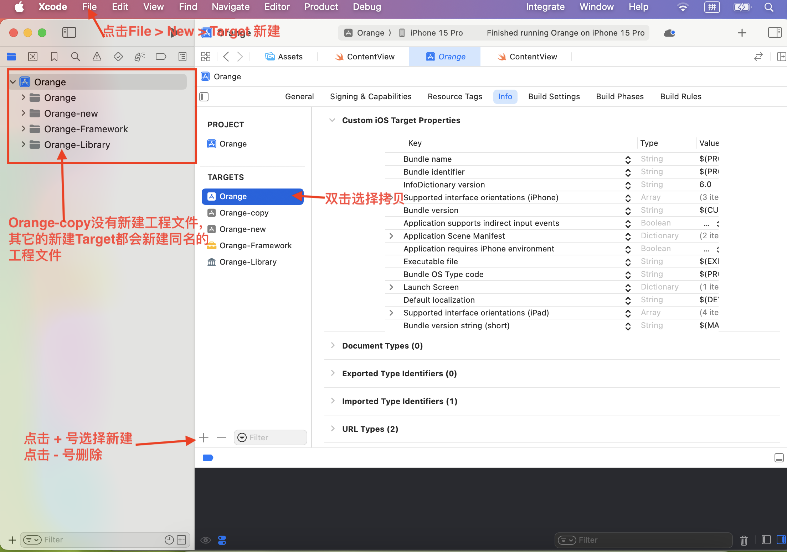
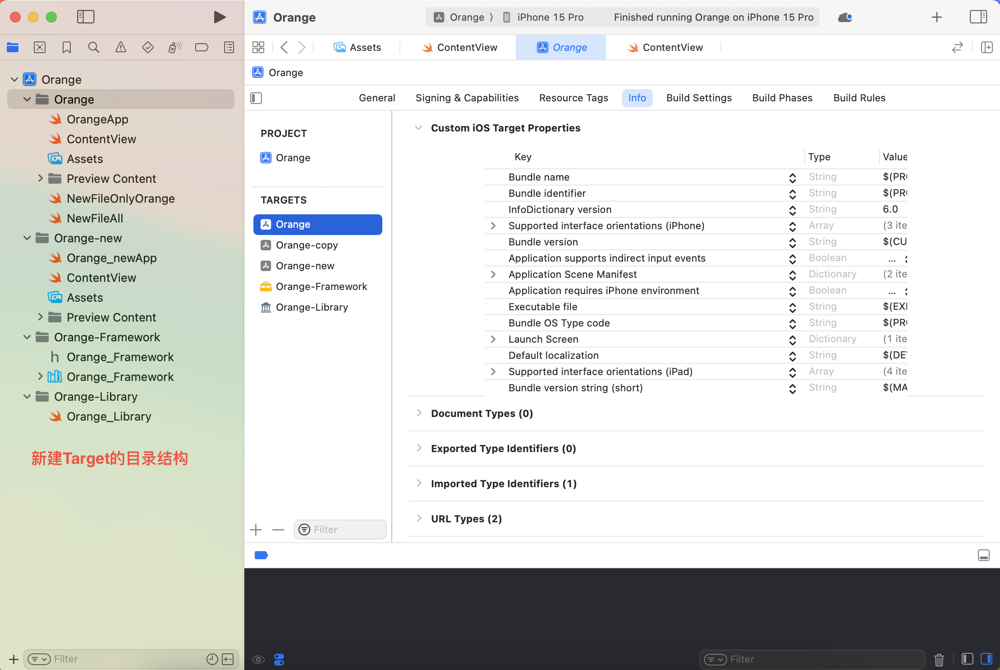
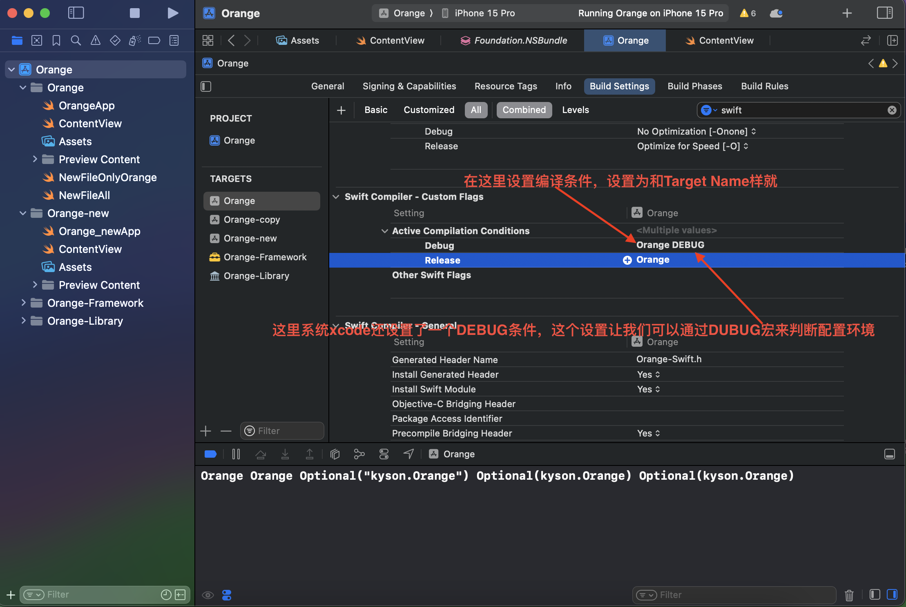
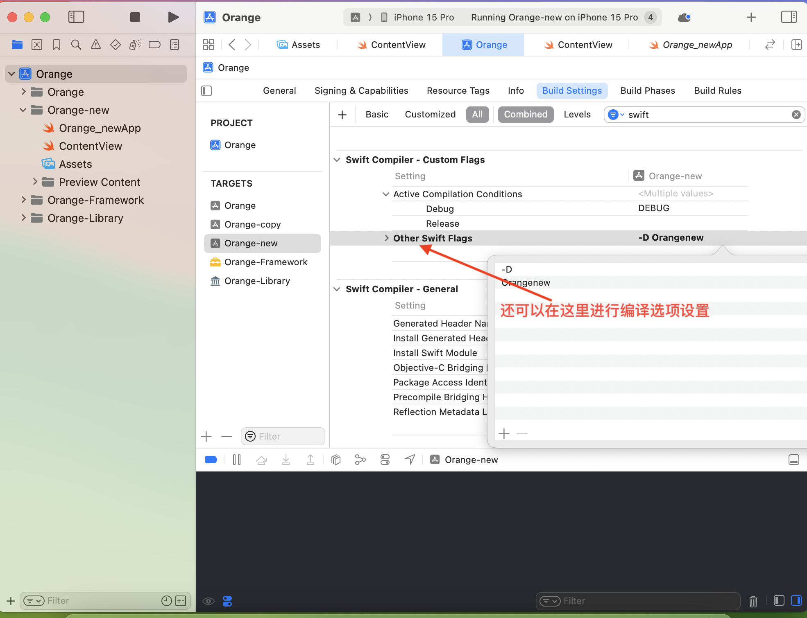

## 多Targets

### 什么是Target

Target定义了项目中需要构建的不同产品或执行不同任务的设置和选项。

Target的类型 + Build Configuration + Build Phase + Build Rules 决定了Pruduct 的构建和输出

- Build Configuration包含了各种各样的构建需要的配置，我们在Xcode > Target中看到的Target > General、Target > Info、Target > Build Settings都是设置它的，除了使用图形界面设置它，还可以使用**.xcconfig**（Configuration Settings File）文件设置它。

-  Build Phase包含了使用哪些资源文件，库文件、代码文件等去构建Product。

>不同的Target通过不同的构建配置可以构建各种不同的Product，比如在通用版的工程中新建一个精简版的Target构建精简版APP，也可以新建Target把项目中的某些功能构建成库文件等。
>
>同一个Target也可以使用不同的**.xcconfig** 文件构建差异化的Product，比如不同的服务器环境、不同的名字、APPICON、启动页、Bundle Id、支持不同平台等；这些差异化也可以使用不同的Target实现，没必要，会繁琐很多（因为每个Target都是完整的构建配置，需要同时维护它们）
>
>不管是构建精简版APP还是使用不同的服务器环境、不同的名字、APPICON、启动页、Bundle Id、支持不同平台等业务也都可以使用宏或者全局变量实现，这样的实现方式很不优雅，而且每次都需要通过代码来改变这些配置。
>
>通过不同的Target或者使用不同的**.xcconfig** 文件构建Product，可以通过Scheme来设置Target和**.xcconfig** 文件，需要什么样的product，选择对应的Scheme就行了。

### 新建Target

新建Target有两种方式

1. 直接拷贝现有的Target，拷贝的Target和原来的Target的构建信息是相同的，不会新建工程目录。

   选择要拷贝的Target > 双击就会显示拷贝选项 >  选择拷贝（Duplicate）

2. 新建一个Target，新建Target的同时也会新建一个同名的工程目录。

   点击Target方框左下角的 + 号可以选择新建、或者通过File > New > Target 新建





### 区分不同的Target

1. 通过Target的名称不同来区分

   貌似没有直接获取Target的方法，但是在Target > Built Settings > Swift Compiler - Custom Flags > Active Compilation Conditions 中可以设置编译条件来区分：如下图所示

   

    也可以在 Target > Built Settings > Swift Compiler - Custom Flags > Other Swift Flags  中设置

   

   

   ```swift
   /// 判断Target
   #if Orange
       print("ORANGE")
   #elseif Orangecopy
       print("ORANGE-copy")
   #elseif Orangenew
   	  print("ORANGE-new")
   #endif
   
   /// 判断配置环境，这里写Release没用，因为没配置这个宏
   #if DEBUG 
   		//调试环境 
   #else
       //发布环境
   #endif
   ```

   在OC项目中的设置位置为：

   Target > Built Settings > Apple LLVM 9.0 - Preprocessing > Preprocessor Macros

1. 通过info.plist中的不同信息区分，比如：Bundle name、Bundle identifier

   ```swift
   let bundleName = Bundle.main.infoDictionary!["CFBundleName"]
   let bundleIdentifier_1 = Bundle.main.infoDictionary!["CFBundleIdentifier"]
   
   let bundleName_1 = Bundle.main.object(forInfoDictionaryKey: "CFBundleName")
   let bundleIdentifier_2 = Bundle.main.object(forInfoDictionaryKey: "CFBundleIdentifier")
   
   let bundleIdentifier = Bundle.main.bundleIdentifier
   
   ```

1. 在多Target中如何设置不同的服务器环境

   根据不同的环境使用全局变量设置服务器环境，比如：

   ```swift
   #if DEBUG && TEST_ENV
   let apiUrl = "https://test.api.com"
   #elseif DEBUG
   let apiUrl = "https://debug.api.com"
   #else
   let apiUrl = "https://production.api.com"
   #endif
   ```

### Target和Pods

使用cocoapods你有几个target就在相应的target下引入几次。如下：

```text
# cocoapods库源
source 'https://github.com/CocoaPods/Specs.git'

# 如有公共组件已经封装成了私有库，则通过链接引用，如果是公有库，则和下面的引用方式一样
# source 'https://github.com/jiangxiaobin1011/JSpecs.git'

# 写在最上面，表示公用
platform :ios, '15.0'

# 用cocoapods导入OC框架到Swift项目必须写该项
# use_frameworks!

# 公用第三方库
def commonPods
  pod 'Masonry', '~> 1.0.2'
  pod 'MBProgressHUD'
  pod 'SDWebImage'
  pod 'SDCycleScrollView'
end

# Target
target 'Orange' do  
	 commonPods
end

# Target
target 'Ornage-copy' do
	commonPods
end

# Target
target 'Ornage-new' do
	commonPods
end

#或用下面的方法
#targets = ['Orange', 'Orange-copy', 'Orange-new']

#targets. each do |t|
#target t do 
#  pod 'Masonry', '~> 1.0.2'
#  pod 'MBProgressHUD'
#  pod 'SDWebImage'
#  pod 'SDCycleScrollView'
#end 
#end
```


## 多.xcconfig


```
switch AppEnvironment.current {
case .debug:
    print("code for debug environment")
case .release, .appStore:
    print("code for release environment")
}
```


## Scheme的配置
