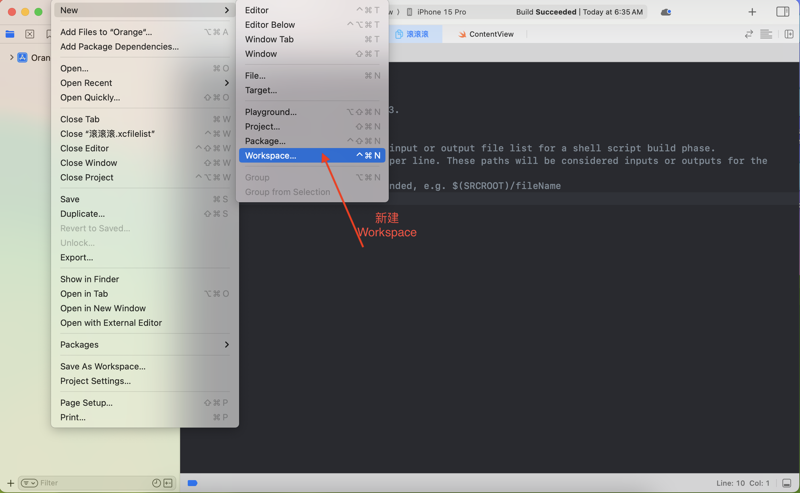
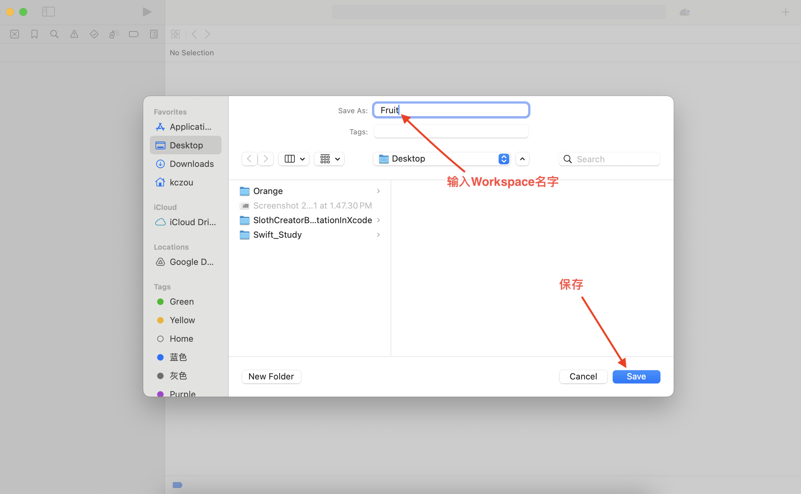
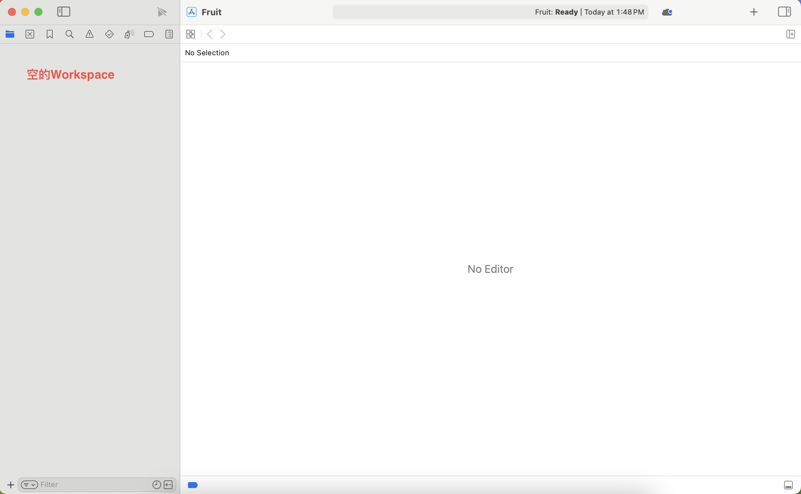
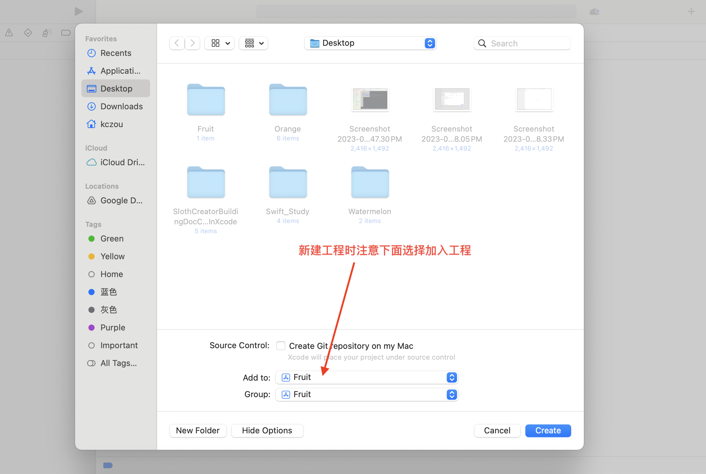
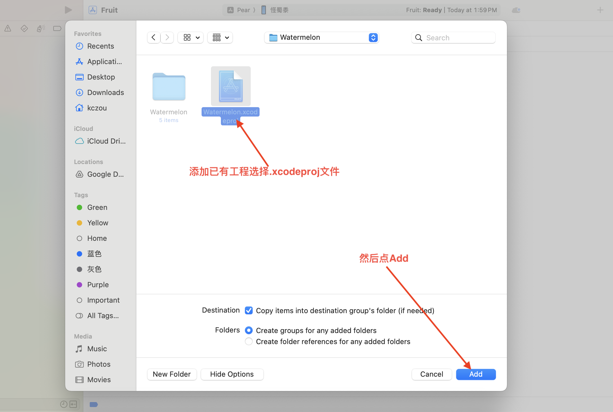
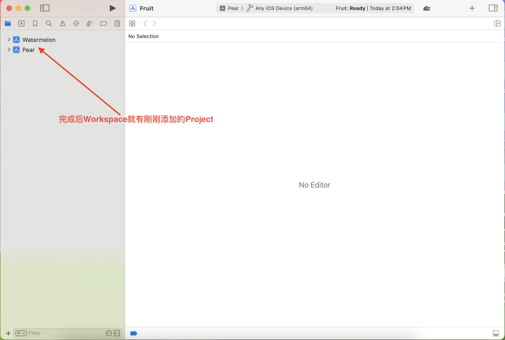
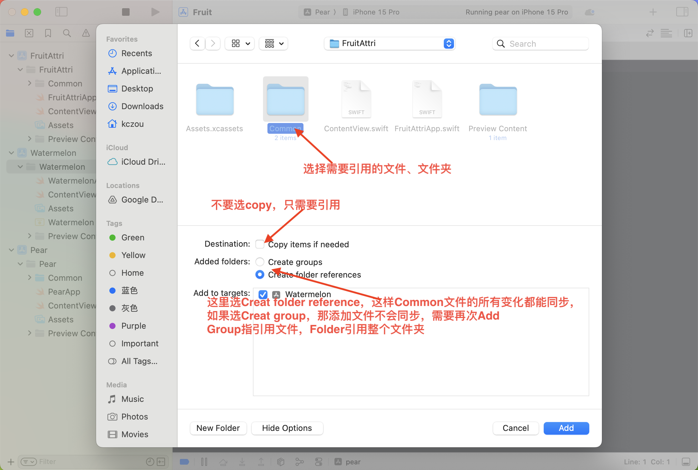
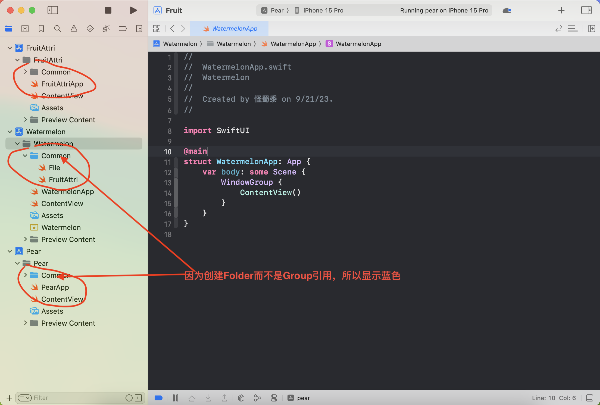
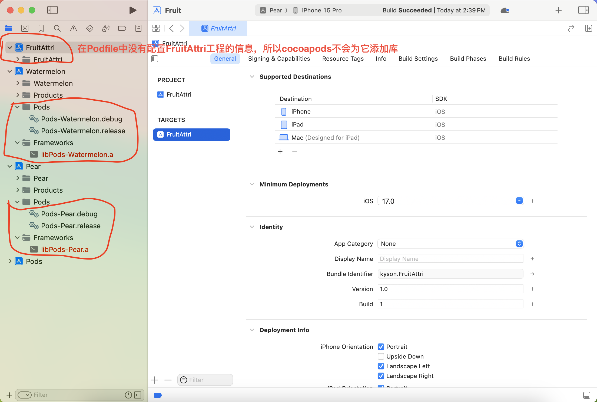

多个APP同时开发的情况，就会有公共代码的需求，那么如何管理公共代码和让不同工程引用呢？

1. 项目工程互相独立，公共代码就在不同的项目里直接修改，然后手动复制到其它项目。这是最简单最垃圾的方式。
2. 项目工程互相独立，公共代码组件化然后部署到cocoapods上面，不同的项目分别用cocoapods去引用它，当公共组件更新的时候，分别在两个app项目端进行更新。这笔第一种方式要好很多。
3. 通过workspace来管理多个项目，公共库可以直接使用、用cocoapods管理，可以通过Framework管理、可以通过Library管理。这样就不需要像第2种方式那样分别更新不同的项目。

### 新建workspace

新建Fruit空间，添加Pear和Watermelon工程

任意打开一个工程，点击 **File> New > Workspace**

 





新建成功并打开Fruit是一个空的工作空间，结下来需要添加工程，有两种方式

1. 添加工程方式一：**File > New > Project** , 然后注意底部选择添加到空间**Add to:**即可

   

2. 添加工程方式二：**File > Add File To "Fruit"** , 然后选择需要添加的工程文件**.xcodeproj**添加

   

包含了两个工程的Workspace




### 将公共代码放在一个新的工程中，然后引用

新建一个工程FruitAttri工程，然后Pear和Water引用其中的内容

> 新建一个文件夹也行





Pear和Watermelon都使用Folder引用Common文件夹，所有的修改也能同步

### 将公共代码制作成Cocoapods库，然后引用

如何使用和制作Cocoapods库的方法在《iOS-Cocoapods》中

- 添加Podfile信息

  ```text
  # cocoapods库源
  source 'https://github.com/CocoaPods/Specs.git'
  
  # 如有公共组件已经封装成了私有库，则通过链接引用，如果是公有库，则和下面的引用方式一样
  # source 'https://github.com/jiangxiaobin1011/JSpecs.git'
  
  # 写在最上面，表示公用
  platform :ios, '15.0'
  
  # 用cocoapods导入OC框架到Swift项目必须写该项
  # use_frameworks!
  
  ## workspace文件名，必须指定空间
  workspace 'Fruit.xcworkspace'
  
  ## 主工程路径，不用设置也行好像
  # project 'Pear/Pear.xcodeproj'
  
  # 公用第三方库
  # def commonPods
  #   pod 'SDWebImage'
  # end
  
  # 工程，target...end内部的库只会在该工程被引用
  target 'Pear' do
    project 'Pear/Pear.xcodeproj'
    
    pod 'Masonry', '~> 1.0.2'
    pod 'MBProgressHUD'
    pod 'SDWebImage'
    pod 'SDCycleScrollView'
   # commonPods
  end
  
  # 工程
  target 'Watermelon' do
    project 'Watermelon/Watermelon.xcodeproj'
   # commonPods
  end
  ```

- pod install 把上面配置的库添加进项目，这样就实现共享共用库了

  

>遇到非预期情况的思考：
>
>看前面的Podfile配置，应该是watermelon工程没有导入任何第三方库的，预期是不能引用任何第三方库的，但是pod install 以后却可以正常引用写代码编译，但是运行就会报错：**reason: '+[UIImage sd_imageWithData:]: unrecognized selector sent to class 0x10a7ee4b8'**
>
>原因：
>
>这是因为cocoapods给项目工程添加了**Pods-watermelon.debug、Pods-watermelon.release** 配置设置文件，而这个文件里的 HEADER_SEARCH_PATHS 有第三方头文件的搜索路径，所以在写代码的时候能够引用。因为我们实际上是没有添加这些库的，所以Pods-watermelon.xxx就没有设置库文件的搜索路径（LIBRARY_SEARCH_PATHS）和链接（OTHER_LDFLAGS）信息，所以在运行的时候就找不到对应的库文件链接，从而报找不到实现方法的错误


### 将公共代码构建成Library库，然后引用

如何使用和制作Library库的方法在《iOS-Library》中

<font color = "red"> 如何引用</font>

### 将公共代码构建成Framework库，然后引用

如何使用和制作Framework库的方法在《iOS-Library》中

<font color = "red"> 如何引用</font>

**白嫖**

[iOS开发: Workspace管理多个Project的简单使用](https://juejin.cn/post/6882638131670040589)

