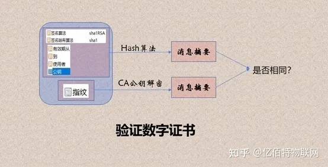
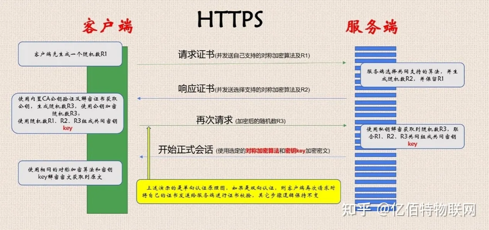

- HTTPS协议在HTTP协议的基础上加上了SSL/TLS协议加密层，对数据进行加密保证数据的安全
- SSL证书是数字证书的一种，由受信任的数字证书颁发机构（简称CA）颁发，数字证书包含.csr证书签名请求文件内容和CA的数字签名（用CA自己的私钥对内容的信息摘要进行签名）
- HTTPS的安全性是在CA机构背书的前提下的
- HTTPS如何确保服务端的合法性：客户端向服务端请求证书，服务端返回证书，
  1. 客户端用CA机构一样的信息摘要算法计算返回证书中.scr证书签名请求文件内容得到返回信息摘要
  2. 客户端用CA机构的公钥去解密返回证书中的CA数字签名得到签名信息摘要，
  3. 比较这俩个摘要是否相同即可判断证书的有效性
  4. 服务端如果要验证客户端的合法性也是一样的方式
- HTTPS如何实现数据的加密传输：**利用非对称性加密协商对称加密密钥对之后的通信数据使用对称加密传输**
  1. 客服端向服务端请求证书并发送随机字符串R1
  2. 服务端向客户端响应请求发送证书和随机字符串R2
  3. 客户端验证用证书的有效性之后再用服务端的公钥加密一段随机字符串R3发送给客户端
  4. 服务端收到加密的R3字符串用自己的私钥解密得到R3明文
  5. R1、R2、R3组成之后通信的对称密钥
  6. 这整个过程中确保了服务端的合法性，因为通过非对称加密协商对称加密密钥，整个过程对称加密密钥没有经过网络传输，只有客户端和服务端本地知道，所以理论上对称加密密钥是没有泄漏的，没有泄漏既通信安全
- 摘要只能保证数据的完整性，而不能保证数据的合法性
- 签名是基于摘要的，所以签名可以保证数据的完整性和合法性
- 数据在互联网传输中被截取是不可避免的，安全性的一大要点是数据被破译的难度

### HTTPS

HTTPS 协议是为了保证数据传输的安全而生，它使用默认端口443，但它其实并不是一个全新的协议，而是HTTP 协议基本之上 再加上SSL/TLS 协议。因此当你访问一个支持 https 的网站时，是需要先进行 SSL/TLS 握手建立连接的。

SSL/TLS 握手的目的是为了安全地协商（使用非对称加密进行密钥的协商）出一份对称加密的密钥，有了这个密钥之后，后续的数据全部使用这个密钥进行加密。

### SSL/TSL

SSL（Secure Socket Layer 安全套接层）是基于HTTPS下的一个协议加密层，由于HTTPS的推出受到了很多人的欢迎，在SSL更新到3.0时，IETF对SSL3.0进行了标准化，并添加了少数机制（但是几乎和SSL3.0无差异），标准化后的IETF更名为TLS1.0（Transport Layer Security 安全传输层协议），可以说TLS就是SSL的新版本3.1。

> TLS（Transport Layer Security）是更为安全的升级版 SSL（Secure Socket Layer ）
>
> TLS（Transport Layer Security）是Secure Socket Layer ）的标准化后的产物

SSL协议位于TCP/IP协议与各种应用层协议之间，为数据通讯提供安全支持。SSL协议可分为两层： SSL记录协议（SSL Record Protocol）：它建立在可靠的传输协议（如TCP）之上，为高层协议提供数据封装、压缩、加密等基本功能的支持。 SSL握手协议（SSL Handshake Protocol）：它建立在SSL记录协议之上，用于在实际的数据传输开始前，通讯双方进行身份认证、协商加密算法、交换加密密钥等。

### 摘要&数字签名

1. 摘要

   一段信息，经过摘要算法得到一串哈希值（hash），就是摘要（dijest）。

   常见的摘要算法有MD5、SHA1、SHA256、SHA512等。

   摘要的特点：

   - 摘要算法，是把任意长度的信息，映射成一个定长的字符串。
   - 摘要算法，两个不同的信息，是有可能算出同一个摘要值的。
   - 摘要算法与加密算法不同，不存在解密的过程。
   - 摘要算法不用于数据的保密，而是用于数据的完整性校验。
   
2. 数字签名

   摘要经过私钥的加密后，便有了一个新的名字 -- 数字签名。

   - 签名 是在发送方，这是一个加密的过程。
   - 验签 是在接收方，这是一个解密的过程。

**思考一：摘要和数字签名的区别**

摘要可以验证数据的完整性，签名是验证数据的合法性（数据是不是CA认证过的）

如果省去签名而也用摘要来验证数据的合法性，那就需要CA中心保存认证过的所有摘要信息，然后验证者去对比验证，流程繁琐且貌似这种验证方式就是不安全的可以被攻击

用签名的话，就CA中心用私钥对摘要签名，验证者用公钥去解密然后对比，流程简单且安全（只要CA中心的私钥不泄漏）

**思考二：为什么要有摘要且对摘要加密签名，而不是直接对内容加密签名**

签名是非对称加密，速度很慢且数据量大，所以如果直接对内容进行签名的话会导致效率低下

### 数字证书

所谓数字证书，就是一份类似于身份证一样的网络通信凭证。由数字证书颁发机构（CA）使用私钥对签名请求文件摘要做的签名（盖章），表示CA结构对证书持有者的认可。 

>CA机构对数字证书内容的一种背书

我们在申请数字证书时，会提供一个.csr文件（域名、申请者、公钥等信息） 给 CA 机构，CA 机构收到申请后，会通过各种手段验证申请者的组织信息和个人信息，如无异常(组织存在，企业合法，确实是域名的拥有者)，CA 就会使用散列算法对.csr里的明文信息先做一个HASH，得到一个信息摘要，再用 CA 自己的私钥对这个信息摘要进行加密，生成一串密文，密文即是所说的 签名。签名 + .csr 明文信息，即是 证书，CA 把这个证书返回给申请人。

**判断数字证书的完整性和合法性**

当客户端请求数据从浏览器端获取到数字证书后，对数字证书中的.csr内容使用Hash算法计算获取到新的摘要，通过CA机构的公钥对数字证书中的签名进行解密得到签名摘要，对比两个摘要是否相同。如果内容对不上，那肯定这个证书是有问题的，证书里面的内容也就不可信了。

### HTTPS请求过程

https如何保证服务器的合法性、数据的完整性、数据的安全性？

在第一次请求时，客户端先去请求服务端的数字证书，并且生成一个随机数R1，将随机数和自己支持的加密算法告诉服务端。

服务端收到客户端的请求后，选择双方共同支持的加密算法，并且生成新的随机数R2，将服务器的数字证书及加密算法、随机数一并返回给客户端。

客户端收到服务端的数字证书，然后判断数字证书的完整性和合法性，从而确保通信安全。然后生成新的随机数R3，使用服务端的公钥对随机数R3进行加密后返回给服务端并将随机数R1、R2、R3组合成一串密钥用作对称加密用。

服务端收到客户端加密后的随机数R3，使用自己的私钥对密文进行解密获取到随机数R3，组合R1、R2、R3获取到一串密钥(和客户端一致)；然后开始使用对称加密进行通信。

上述就是HTTPS对密钥协商的过程，由于非对称加密一方密匙加密后只能使用另一方密匙解密，所以在前两次数据传输中即使被窃听也不怕，因为在第三次传递随机数R3时是使用公钥加密的，只有服务端的私钥才能解密，从而确保密钥的安全性。

合法性：通过数字证书来确定

完整性、安全性：因为通过非对称加密协商对称加密密钥，所以对称加密密钥是没有在互联网中暴漏过的，所以第三方是很难破解数据和篡改数据的

### 单双向认证

在上面的例子中，客户端请求服务端获取证书信息进行认证，这个就是单向认证，只是客户端认证服务端，但是服务端并没有认证客户端的请求。HTTPS支持单向认证，也支持双向认证。

双向认证的情况通常比较少见，常见于银行等领域，就像我们以前使用银行的U盾，这就是一种双向认证案例，还有就是在电脑上安装支付宝的证书等；双向认证比单向认证更加安全，但是需要对每一个客户端都进行分配证书。

### 参考

[HTTPS如何保证数据安全](https://zhuanlan.zhihu.com/p/578936926)

[数字证书、签名](https://www.51cto.com/article/628890.html)

