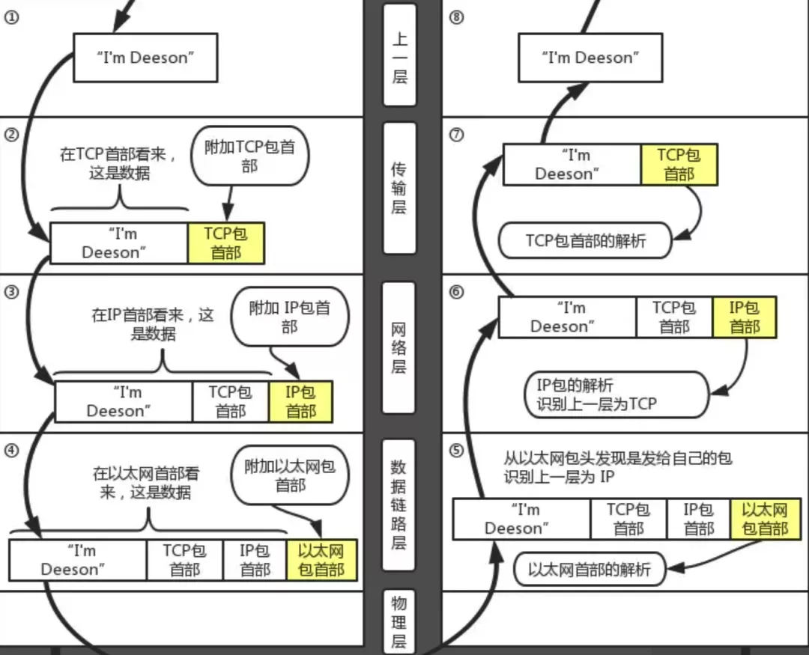
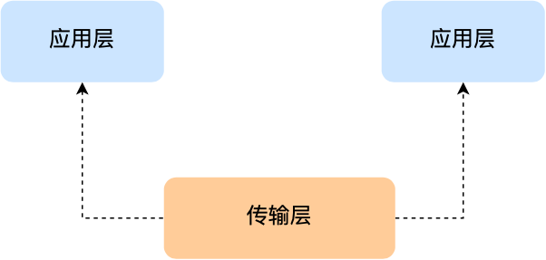
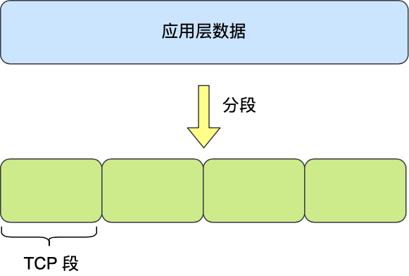
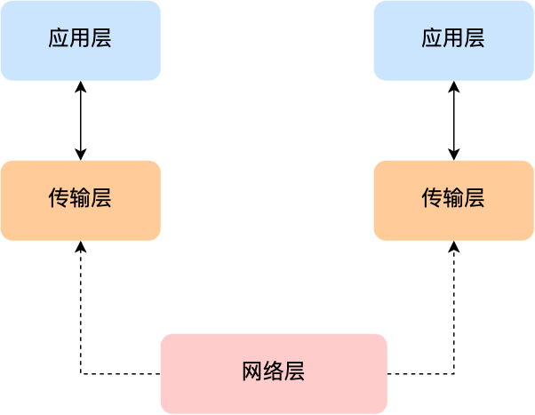
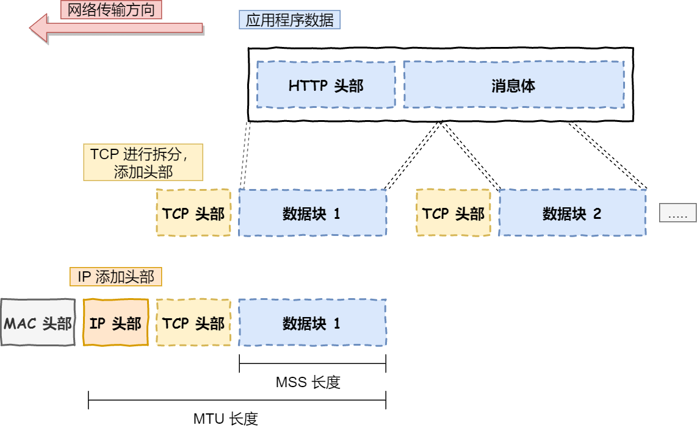
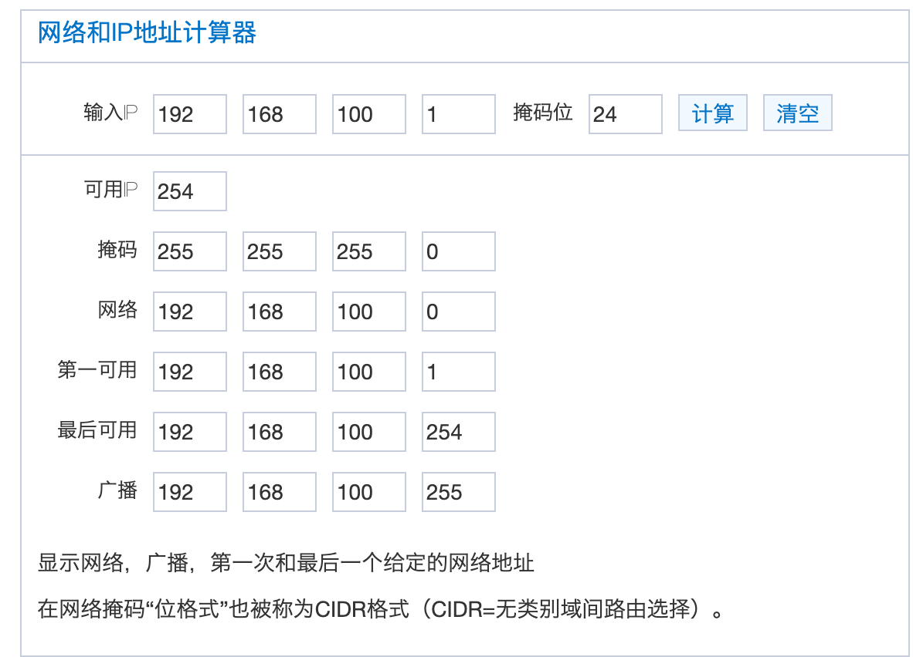
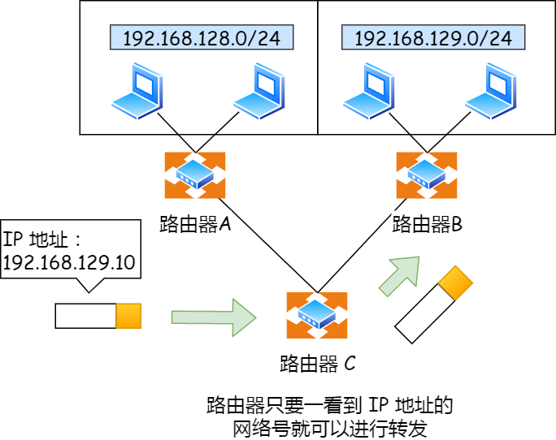
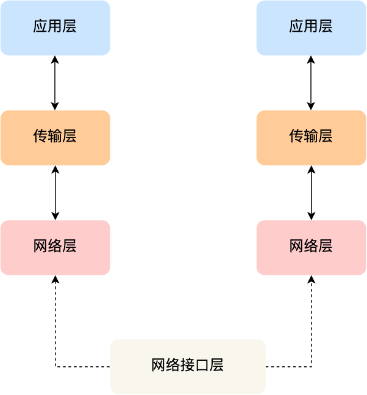
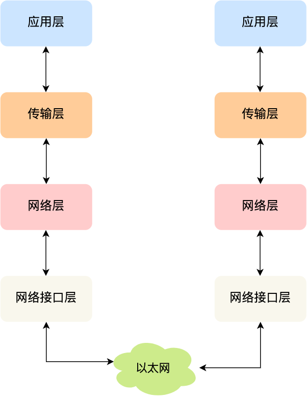
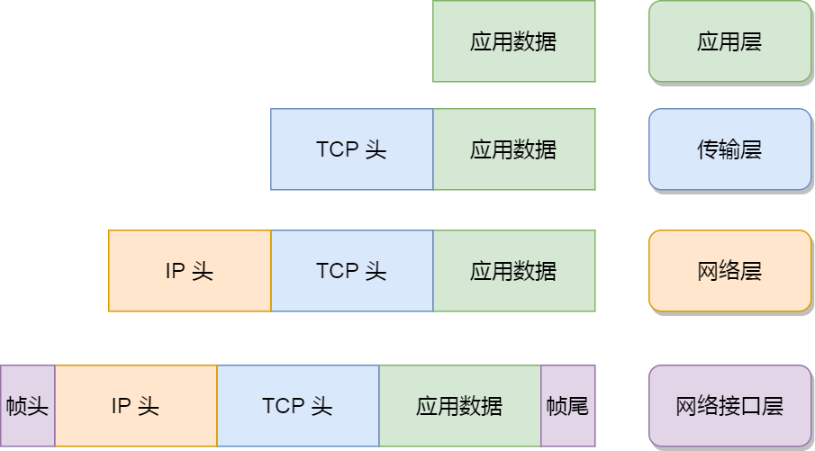

### OSI七层模型

OSI 模型（Open Systems Interconnection Model）是一个将计算机网络通信划分为七个不同层次的概念框架。每个层次有其独特的功能和任务，它们协同工作以实现端到端的通信。

#### 物理层

- Physical Layer
- 传输比特流（bit)，010101 
- 定义了通信传输设备的标准，比如网线、光纤、接口等。

```plaintext
首先解决两台物理机之间的通信需求，具体就是机器A往机器B发送比特流，机器B能收到比特流。

物理层主要定义了物理设备的标准，如网线的类型，光纤的接口类型，各种传输介质的传输速率。

主要作用是传输比特流（0101二进制数据），将比特流转化为电流强弱传输，到达目的后再转化为比特流，即常说的数模转化和模数转换。

这层数据叫做比特。「网卡工作在这层」。

物理层是OSI七层模型的物理基础，没有它就谈不上数据传输了
```

```plaintext
ChatGPT
物理层（Physical Layer）是计算机网络中的一层，位于OSI（开放式系统互连参考模型）模型的底层，即第一层。它的主要任务是负责处理物理媒体上的比特流（0和1），将数字信号转换为适合在网络媒体上传输的模拟信号，以及管理数据的物理传输。

以下是物理层的一些主要功能和特点：

1. **数据编码：** 物理层负责将数字数据转换为模拟信号，以便通过传输媒体（如电缆、光纤、无线信道）传输。这包括将比特转换为电压、光强度或无线电波等模拟信号。

2. **物理介质：** 物理层定义了网络的物理介质，包括电缆的类型（如双绞线、同轴电缆、光纤）、信号的传播方式（如电流、光信号、无线电波）以及连接器和接口的规范。

3. **信号传输：** 物理层管理数据在物理媒体上的传输，包括信号的放大、衰减、传播延迟等特性。它确保信号在传输过程中不会失真。

4. **传输速率和时序：** 物理层定义了数据的传输速率（比特率）以及数据帧的时序和同步。它确保发送和接收端的时钟同步，以便正确解释数据。

5. **物理拓扑：** 物理层定义了网络的拓扑结构，包括总线型、星型、环型等。不同的拓扑结构需要不同的物理连接方式。

6. **媒体访问控制：** 在某些情况下，物理层也包括媒体访问控制（MAC）功能，用于协调多个设备在共享媒体上的访问，例如以太网中的CSMA/CD。

7. **信号增强：** 物理层可以包括信号的增强和中继设备，以扩展网络的范围和性能。

总之，物理层在计算机网络中起到了连接不同网络设备并管理数据传输的关键作用。它负责处理物理信号、介质、速率、同步和连接的细节，以确保数据能够在不同设备之间可靠地传输。不同的物理层技术和介质用于不同的网络类型和应用场景，例如以太网、光纤网络、Wi-Fi等。
```


#### 数据链路层

- Data Link Layer
- 解决设备-设备之间的通信，并提供错误检测和纠正
- 添Mac地址信息...，将数据封装成比特帧（以太网帧），然后通过以太网传输到下一台设备
- 主要的协议、技术有：IP/TCP协议中的ARP寻址协议、以太网协议、WIFI、蓝牙

```plaintext
在传输比特流的过程中，会产生错传、数据传输不完整的可能。

数据链路层定义了「如何格式化数据进行传输」，以及如何控制对物理介质的访问。通常提供错误检测和纠正，以确保数据传输的准确性。

本层将比特数据组成帧，交换机工作在这层，对帧解码，并根据帧中包含的信息把数据发送到正确的接收方。
```

```plaintext
ChatGPT
数据链路层（Data Link Layer）是计算机网络中的一层，位于OSI（开放式系统互连参考模型）模型的第二层。它的主要任务是在直接相连的两个网络节点之间提供可靠的数据传输，确保数据的高效交换和错误检测。

以下是数据链路层的一些主要功能和特点：

1. **物理地址（MAC地址）：** 数据链路层使用物理地址（也称为MAC地址）来唯一标识网络中的设备。MAC地址通常是由硬件制造商分配的，它们用于在局域网（LAN）中识别设备。

2. **数据帧封装：** 数据链路层将数据分割成较小的数据帧（Frames），并为每个数据帧添加头部和尾部信息，以便在物理介质上传输。这些帧包含了源和目标的MAC地址，以及其他控制信息。

3. **流量控制：** 数据链路层可以使用流量控制技术来管理数据的传输速率，以防止发送端发送过多的数据导致接收端无法处理。

4. **差错检测和纠正：** 数据链路层可以检测数据传输过程中可能出现的错误，并在必要时请求重传。这可以通过差错检测码（如CRC）来实现。

5. **访问控制：** 在共享媒体的局域网中，数据链路层也负责管理对共享媒体的访问。常见的访问控制协议包括CSMA/CD（用于以太网）和CSMA/CA（用于Wi-Fi）。

6. **帧的传输和接收：** 数据链路层负责将数据帧从发送端传输到接收端，并确保帧在接收端的正确重组。

7. **网络拓扑：** 数据链路层定义了局域网的拓扑结构，例如星型、总线型、环型等，以及如何在这些拓扑结构中传输数据帧。

8. **协议：** 数据链路层的协议通常因不同的局域网技术而异。例如，以太网是一种常见的数据链路层协议，而Wi-Fi使用不同的协议。

总之，数据链路层在计算机网络中负责直接相连的节点之间的数据传输。它提供了错误检测、流量控制、物理地址分配和帧传输等功能，以确保数据的可靠传输和接收。不同的局域网技术使用不同的数据链路层协议，但它们都在这一层提供了类似的基本服务。

```


#### 网络层

- Network Layer
- 解决不同网络之间的通信，通过路由确定最佳的转发策略。
- 添加源IP、目标IP...，将数据封装成IP数据包，交给数据链路层处理
- 主要的协议技术有：TCP/IP中的IP协议、ICMP

```plaintext
随着网络节点的不断增加，点对点通讯需要通过多个节点，如何找到目标节点，如何选择最佳路径成为首要需求。

网络层主要功能是将网络地址转化为对应的物理地址，并决定如何将数据从发送方路由到接收方。

网络层通过综合考虑发送优先权、网络拥塞程度、服务质量以及可选路由的花费来决定从一个网络中节点A到另一个网络中节点B的最佳路径。

由于网络层处理并智能指导数据传送，路由器连接网络隔断，所以路由器属于网络层。

此层的数据称之为数据包。本层需要关注的协议TCP/IP协议中的IP协议。
```

```plaintext
ChatGPT
网络层（Network Layer）是计算机网络中的一层，位于OSI（开放式系统互连参考模型）模型的第三层。它的主要任务是在不同网络之间提供数据包的路由、转发和交付服务，以确保数据从源主机传输到目标主机，并且可以跨越不同的网络。

以下是网络层的一些主要功能和特点：

1. **数据包路由：** 网络层根据目标地址（通常是IP地址）来决定如何将数据包从源主机传输到目标主机。它维护路由表，这些表用于确定数据包的下一跳路由器或网关。

2. **跨网络通信：** 网络层允许不同的物理网络相互连接，使数据可以在这些网络之间传输。它提供了一种抽象的、独立于物理网络的方式来进行通信。

3. **分组交换：** 在网络层，数据通常被分成较小的数据包，这些数据包可以独立传输，并且可以采用不同的路径到达目标。这种分组交换的方式允许更有效地利用网络资源。

4. **逻辑地址：** 网络层使用逻辑地址（通常是IP地址）来标识主机和设备，而不是物理地址（如MAC地址）。这使得主机可以在不同网络中移动而无需更改其地址。

5. **数据包转发：** 网络层负责在路由器和交换机之间进行数据包转发。路由器根据目标地址决定将数据包发送到哪个接口，以便它能够沿着正确的路径到达目标主机。

6. **错误处理：** 网络层可以处理一些网络层的错误，例如目标不可达、数据包丢失等，并根据需要发送错误消息。

7. **网络协议：** 最常见的网络层协议是Internet协议（IP），它是互联网的基础协议。IPv4和IPv6是两个广泛使用的IP协议版本。

总之，网络层在计算机网络中起到关键作用，它为不同主机和网络之间的通信提供了路由和转发服务。通过逻辑地址，它允许数据包在网络之间自由传输，确保数据的可达性和可靠性。不同的网络层协议和技术可以用来满足不同网络需求，而IP是最常用的网络层协议之一。
```


#### 传输层

- Transport Layer
- 解决端到端的数据传输，提供可靠数据传输服务、控制数据流量、错误检测和纠正、超时重传、拥塞控制等
- 添加源端口号、目标端口号...，将数据封装成数据段（Segement），交给网络层处理。
- 主要的协议有：IP/TCP中的TCP、UDP

```plaintext
随着网络通信需求的进一步扩大，通信过程中需要发送大量的数据，如海量文件传输，可能需要很长时间，网络在通信的过程中会中断很多次，此时为了保证传输大量文件时的准确性，需要对发送出去的数据进行切分，切割为一个一个的段落（Segement）发送，其中一个段落丢失是否重传，段落是否按顺序到达，是传输层需要考虑的问题。

传输层解决了主机间的数据传输，数据间的传输可以是不同网络，并且传输层解决了「传输质量」的问题。

传输层需要关注的协议有TCP/IP协议中的TCP协议和UDP协议。
```

```plaintext
传输层（Transport Layer）是计算机网络中的一层，位于OSI（开放式系统互连参考模型）模型的第四层。它的主要任务是在源主机和目标主机之间提供端到端的数据传输服务，确保数据可靠地从一个端点传输到另一个端点。

以下是传输层的一些主要功能和特点：

1. **端到端通信：** 传输层负责确保两台主机之间的端到端通信。它通过使用源端口和目标端口标识不同的应用程序进程，以便将数据正确交付到目标。

2. **可靠性：** 传输层可以提供可靠的数据传输服务，通过使用确认和重传机制来确保数据的完整性和可靠性。如果数据在传输过程中丢失或损坏，传输层将负责重新发送丢失的数据。

3. **流量控制：** 传输层可以控制数据的流量，以防止发送端发送过多的数据导致网络拥塞。这通过使用滑动窗口等机制来实现。

4. **多路复用和多路分解：** 传输层支持多路复用，这意味着它可以在同一个网络连接上同时传输多个数据流。然后，它使用目标端口将这些数据流正确地分解到不同的应用程序进程。

5. **错误检测和纠正：** 传输层可以使用一些错误检测和纠正技术来检测和修复在数据传输中可能出现的错误。

6. **协议：** 传输层常用的协议包括TCP（传输控制协议）和UDP（用户数据报协议）。TCP提供可靠的数据传输，而UDP提供无连接的、不可靠的数据传输。

总之，传输层在计算机网络中扮演了重要角色，它负责提供端到端的数据传输服务，并确保数据的可靠性和完整性。它还支持多路复用、流量控制和错误处理等功能，以满足不同应用程序的需求。常见的应用层协议如HTTP、FTP和SMTP等都依赖于传输层来实现数据的可靠传输。
```


#### 会话层

- Session Layer
- 解决应用服务到应用服务的通信，管理和维护通信会话（sessions）
- socket编程接口，使用socket编程去实现和传输层通信

```plaintext
自动收发包，自动寻址。

会话层作用是「负责建立和断开通信连接」，何时建立，断开连接以及保持多久的连接。常见的协议有 ADSP、RPC 等
```

```plaintext
ChatGPT

会话层（Session Layer）是计算机网络中的一层，位于OSI（开放式系统互连参考模型）模型的第五层。它的主要任务是管理和维护通信会话（sessions）以确保数据在发送和接收系统之间的可靠传输。

以下是会话层的一些主要功能：

1. 会话建立和维护：会话层负责建立、管理和终止通信会话。通信会话是两个应用程序之间的逻辑连接，通过它们可以在网络上交换数据。会话层确保会话的建立和维护，以便应用程序可以在通信期间进行数据交换。

2. 数据同步：会话层可以在数据交换过程中插入同步点，以确保数据的一致性和可靠性。如果在通信中发生错误或中断，会话层可以协助重新建立连接并恢复数据传输。

3. 对话控制：会话层支持对话控制功能，这包括设置会话参数、权限控制、会话结束通知等。

4. 会话管理：会话层负责跟踪多个会话，并确保它们之间的正确管理和切换。

总之，会话层在OSI模型中扮演了一个关键的角色，它提供了一种机制来管理和维护通信会话，以确保数据的可靠传输。这一层有助于应用程序在网络上进行有序的数据交换，并提供了错误处理和数据同步的支持。
```


#### 表示层

- Presentation Layer
- 处理数据的表示、转换、加密、解密、压缩、编码等，以确保在不同系统之间的通信中，数据能够正确的解释和呈现
- 常见的协议有ASCII、SSL/TLS 等

```plaintext
Linux给WIndows发包，不同系统语法不一致，如exe不能在Linux下执行，shell不能在Windows不能直接运行。于是需要表示层。

解决「不同系统之间通信语法问题」，在表示层数据将按照网络能理解的方案进行格式化，格式化因所使用网络的不同而不同。

它主要负责数据格式的转换。具体来说，就是讲设备固有的数据格式转换为网络标准格式。常见的协议有ASCII、SSL/TLS 等
```

```plaintext
ChatGPT
表示层（Presentation Layer）是计算机网络中的一层，位于OSI（开放式系统互连参考模型）模型的第七层。它的主要目标是处理数据的表示和转换，以确保在不同系统之间的通信中，数据的格式和语法得以正确解释和呈现。表示层的功能包括以下几个方面：

1. 数据格式转换：表示层可以将数据从一种格式转换为另一种格式，以便不同系统之间的通信。例如，它可以将文本数据转换为二进制数据或反之。

2. 数据加密和解密：表示层可以加密数据以确保安全传输，同时在接收端进行解密以还原原始数据。

3. 数据压缩和解压缩：为了减少数据传输的带宽占用，表示层可以对数据进行压缩，然后在接收端进行解压缩。

4. 字符编码和解码：当在不同国家或地区之间传输数据时，字符集和编码可能不同，表示层负责将这些字符进行正确编码和解码。

5. 数据的语法检查：表示层可以检查数据的语法，以确保数据没有错误。

总之，表示层的主要任务是处理数据的格式、编码、加密和压缩，以确保数据在网络中的正确传输和解释。这一层的工作有助于不同系统之间的互操作性和数据交换。
```


#### 应用层

- Application Layer
- 提供了用户与计算机网络交互的界面
- 提供各种网络服务和协议：文件传输协议（FTP）、网页浏览协议（HTTP、HTTPS）、远程登录（SSH、Telnet）、域名系统（DNS）、电子邮件传输协议（SMTP），电子邮件接收协议（POP3和IMAP）等
- 通过DNS解析目标域名的IP，遵循协议封装应用层数据，然后交给表示层处理

```plaintext
规定发送方和接收方必须使用一个固定长度的消息头，消息头必须使用某种固定的组成，消息头中必须记录消息体的长度等信息，方便接收方正确解析发送方发送的数据。

应用层旨在更「方便应用从网络中接收的数据」，重点关注TCP/IP协议中的HTTP协议
```

```plaintext
ChatGPT
应用层（Application Layer）是OSI（开放式系统互连参考模型）模型中的最高层，也是网络通信中的最顶层。它直接面向用户应用程序，为用户提供了网络服务和接口，以便他们能够与网络进行交互和通信。应用层的主要任务包括以下几个方面：

1. **用户界面和应用程序接口：** 应用层提供了用户与计算机网络交互的界面，通常通过用户界面或应用程序接口（API）的形式。这些界面允许用户启动应用程序、发送和接收数据、设置参数等。

2. **网络应用和服务：** 应用层包括了各种网络应用和服务，例如电子邮件、文件传输协议（FTP）、网页浏览、远程登录（SSH、Telnet）、域名系统（DNS）查询等。这些应用程序和服务允许用户在网络上执行各种任务和交流信息。

3. **数据表示和编码：** 应用层负责将数据表示为适合于通信的格式。这可能涉及到数据的编码、加密、压缩和解码等操作。

4. **协议支持：** 应用层使用不同的协议来实现不同的网络应用。例如，HTTP协议用于网页浏览，SMTP协议用于电子邮件传输，POP3和IMAP协议用于接收电子邮件等。

5. **错误处理和安全性：** 应用层通常包括错误处理和安全性功能，以确保数据的完整性和安全性。这可以包括数据验证、加密、身份验证和授权等功能。

6. **应用层数据交换：** 应用层负责处理数据的格式、结构和语法，以便不同系统之间的应用程序可以相互理解和通信。

总之，应用层是用户与网络之间的接口层，它为各种网络应用程序和服务提供了平台，并允许用户通过这些应用程序与远程主机进行通信和数据交换。应用层协议和服务的种类非常多样，它们共同构建了互联网中的各种应用，使用户能够实现信息传输、资源共享和远程访问等功能。
```

#### 总结

- 发送端是由上至下，把上层来的数据在头部加上各层协议的数据（部首）再下发给下层。
- 接受端则由下而上，把从下层接受到的数据进行解密和去掉头部的部首后再发送给上层。
- 层层加密和解密后，应用层最终拿到了需要的数据。

示意图




四层传输层数据被称作**「段」**（Segments）；

三层网络层数据被称做**「包」**（Packages）；

二层数据链路层时数据被称为**「帧」**（Frames）；

一层物理层时数据被称为**「比特流」**（Bits）。


### TCP/IP模型

OSI模型注重通信协议必要的功能；TCP/IP更强调在计算机上实现协议应该开发哪种程序

应用层：OSI模型的应用成+表示层+会话层（Application Layer ）

传输层：OSI模型的传输层（Transport Layer）

网络层：OSI模型的网络层（Network Layer）

网络接口层：OSI模型的数据链路层+物理层（Network Port Layer）

####  应用层

最上层的，也是我们能直接接触到的就是**应用层**（*Application Layer*），我们电脑或手机使用的应用软件都是在应用层实现。那么，当两个不同设备的应用需要通信的时候，应用就把应用数据传给下一层，也就是传输层。

所以，应用层只需要专注于为用户提供应用功能，比如 HTTP、FTP、Telnet、DNS、SMTP等。

应用层是不用去关心数据是如何传输的，就类似于，我们寄快递的时候，只需要把包裹交给快递员，由他负责运输快递，我们不需要关心快递是如何被运输的。

而且应用层是工作在操作系统中的用户态，传输层及以下则工作在内核态。

####  传输层

应用层的数据包会传给传输层，**传输层**（*Transport Layer*）是为应用层提供网络支持的。




在传输层会有两个传输协议，分别是 TCP 和 UDP。

TCP 的全称叫传输控制协议（*Transmission Control Protocol*），大部分应用使用的正是 TCP 传输层协议，比如 HTTP 应用层协议。TCP 相比 UDP 多了很多特性，比如流量控制、超时重传、拥塞控制等，这些都是为了保证数据包能可靠地传输给对方。

UDP 相对来说就很简单，简单到只负责发送数据包，不保证数据包是否能抵达对方，但它实时性相对更好，传输效率也高。当然，UDP 也可以实现可靠传输，把 TCP 的特性在应用层上实现就可以，不过要实现一个商用的可靠 UDP 传输协议，也不是一件简单的事情。

应用需要传输的数据可能会非常大，如果直接传输就不好控制，因此当传输层的数据包大小超过 MSS（TCP 最大报文段长度） ，就要将数据包分块，这样即使中途有一个分块丢失或损坏了，只需要重新发送这一个分块，而不用重新发送整个数据包。在 TCP 协议中，我们把每个分块称为一个 **TCP 段**（*TCP Segment*）。



当设备作为接收方时，传输层则要负责把数据包传给应用，但是一台设备上可能会有很多应用在接收或者传输数据，因此需要用一个编号将应用区分开来，这个编号就是**端口**。

比如 80 端口通常是 Web 服务器用的，22 端口通常是远程登录服务器用的。而对于浏览器（客户端）中的每个标签栏都是一个独立的进程，操作系统会为这些进程分配临时的端口号。

由于传输层的报文中会携带端口号，因此接收方可以识别出该报文是发送给哪个应用。

#### 网络层

传输层可能大家刚接触的时候，会认为它负责将数据从一个设备传输到另一个设备，事实上它并不负责。

实际场景中的网络环节是错综复杂的，中间有各种各样的线路和分叉路口，如果一个设备的数据要传输给另一个设备，就需要在各种各样的路径和节点进行选择，而传输层的设计理念是简单、高效、专注，如果传输层还负责这一块功能就有点违背设计原则了。

也就是说，我们不希望传输层协议处理太多的事情，只需要服务好应用即可，让其作为应用间数据传输的媒介，帮助实现应用到应用的通信，而实际的传输功能就交给下一层，也就是**网络层**（*Internet Layer*）。



网络层最常使用的是 IP 协议（*Internet Protocol*），IP 协议会将传输层的报文作为数据部分，再加上 IP 包头组装成 IP 报文，如果 IP 报文大小超过 MTU（以太网中一般为 1500 字节）就会**再次进行分片**，得到一个即将发送到网络的 IP 报文。



网络层负责将数据从一个设备传输到另一个设备，世界上那么多设备，又该如何找到对方呢？因此，网络层需要有区分设备的编号。

我们一般用 IP 地址给设备进行编号，对于 IPv4 协议， IP 地址共 32 位，分成了四段（比如，192.168.100.1），每段是 8 位。只有一个单纯的 IP 地址虽然做到了区分设备，但是寻址起来就特别麻烦，全世界那么多台设备，难道一个一个去匹配？这显然不科学。

因此，需要将 IP 地址分成两种意义：

- 一个是**网络号**，负责标识该 IP 地址是属于哪个「子网」的；
- 一个是**主机号**，负责标识同一「子网」下的不同主机；

怎么分的呢？这需要配合**子网掩码**才能算出 IP 地址 的网络号和主机号。

举个例子，比如 10.100.122.0/24，后面的`/24`表示就是 `255.255.255.0` 子网掩码，255.255.255.0 二进制是「11111111-11111111-11111111-00000000」，大家数数一共多少个1？不用数了，是 24 个1，为了简化子网掩码的表示，用/24代替255.255.255.0。

知道了子网掩码，该怎么计算出网络地址和主机地址呢？

将 10.100.122.2 和 255.255.255.0 进行**按位与运算**，就可以得到网络号，如下图：


将 255.255.255.0 取反后与IP地址进行进行**按位与运算**，就可以得到主机号。

大家可以去搜索下子网掩码计算器，自己改变下「掩码位」的数值，就能体会到子网掩码的作用了。



那么在寻址的过程中，先匹配到相同的网络号（表示要找到同一个子网），才会去找对应的主机。

除了寻址能力， IP 协议还有另一个重要的能力就是**路由**。实际场景中，两台设备并不是用一条网线连接起来的，而是通过很多网关、路由器、交换机等众多网络设备连接起来的，那么就会形成很多条网络的路径，因此当数据包到达一个网络节点，就需要通过路由算法决定下一步走哪条路径。

路由器寻址工作中，就是要找到目标地址的子网，找到后进而把数据包转发给对应的网络内。



所以，**IP 协议的寻址作用是告诉我们去往下一个目的地该朝哪个方向走，路由则是根据「下一个目的地」选择路径。寻址更像在导航，路由更像在操作方向盘**。

#### 网络接口层

生成了 IP 头部之后，接下来要交给**网络接口层**（*Link Layer*）在 IP 头部的前面加上 MAC 头部，并封装成数据帧（Data frame）发送到网络上。



IP 头部中的接收方 IP 地址表示网络包的目的地，通过这个地址我们就可以判断要将包发到哪里，但在以太网的世界中，这个思路是行不通的。

什么是以太网呢？电脑上的以太网接口，Wi-Fi接口，以太网交换机、路由器上的千兆，万兆以太网口，还有网线，它们都是以太网的组成部分。以太网就是一种在「局域网」内，把附近的设备连接起来，使它们之间可以进行通讯的技术。

以太网在判断网络包目的地时和 IP 的方式不同，因此必须采用相匹配的方式才能在以太网中将包发往目的地，而 MAC 头部就是干这个用的，所以，在以太网进行通讯要用到 MAC 地址。

MAC 头部是以太网使用的头部，它包含了接收方和发送方的 MAC 地址等信息，我们可以通过 ARP 协议获取对方的 MAC 地址。

所以说，网络接口层主要为网络层提供「链路级别」传输的服务，负责在以太网、WiFi 这样的底层网络上发送原始数据包，工作在网卡这个层次，使用 MAC 地址来标识网络上的设备。

#### 总结

综上所述，TCP/IP 网络通常是由上到下分成 4 层，分别是**应用层，传输层，网络层和网络接口层**。



再给大家贴一下每一层的封装格式：



网络接口层的传输单位是帧（frame），IP 层的传输单位是包（packet），TCP 层的传输单位是段（segment），HTTP 的传输单位则是消息或报文（message）。但这些名词并没有什么本质的区分，可以统称为数据包。


### TCP/IP协议族

从字面意义上来讲，TCP/IP是指**「传输层」**的TCP协议和**「网络层」**的IP协议。

实际上，TCP/IP只是利用 IP 进行通信时所必须用到的协议群的统称。

其中最重要的包括：

1. **IP（Internet Protocol）**：互联网协议，负责在网络上定位和路由数据包。IPv4和IPv6是两个主要版本。

2. **TCP（Transmission Control Protocol）**：传输控制协议，提供可靠的、面向连接的数据传输服务，确保数据的可靠性和顺序性。

3. **UDP（User Datagram Protocol）**：用户数据报协议，提供不可靠的、面向无连接的数据传输服务，通常用于实时应用和多播通信。

4. **ICMP（Internet Control Message Protocol）**：互联网控制消息协议，用于传输网络错误和控制消息，例如Ping命令。

5. **ARP（Address Resolution Protocol）**：地址解析协议，用于将IP地址映射到物理MAC地址，以便在局域网中进行通信。

6. **RARP（Reverse Address Resolution Protocol）**：反向地址解析协议，与ARP相反，将MAC地址映射到IP地址。

7. **FTP（File Transfer Protocol）**：文件传输协议，用于在网络上传输文件。

8. **HTTP（Hypertext Transfer Protocol）**：超文本传输协议，用于在Web上传输HTML和其他资源。

9. **HTTPS（HTTP Secure）**：加密的HTTP协议，用于安全地传输敏感信息，如信用卡信息和登录凭据。

10. **SMTP（Simple Mail Transfer Protocol）**：简单邮件传输协议，用于电子邮件的发送。

11. **POP3（Post Office Protocol version 3）**：邮局协议第3版，用于从邮件服务器上接收电子邮件。

12. **IMAP（Internet Message Access Protocol）**：互联网消息访问协议，用于在邮件服务器上管理电子邮件。

13. **DNS（Domain Name System）**：域名系统，用于将域名映射到IP地址，以便在Internet上查找主机。

14. **DHCP（Dynamic Host Configuration Protocol）**：动态主机配置协议，用于自动分配IP地址和其他网络配置信息。

15. **SNMP（Simple Network Management Protocol）**：简单网络管理协议，用于管理和监控网络设备和服务。

这些协议共同构成了TCP/IP协议套件，支持了互联网和许多其他计算机网络的运作。不同的协议在不同的网络层次上工作，以实现各种网络功能。


