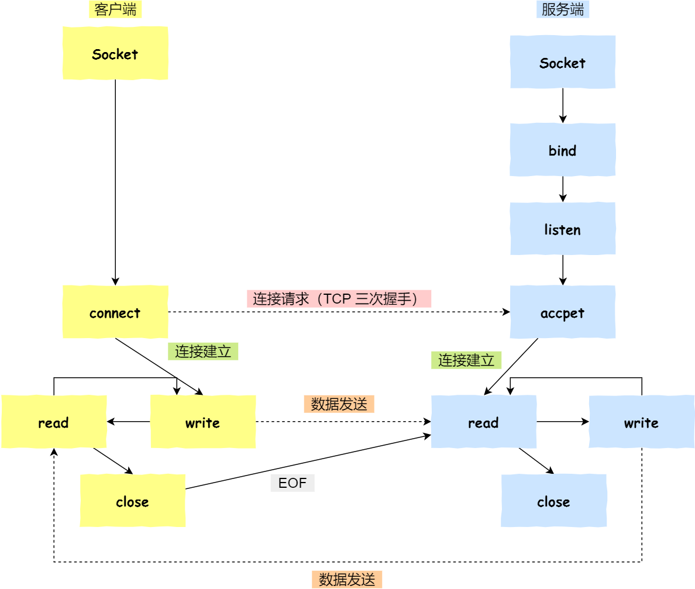

- 服务端的半连接队列（SYN队列）、全连接队列（Accept队列）

- 客户端 connect 成功返回是在第二次握手，服务端 accept 成功返回是在三次握手成功之后。

- 服务端没有Accept也能建立连接

- 服务端没有listen也能建立连接

  

### Socket是什么？

Socket网络编程就是编写程序使两台联网的计算机相互交换数据。

不要把 socket 想得太复杂，它其实和一般的文件读写没有太大区别。

socket中文叫套接字，就是TCP/IP协议栈中不同主机应用进程之间进行双向通信的端点抽象。一个socket就是网络上进程通信的一端，提供了应用进程利用网络协议交换数据的机制。socket上联应用进程，下联操作系统TCP/IP协议栈。是应用程序通过网络协议进行通信的接口。


###  针对 TCP 应该如何 Socket 编程？



- 服务端和客户端初始化 `socket`，得到文件描述符；
- 服务端调用 `bind`，将 socket 绑定在指定的 IP 地址和端口;
- 服务端调用 `listen`，进行监听；
- 服务端调用 `accept`，等待客户端连接；
- 客户端调用 `connect`，向服务端的地址和端口发起连接请求；
- 服务端 `accept` 返回用于传输的 `socket` 的文件描述符；
- 客户端调用 `write` 写入数据；服务端调用 `read` 读取数据；
- 客户端断开连接时，会调用 `close`，那么服务端 `read` 读取数据的时候，就会读取到了 `EOF`，待处理完数据后，服务端调用 `close`，表示连接关闭。

这里需要注意的是，服务端调用 `accept` 时，连接成功了会返回一个已完成连接的 socket，后续用来传输数据。

所以，监听的 socket 和真正用来传送数据的 socket，是「两个」 socket，一个叫作**监听 socket**，一个叫作**已完成连接 socket**。

成功连接建立之后，双方开始通过 read 和 write 函数来读写数据，就像往一个文件流里面写东西一样。

###  listen 时候参数 backlog 的意义？

Linux内核中会维护两个队列：

- 半连接队列（SYN 队列）：接收到一个 SYN 建立连接请求，处于 SYN_RCVD 状态；
- 全连接队列（Accpet 队列）：已完成 TCP 三次握手过程，处于 ESTABLISHED 状态；


```
int listen (int socketfd, int backlog)
```

- 参数一 socketfd 为 socketfd 文件描述符
- 参数二 backlog，这参数在历史版本有一定的变化

在早期 Linux 内核 backlog 是 SYN 队列大小，也就是未完成的队列大小。

在 Linux 内核 2.2 之后，backlog 变成 accept 队列，也就是已完成连接建立的队列长度，**所以现在通常认为 backlog 是 accept 队列。**

**但是上限值是内核参数 somaxconn 的大小，也就说 accpet 队列长度 = min(backlog, somaxconn)。**

想详细了解 TCP 半连接队列和全连接队列，可以看这篇：[TCP 半连接队列和全连接队列满了会发生什么？又该如何应对？](https://xiaolincoding.com/network/3_tcp/tcp_queue.html)

###  accept 发生在三次握手的哪一步？

我们先看看客户端连接服务端时，发送了什么？


- 客户端的协议栈向服务端发送了 SYN 包，并告诉服务端当前发送序列号 client_isn，客户端进入 SYN_SENT 状态；
- 服务端的协议栈收到这个包之后，和客户端进行 ACK 应答，应答的值为 client_isn+1，表示对 SYN 包 client_isn 的确认，同时服务端也发送一个 SYN 包，告诉客户端当前我的发送序列号为 server_isn，服务端进入 SYN_RCVD 状态；
- 客户端协议栈收到 ACK 之后，使得应用程序从 `connect` 调用返回，表示客户端到服务端的单向连接建立成功，客户端的状态为 ESTABLISHED，同时客户端协议栈也会对服务端的 SYN 包进行应答，应答数据为 server_isn+1；
- ACK 应答包到达服务端后，服务端的 TCP 连接进入 ESTABLISHED 状态，同时服务端协议栈使得 `accept` 阻塞调用返回，这个时候服务端到客户端的单向连接也建立成功。至此，客户端与服务端两个方向的连接都建立成功。

从上面的描述过程，我们可以得知**客户端 connect 成功返回是在第二次握手，服务端 accept 成功返回是在三次握手成功之后。**

###  客户端调用 close 了，连接是断开的流程是什么？

我们看看客户端主动调用了 `close`，会发生什么？


- 客户端调用 `close`，表明客户端没有数据需要发送了，则此时会向服务端发送 FIN 报文，进入 FIN_WAIT_1 状态；
- 服务端接收到了 FIN 报文，TCP 协议栈会为 FIN 包插入一个文件结束符 `EOF` 到接收缓冲区中，应用程序可以通过 `read` 调用来感知这个 FIN 包。这个 `EOF` 会被**放在已排队等候的其他已接收的数据之后**，这就意味着服务端需要处理这种异常情况，因为 EOF 表示在该连接上再无额外数据到达。此时，服务端进入 CLOSE_WAIT 状态；
- 接着，当处理完数据后，自然就会读到 `EOF`，于是也调用 `close` 关闭它的套接字，这会使得服务端发出一个 FIN 包，之后处于 LAST_ACK 状态；
- 客户端接收到服务端的 FIN 包，并发送 ACK 确认包给服务端，此时客户端将进入 TIME_WAIT 状态；
- 服务端收到 ACK 确认包后，就进入了最后的 CLOSE 状态；
- 客户端经过 `2MSL` 时间之后，也进入 CLOSE 状态；

###  没有 accept，能建立 TCP 连接吗？

答案：**可以的**。

accpet 系统调用并不参与 TCP 三次握手过程，它只是负责从 TCP 全连接队列取出一个已经建立连接的 socket，用户层通过 accpet 系统调用拿到了已经建立连接的 socket，就可以对该 socket 进行读写操作了。


更想了解这个问题，可以参考这篇文章：[没有 accept，能建立 TCP 连接吗？](https://xiaolincoding.com/network/3_tcp/tcp_no_accpet.html)

###  没有 listen，能建立 TCP 连接吗？

答案：**可以的**。

客户端是可以自己连自己的形成连接（**TCP自连接**），也可以两个客户端同时向对方发出请求建立连接（**TCP同时打开**），这两个情况都有个共同点，就是**没有服务端参与，也就是没有 listen，就能 TCP 建立连接。**

更想了解这个问题，可以参考这篇文章：[服务端没有 listen，客户端发起连接建立，会发生什么？](https://xiaolincoding.com/network/3_tcp/tcp_no_listen.html)


### Socket函数

Socket编程涉及使用不同编程语言提供的Socket库或API来创建、配置、连接和通信套接字。下面是一些常见的Socket函数，它们通常可在不同的编程语言中使用：

1. **socket()**：
   - 用于创建新的套接字。
   - 参数包括地址族（AF_INET用于IPv4，AF_INET6用于IPv6）、套接字类型（SOCK_STREAM用于TCP，SOCK_DGRAM用于UDP）、协议（通常为0）。
   - 返回一个新的套接字描述符。

2. **bind()**：
   - 用于将套接字绑定到一个特定的IP地址和端口号。
   - 参数包括套接字描述符、IP地址和端口号。

3. **listen()**：
   - 用于开始监听连接请求，仅对服务器端套接字有效。
   - 参数包括套接字描述符和等待连接的最大数量。

4. **accept()**：
   - 用于接受客户端的连接请求，返回一个新的套接字描述符，用于与客户端通信。
   - 参数包括服务器端套接字描述符。

5. **connect()**：
   - 用于客户端套接字，连接到服务器端套接字。
   - 参数包括客户端套接字描述符、服务器的IP地址和端口号。

6. **send()**和**recv()**：
   - 用于在已连接的套接字上发送和接收数据（通常用于TCP套接字）。
   - 参数包括套接字描述符、数据缓冲区和数据长度。

7. **sendto()**和**recvfrom()**：
   - 用于在无连接套接字上发送和接收数据（通常用于UDP套接字）。
   - 参数包括套接字描述符、数据缓冲区、数据长度和目标地址。

8. **close()**：
   - 用于关闭套接字连接。
   - 参数包括套接字描述符。

9. **setsockopt()**：
   - 用于设置套接字选项，例如超时设置、广播等。
   - 参数包括套接字描述符、选项级别、选项名称和选项值。

这些函数是Socket编程的基础，它们在不同的编程语言中名称和参数略有不同，但基本概念和功能保持一致。在使用Socket编程时，您需要根据所选编程语言的Socket库来调用相应的函数来执行特定的操作，例如创建服务器、接受连接、发送和接收数据等。

### Socket 编程实例

#### 服务端

```python
import socket

# 创建一个IPv4 TCP socket
server_socket = socket.socket(socket.AF_INET, socket.SOCK_STREAM)

# 绑定服务器的IP地址和端口号
server_address = ('127.0.0.1', 12345)
server_socket.bind(server_address)

# 开始监听客户端连接
server_socket.listen(1)  # 允许一个客户端连接

print("等待客户端连接...")
client_socket, client_address = server_socket.accept()

print(f"接受来自 {client_address} 的连接")

# 从客户端接收数据
data = client_socket.recv(1024)
print(f"接收到的数据: {data.decode()}")

# 向客户端发送响应
response = "你好，客户端！"
client_socket.send(response.encode())

# 关闭连接
client_socket.close()
server_socket.close()

```

#### 客户端

```python
import socket

# 创建一个IPv4 TCP socket
client_socket = socket.socket(socket.AF_INET, socket.SOCK_STREAM)

# 服务器地址和端口
server_address = ('127.0.0.1', 12345)

# 连接到服务器
client_socket.connect(server_address)

# 发送数据到服务器
message = "你好，服务器！"
client_socket.send(message.encode())

# 接收服务器响应
data = client_socket.recv(1024)
print(f"接收到的响应: {data.decode()}")

# 关闭连接
client_socket.close()

```

**白嫖**

[Socket编程](https://xiaolincoding.com/network/3_tcp/tcp_interview.html#socket-编程)

[Socket编程入门](http://c.biancheng.net/view/2123.html)