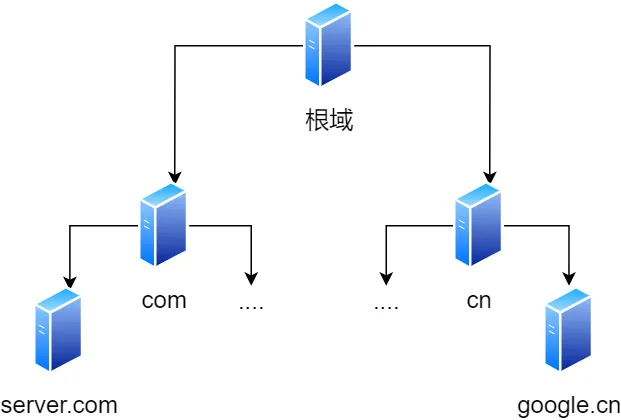
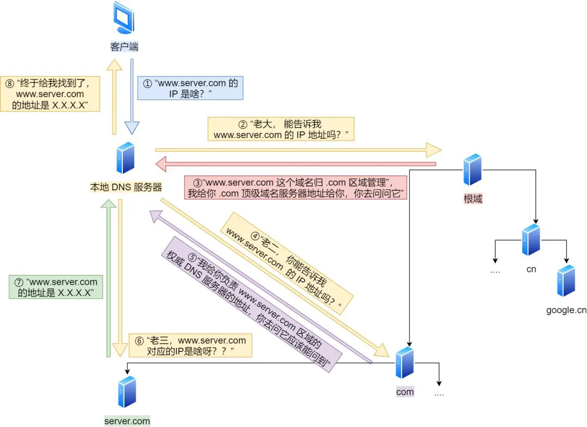

### 日常见的词语

#### WAN（广域网）

主观角度：以相对的大和小的概念看，中国既可以是广域网、也可以是局域网，视角只在中国，那中国就是个互联互通的广域网，视角是全球，那其实中国就是个大的局域网。

技术角度：使用了OSI模型的第三层网络层来传输数据的就是广域网，可以连接公网设备（可以上网），俗称公网、互联网、英特网，把不同网络号的主机设备连接起来。

家用路由器：是通过WAN口接入的，对内都是LAN口，主机和外部设备就是互联网连接，内部主机之间就是一个局域网。

#### LAN（局域网）

主观角度：以相对的大和小的概念看，中国既可以是广域网、也可以是局域网，视角只在中国，那中国就是个互联互通的广域网，视角是全球，那其实中国就是个大的局域网。

技术角度：1.只使用了OSI模型的第二层来传输数据的就是局域网。2.数据链路层的概念，指二层可达的网络

家用路由器：如果把多个家用路由器通过LAN口连接起来，就可以形成比单个路由器更大的局域网。路由器换成交换机不就是妥妥的商用方案嘛。

#### Internet（以太网）

以太网是一种技术标准，制定了相当于 OSI 模型 中第一层（物理层）和第二层（数据链路程）的技术规范。

在OSI模型中的数据链路成就是将数据包封装成以太网帧，带有源MAC地址和目标MAC地址，然后通过支持以太网技术的物理层介质传输。

#### mac address（地址）

MAC地址（Media Access Control Address）是一个用于唯一标识计算机网络适配器（通常是网卡）的物理硬件地址。MAC地址是一个由12个十六进制数字（0-9和A-F）组成的字符串，通常以冒号或连字符分隔。例如，一个MAC地址可能看起来像这样：00:1A:2B:3C:4D:5E。

1. **唯一性标识：** 每个网络适配器都有一个唯一的MAC地址，这意味着没有两个网络适配器具有相同的MAC地址。这确保了在同一局域网中的设备能够唯一标识和寻址。
2. **数据帧寻址：** MAC地址在数据链路层（第二层）用于在局域网内的设备之间寻址和通信。当设备要发送数据包到网络中的其他设备时，它使用目标设备的MAC地址进行寻址，以确保数据包被正确传递。
3. **数据链路层控制：** MAC地址用于管理局域网上的数据链路层访问控制。通过MAC地址，网络设备可以识别哪个设备有权访问网络媒体（例如，以太网）并进行通信。
4. **ARP（地址解析协议）：** ARP协议用于将IP地址映射到MAC地址，以便设备能够在局域网内找到其他设备的物理位置。这对于在局域网内进行通信和数据包路由至关重要。
5. **网络安全：** MAC地址可以用于实施网络安全策略，如MAC地址过滤，以允许或拒绝特定设备的访问局域网。

查看Mac地址

```bash
# 查看ip信息 在en0下
$ ifconfig
```

#### IP（IP 地址）

IP地址（Internet Protocol Address）是一种用于在计算机网络中唯一标识和寻址设备的逻辑地址，IP地址是基于网络拓扑设计出的。

1. **Pv4地址：** IPv4地址是32位地址，通常以点分十进制表示，如 "192.168.1.1"。
2. **IPv6地址：** IPv6地址是128位地址，通常以冒号分隔的十六进制表示，如 "2001:0db8:85a3:0000:0000:8a2e:0370:7334"。IPv6最终目标是取代 IPv4。它带来了更大的地址空间，更方便的配置管理，更高效的网际路由，更安全的通信技术。

```bash
# 查看ip信息 在en0下
$ ifconfig
```

#### Network ID（网络号）

- 网络号是IP地址中的一部分，用于标识网络的一部分。它确定了一个IP地址属于哪个网络。
- 在IPv4地址中，网络号通常位于IP地址的左侧，而主机号位于右侧
- 在IPv4中表示网络号的方法有：传统的A、B、C、D、E类的划分法，子网划分时候使用的子网掩码、更现在的更主流的 CIDR 格式。
- 在 IPv6 中，表示网络信息只能使用 CIDR 格式，不能使用掩码格式。

```plaintext
# 广域网根据IP地址和子网掩码计算网络号来判断是否在同一网络，
ip地址：192.168.1.1 子网掩码：255.255.255.0  网络号：192.168.1.0
ip地址：192.168.2.1 子网掩码：255.255.0.0    网络号：192.168.2.0
ip地址：192.168.1.2 子网掩码：255.255.0.0    网络号：192.168.0.0
# 上面三个都是不同的网络
# 局域网就是同一网络

# 局域网内的设备可以通过DHCP自动分配IP，也可以手动设置IP，如果手动设置，就有可能两个人设置了相同IP的情况
# 局域网内的子网掩码和IP地址的起始地址是上一级路由器设置的，本地改不了的
# 路由器也可以为局域网内的上网设备设置唯一的IP。
```

#### Host ID（主机号）

- 主机号是IP地址中的一部分，用于标识特定网络中的主机或设备。它确定了一个IP地址在该网络中的具体主机。
- 在IPv4地址中，主机号通常位于IP地址的右侧

#### CIDR（地址分配）

- CIDR（Classless Inter-Domain Routing）是一种IP地址分配和路由的方法，旨在更灵活和有效地使用IP地址。它取代了传统的基于类别的IP地址分配方法（如A类、B类、C类地址），允许更精细地控制IP地址的分配和路由。
- CIDR表示法示例：192.168.1.0/24，24为网络号，8位主机号， 表示一个包含256个IP地址的子网。

#### Subnet（子网）

- 网络IP通过**CIDR**来分配，分配到网络号的网络依然需要对主机进行再分配和管理，子网就是用来干这事的。
- 大部分情况下，子网等同于网络。子网有时也被人称为网段。
- 在大型网络中，节点较多，出于性能，安全或管理方面的原因，可以将单个网络划分为多个较小的子网络。

#### Subnet Mask（子网掩码）

- 子网掩码是配合子网使用的，用于将IP地址分成网络号和主机号部分的32位二进制数字，它指示哪些位属于网络号，哪些位属于主机号。
- 比如一个IP地址范围为192.168.1.0 到 192.168.1.255（使用子网掩码255.255.255.0），可以将这个IP地址范围划分为两个子网，每个子网包含128个IP地址：
  - 起始IP地址：192.168.1.0 ，子网掩码：255.255.255.128
  - 起始IP地址：192.168.1.128  子网掩码：255.255.255.128

#### DHCP（动态主机设置协议）

- DHCP（Dynamic Host Configuration Protocol） 用于动态配置IPv4网络节点。它是一种应用层协议，用于自动分配IP地址和其他网络配置信息给计算机和其他网络设备，对用户IP地址进行动态管理和配置

#### Network Segment（网段）

- 有一种理解是，子网就是网段。可能就是同一路由器或网关下的主机就称为同一网段吧
- 还有一种理解是物理层的定义，使用同一物理层设备，比如：中继器，集线器是和网线一样工作在物理层的硬件设备。被它们连接在一起的部分被称为网段，工作在数据链路层（二层交换机、网桥）或更高层的设备如路由器等等，由它们连接起来的两组设备仍然分别处于各自独立的物理层，是两个网段。

#### DNS（域名地址解析）

- 域名地址解析（Domain Name Resolution）是将域名转换为相应的IP地址的过程，以便在互联网上找到和访问网络资源。

- 通常发生在OSI模型的应用层，通过DNS（Domain Name System）服务器得到IP地址，用于TCP头部和之后的路由、地址解析等。

#### ARP（地址解析）

- ARP（Address Resolution Protocal），即地址解析协议。用于将IP地址解析为以太网的MAC地址的协议。
- MAC地址解析通常发生在OSI模型的数据链路层，将网络层的IP地址翻译为数据链路层需要的MAC地址，以便将数据包封装成以太网帧在以太网中传输。

#### NAT（网络地址翻译）

NAT (Network Address Translation)是路由器在传输数据的过程中改写其中发送方/接收方 IP 地址（很可能还有端口号）的技术，它大规模应用于缓解 IPv4 地址空间不足的问题。

处于内网的主机，需要与外界通信时，发出的数据包通过拥有外网地址的网关。网关将包中的发送方地址替换为自己的外网地址，同时还可能将端口号替换为新的端口号，然后再转发出去，接收方只能看到替换后的地址和端口号。网关会记录发送方的内网地址，更改前后的端口号，以及接收方的地址和端口号。收到对方回复时，网关根据记录的信息，将数据包中的接收方IP（目前是网关的外网IP）和端口号替换为内网IP和原发起端口，然后转发回内网主机。

通常，处于内网的主机只能作为客户端发起通信，无法作为服务器被动等待外界通信。除非网关配置了端口转发，将外网 IP 某些端口的通信转发给它。

#### router（路由器）

- 路由器是连接两个或多个网络并提供路由功能的网络设备
- 路由器的工作层级不同可以分为：网络接口级、物理级路由、网络级路由。
  - 网络级路由：工作在三层网络层的路由器设备，如：路由器、网关、三层交换机
  - 网络接口级：工作在二层数据链路层的路由器设备，如：网桥，二层交换机
  - 物理级路由：工作在一层物理层的路由器设备，如：中继器，集线器
- 家用路由器是最简单的单口WAN+多个LAN口的模式，主干网络应该会部署很多的核心路由器作为数据转发和中转。

#### routing（路由）

- 路由是一种计算机网络中的概念，不是一个特定的协议。路由的任务是将数据包从源主机路由到目标主机，以确保它们按照正确的路径到达，并且在传输过程中遵循一定的规则和策略。
- 路由定义一条路径，这是为了经过因特网发送包到另一网络上的地址。
- 路由不定义完全路径，只定义从主机到可以将包转发到目的地的网关间的路径段（或从一个网关到另一个网关）。只定义到下一跳IP，下一跳之后的怎么跳由下一跳的路由决定。

- 默认路由，就是当路由器没有找到合适的下一跳IP时，直接使用默认的下一跳IP把数据发出去

```bash
# Mac os下查看路由表
$ netstat -nr

#linux
route -n
```

#### Gateway（网关）

- 网关是一种路由器。所以网关和路由器都是能提供不同网络之间的通信功能

- 还有说法网关是路由器的IP。
- 默认网关，和默认路由一样，都是当数据不知道怎么转发的时候会被使用的预设网关。

#### FireWall（防火墙）

防火墙是一种安全系统，它基于一组安全规则来监视和控制网络流量。防火墙通常位于受信任的网络和不受信任的网络之间，防火墙决定是否允许传入和传出的流量通过。它们可以内置于硬件、软件或两者的组合之中。

最初，防火墙是硬件设备。虽然一些硬件防火墙仍在使用，但许多现代防火墙是基于软件的，这意味着它们可以在几种不同类型的硬件上运行。而 FWaaS 则是在云中托管。

在Mac 上，**选取苹果菜单 >“系统设置”，在边栏中点按“网络” ，然后点按“防火墙”**。

#### Port（端口）

端口是计算机网络中用于标识和区分不同网络应用或服务的逻辑通信端点，允许不同的应用程序在同一台计算机上或不同计算机之间进行通信。端口主要用于传输层协议，传输层数据报头部会有源端口和目标端口。


**白嫖**

[基本修养：以太网与 TCP/IP](https://deerchao.cn/blog/posts/network.html)

[一文让你搞懂：路由器，集线器，交换机，网桥，光猫有啥区别？](https://www.eet-china.com/mp/a73949.html)


### ARP协议

- ARP（Address Resolution Protocal），即地址解析协议。用于将IP地址解析为以太网的MAC地址的协议。
- MAC地址解析通常发生在OSI模型的数据链路层，将网络层的IP地址翻译为数据链路层需要的MAC地址，以便将数据包封装成以太网帧在以太网中传输。

```bash
# 查看ARP缓存
$ arp -a
```

**通信流程：**

1. 先查询 ARP 缓存，如果其中已经保存了对方的 MAC 地址，就不需要发送 ARP 查询，直接使用 ARP 缓存中的地址。
2. 而当 ARP 缓存中不存在对方 MAC 地址时，则在以太网中发送 ARP 广播查询。
3. 得到MAC地址就可以封装成以太网帧，进行转发了。

操作系统会把每次查询结果放到一块叫做 ARP 缓存的内存空间留着以后用，不过缓存的时间就几分钟。

猜想：

计算机到路由器的猜想：计算机找不到目标IP的MAC，这个时候属于不知道发给谁的状态，计算机就发给默认网关。大部分时候我们计算机都只连一个路由器，所以其实就只有一个网关，也是默认网关。

路由器收到数据的猜想：先通过路由确定下一跳IP（确定不了目标IP就是用默认路由），在通过上面的1、2流程获得MAC地址，进行转发


### 网卡

**网路介面控制器**（英语：network interface controller，NIC），又称**网络接口控制器**，**网络适配器**（network adapter），**网卡**（network interface card），或**区域网路接收器**（LAN adapter），是一块被设计用来允许计算机在计算机网络计算机网络上进行通讯的计算机硬件。由于其拥有MAC地址，因此属于OSI模型的第2层。

简单点理解：网卡就是把外部网络信号携带的信息转换成计算机内部需要的二进制信息给计算机，反过来就是把计算机内部二进制信息转换让外部网络信号携带传输。

二进制可以同时被看作信号和信息，具体取决于上下文和使用方式。计算机内部使用0、1表示信息，同时也使用高（1）低（0）电平来传输信息（数字信号），在计算机世界一切都是二进制😅。


### 通信原理

1. 信号（Signal）：
   - 信号是一个表示某种信息的物理现象或数据。这些物理现象可以是电压的变化、声音波形、光的强度、无线电波的频率等。
   - 信号可以分为模拟信号和数字信号两种类型：
     - 模拟信号是连续的信号，其数值在时间和幅度上都可以无限变化。典型的模拟信号包括声音波形和模拟电压信号。
     - 数字信号是离散的信号，其数值在时间和幅度上都以离散的方式变化。数字信号是用数字表示的，通常是0和1的序列，适用于数字通信和计算机系统中。
   - 信号可以通过各种传输媒体（如电线、光纤、空气（wifi、蓝牙））传送，以进行信息交换。

2. 信息（Information）：
   - 信息是有意义的数据，它携带了一定的含义或知识，可以为接收方提供有用的内容。
   - 从人类的角度来说：信息是文本、图像、声音、视频等各种形式，具体取决于通信或数据处理的上下文。
   - 从计算机的角度来说：信息是二进制数0、1。
   - 从传输角度来说：信息是模拟信号、数字信号。

   - 在信息理论中，信息的度量通常以比特（bit）为单位，表示信息的量或不确定性的度量。

### 驱动

硬件驱动程序是一种软件，它允许操作系统与计算机硬件（如显卡、声卡、打印机、鼠标等）进行通信和协作。每个硬件设备都需要相应的驱动程序，以便操作系统能够识别设备、控制它们，并允许应用程序与设备进行交互。驱动程序充当操作系统和硬件之间的中介，确保硬件设备能够在计算机上正常运行。

```plaintext
# 常见的驱动

1. 显卡驱动程序（Graphics Card Drivers）

2. 声卡驱动程序（Audio Drivers）

3. 网络适配器驱动程序（Network Adapter Drivers）

4. 主板芯片组驱动程序（Motherboard Chipset Drivers）

5. 存储控制器驱动程序（Storage Controller Drivers）

6. 打印机和扫描仪驱动程序（Printer and Scanner Drivers）

7. USB控制器驱动程序（USB Controller Drivers）

8. 触摸板或鼠标驱动程序（Touchpad or Mouse Drivers）

9. 键盘驱动程序（Keyboard Drivers）

10. 摄像头驱动程序（Webcam Drivers）

11. 手柄或游戏控制器驱动程序（Gamepad or Game Controller Drivers）

请注意，大多数Windows操作系统会自动安装常见硬件的通用驱动程序，以确保基本功能可用。然而，为了获得最佳性能和兼容性，安装制造商提供的最新驱动程序通常是一个好主意。您可以通过访问硬件制造商的官方网站或使用Windows设备管理器来查找和安装适当的驱动程序。
```

### IPV4

#### IPV历史

根据 IPV4 （ Internet Protocol version 4）的是由32为构成的，所以我们知道它能代表的最大IP数量就应该是2^32，4,294,967,296数量。为了更好的管理Pv4接近 423亿个 IP 地址的用途， Pv4地址时代最开始的划分如经典IP图所示：


大概的意思是 32 位地址里，开头为 0 的，那就是 A 类地址。开头为 10 的，就是 B 类，开头为 110 的，就是 C 类。在这之后，把剩下的字节数拆成两段，一段表示**网络号**，另一段表示**主机号**。

大佬们一开始这么划分网络，其实也是为了**方便管理**，比如 A 类地址，是给大型组织机构用的，主机地址的位数高达 16,777,214，B类 65,534，C 类地址是给小公司用的，主机号只有  254 。

>这里的最大主机数都是：2^24 - 2、2^16 - 2、2^8 - 2
>
>减去2是因为A、B 、C、类地址中的全0和全1地址有特殊用途

这个设计就是固定了不同类地址的主机号位数，放在今天就不太合理了，因为各种应用场景太多，比如开个网吧可能都不止 200 台机子对吧，用 C 类嫌主机号少，用 A 、B类又嫌主机号太多。因此现在这套分类机制其实已经很少用了。

取而代之的是方案是，将所谓的 ABC 分类直接取消，**只保留网络号和主机号**，并且网络号的位数也不像以前限制的那么死，**用一个斜杠告诉用户多少位是网络号，其余的都是主机号**。比如 172.20.61.69/20，那**网络号**的位数就是 20 位，主机号的位数是 32-20=12 位，能放 4096 台机子，很灵活，很够用。


这就是，所谓的 **CIDR**，(Classless Inter-Domain Routing，无类别域间路由)。

#### 公私网

不管你怎么去分类，在 32 位下的限制下，你就算玩得再花，只要将 A 类 + B 类 + C 类 + X 类**加起来**，IP 的个数也最多还是 423亿个。还是不够用。

这时候那些大佬就设计出让一个IP可以方便连接多台主机的方案。这就是公网IP+局域网的组网方式，让局域网内的人都共用一个公网IP上网，这样就让IPV4地址可以连接远远大于43亿台设备。

因此大佬们也将原来的IP分成了**私有和公有两部分**。

在 rfc1918 文档中定义了**私有地址的范围**。它们不会出现在广域网中，只会出现在局域网内。

```plaintext
* A类地址：10.0.0.0--10.255.255.255  
* B类地址：172.16.0.0--172.31.255.255  
* C类地址：192.168.0.0--192.168.255.255
```

这时候，你再看看 **C 类**里的私有地址范围，眼熟不？

192.168.xx.xx 就是这网段内的其中一个 IP 地址。这个范围里大概有 6w + 个主机号，什么家庭条件能用得完？

于是，就变成了一条街或者一个小区，又或者小区内的几幢楼**共用一个公网 IP**，而内部就用 192.168.xx.xx 这样的**内网 IP**。所以只要你在家，大概率会发现你的 IP 地址是 C 类的 192.168.xx.xx。

A 类和 B 类的私有地址也是可以用在局域网里的。


几幢楼共用一个公网 IP（局域网内还可以继续套娃）

所以为了缓解IPV4的枯竭，IP管理者做了以下一些设计

- 将传统的A、B、C类分类方式改成了CIDR提高IP的灵活性和利用率。
- 设计公网IP接局域网的方式增加接入主机的数量，并将IPV4分成了公有和私有。
- 设计了网络地址翻译（NAT），实现私有地址到公有地址的转换，一般部署在路由器上。

#### IP查询

局域网内被分配到的的IP

```bash
# 查询IP 在en0下
$ ifconfig  
```

要查看自己的公网IP可以使用网页

[查询公网IP](http://ip111.cn)

**白嫖**

[为什么我们家里的 IP 都是 192.168 开头的](https://www.ithome.com/0/666/834.htm)


### DNS

- 域名地址解析（Domain Name Resolution）是将域名转换为相应的IP地址的过程，以便在互联网上找到和访问网络资源。
- 通常发生在OSI模型的应用层，通过DNS（Domain Name System）服务器得到IP地址，用于TCP头部和之后的路由、地址解析等。

DNS服务器是用来专门保存 Web 服务器域名与 IP 对应关系的。

```plaintext
# 本地配置的DNS
/etc/hosts
```


#### 域名

DNS 中的域名都是用句点来分隔的，比如 www.server.com ，这里的句点代表了不同层次之间的界限。

在域名中，越靠右的位置表示其层级越高。毕竟域名是外国人发明的，所以思维和中国人相反。

根域是在最顶层，它的下一层就是 com 顶级域，再下面是 server.com 。

所以域名的层级关系类似一个树状结构：

- 根 DNS 服务器
- 顶级域 DNS 服务器（ com ）
- 权威 DNS 服务器（ server.com ）



根域的 DNS 服务器信息保存在互联网中所有的 DNS 服务器中。

这样一来，任何 DNS 服务器就都可以找到并访问根域 DNS 服务器了。

因此，客户端只要能够找到任意一台 DNS 服务器，就可以通过它找到根域 DNS 服务器，然后再一路顺藤摸瓜找到位于下层的某台目标 DNS 服务器。

#### 域名解析

工作流程

1. 在浏览器中输入www.qq.com域名，操作系统会先检查自己本地的hosts文件是否有这个网址映射关系，如果有，就先调用这个IP地址映射，完成域名解析。
2. 如果hosts里没有这个域名的映射，则查找本地DNS解析器缓存，是否有这个网址映射关系，如果有，直接返回，完成域名解析。
3. 如果hosts与本地DNS解析器缓存都没有相应的网址映射关系，首先会找TCP/IP参数中设置的首选DNS服务器，在此我们叫它本地DNS服务器，此服务器收到查询时，如果要查询的域名，包含在本地配置区域资源中，则返回解析结果给客户机，完成域名解析，此解析具有权威性。
4. 如果要查询的域名，不由本地DNS服务器区域解析，但该服务器已缓存了此网址映射关系，则调用这个IP地址映射，完成域名解析，此解析不具有权威性。
5. 如果本地DNS服务器本地区域文件与缓存解析都失效，则根据本地DNS服务器的设置（是否设置转发器）进行查询，如果未用转发模式，本地DNS就把请求发至 “根DNS服务器”，“根DNS服务器”收到请求后会判断这个域名(.com)是谁来授权管理，并会返回一个负责该顶级域名服务器的一个IP。本地DNS服务器收到IP信息后，将会联系负责.com域的这台服务器。这台负责.com域的服务器收到请求后，如果自己无法解析，它就会找一个管理.com域的下一级DNS服务器地址(qq.com)给本地DNS服务器。当本地DNS服务器收到这个地址后，就会找qq.com域服务器，重复上面的动作，进行查询，直至找到www.qq.com主机。
6. 如果用的是转发模式，此DNS服务器就会把请求转发至上一级DNS服务器，由上一级服务器进行解析，上一级服务器如果不能解析，或找根DNS或把转请求转至上上级，以此循环。不管是本地DNS服务器用是是转发，还是根提示，最后都是把结果返回给本地DNS服务器，由此DNS服务器再返回给客户机。

整个过程我画成了一个图。




### Port 端口

端口是计算机网络中用于标识和区分不同网络应用或服务的逻辑通信端点，允许不同的应用程序在同一台计算机上或不同计算机之间进行通信。

#### 端口概念

在网络技术中，端口（port）大致有两种意思：

- 一是物理上的端口，比如ADSL、Modem、集线器、交换机、路由器用于连接其他网络设备的接口，如RJ-45端口、SC端口等等。
- 二是逻辑意义上的端口，一般是指TCP/IP协议中的端口，端口号的范围从0到65535，比如用于浏览网页服务的HTTP是80端口、HTTPS是443端口，用于FTP服务的21端口等等。

这里要说的是逻辑意义上的端口。

#### 什么是端口

在Internet上，各主机间通过TCP/TP协议发送和接收数据报，各个数据报根据其目的主机的IP地址来进行互联网络中的路由选择。可见，把数据报顺利的传送到目的主机是没有问题的。我们知道大多数操作系统都支持多程序（进程）同时运行，那么目的主机应该把接收到的数据报传送给众多同时运行的进程中的哪一个？显然这个问题有待解决，端口机制便由此被引入了进来。

本地操作系统会给那些有需求的进程分配协议端口（protocal port，即我们常说的端口），每个协议端口由一个正整数标识，例如HTTP（端口80）、HTTPS（端口443）和FTP（端口21）等等。当目的主机接收到数据报后，将根据报文首部的目的端口号，把数据发送到相应端口，而与此端口相对应的那个进程将会领取数据并等待下一组数据的到来。

不光接受数据报的进程需要开启它自己的端口，发送数据报的进程也需要开启端口，这样，数据报中将会标识有源端口，以便接受方能顺利的回传数据报到这个端口。

#### 端口的作用

我们知道，一台拥有IP地址的主机可以提供许多服务，比如Web服务，FTP服务、SMTP服务等，这些服务完全可以通过1个IP地址来实现。那么，主机是怎样区分不同的网络服务呢？显然不能只靠IP地址，因为IP地址与网络服务的关系是一对多的关系。实际上是通过"IP地址+端口号"来区分不同的服务的。
客户端通常对它所使用的端口号并不关心，只需保证该端口号在本机上是唯一的就可以了。客户端端口号又称作临时端口号（即存在时间很短）。这是因为它通常只是在用户运行该客户程序时才存在，而服务器则只要主机开着，其服务就运行。

#### 查看端口

```bash
# MacOS
$ netstat -AaLlnW

# windows
$ netstat -a -n
```

#### 端口在入侵中的作用

有人曾经把服务器比作房子，而把端口比作通向不同房间（服务）的门。入侵者要占领这间房子，势必要破门而入（物理入侵另说），那么对于入侵者来说，了解房子开了几扇门，都是什么样的门，门后面有什么东西就显得至关重要。
入侵者通常会用扫描器对目标主机的端口进行扫描，以确定哪些端口是开放的，从开放的端口，入侵者可以知道目标主机大致提供了哪些服务，进而猜测可能存在的漏洞，因此对端口的扫描可以帮助我们更好的了解目标主机，而对于管理员，扫描本机的开放端口也是做好安全防范的第一步。

#### ChatGPT

```plaintext
端口（Port）是计算机网络中的一个重要概念，用于区分和管理不同网络应用程序或服务之间的通信。在计算机通信中，端口是一个数字或者是一种标识，它帮助操作系统确定数据包应该被传送到哪个应用程序或服务。

以下是端口的一些关键特点和用途：

1. 端口号：每个端口都有一个唯一的数字标识，称为端口号。端口号的范围是从0到65535，其中0到1023通常被称为“知名端口”或“系统端口”，用于一些常见的网络服务，例如HTTP（端口80）、HTTPS（端口443）和FTP（端口21）等。剩余的端口号可以被应用程序或服务自由使用。

2. 传输层：端口主要用于传输层协议，例如TCP（传输控制协议）和UDP（用户数据报协议）。TCP和UDP是常用的网络传输协议，它们分别提供可靠的连接和不可靠的数据传输。

3. 网络通信：当计算机上的应用程序需要与其他计算机或设备进行通信时，它们通过指定目标IP地址和目标端口号来确定通信的终点。接收端的操作系统会根据端口号将数据包路由到正确的应用程序。

4. 安全性：防火墙和网络安全策略通常根据端口号来控制流量和限制对某些服务的访问。通过关闭不必要的端口或限制对特定端口的访问，可以提高系统的安全性。

总之，端口是计算机网络中的一个重要概念，它帮助不同应用程序或服务在网络上进行通信，并在数据包传输中起到关键作用。不同的端口号用于区分不同的网络服务，从而实现有效的数据交换和通信。
```

**白票**

[计算机网络端口详解](https://www.jianshu.com/p/d8a601323670)