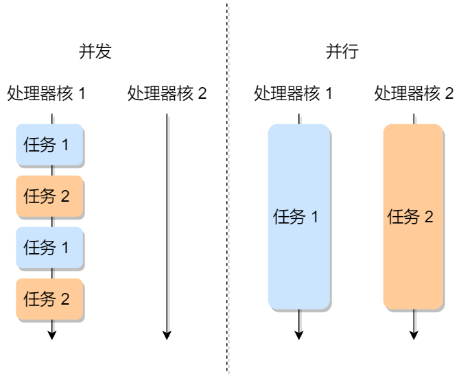

### 并行、并发、串行

**并行：**指多个任务在同一时刻同时执行的能力，通常是在多个处理器核心上实现的，以提高系统的性能和效率。

**并发：**指在一段时间内，多个任务交替执行的能力。这些任务可能在时间上部分重叠，但不一定在同一时刻同时执行。

**串行：**指多个任务按顺序一个接一个执行，一个任务完成后，才会开始执行下一个任务。

并行可以看成是一种特殊的并发

### 进程、线程

**进程（Process）**：

1. **定义**：进程是计算机系统中的一个独立执行单元，它包含了程序代码、数据以及系统资源（如文件句柄、网络连接等）。每个进程都有自己的独立内存空间，因此进程之间相互隔离。
2. **特点**：
   - 进程之间是相互独立的，一个进程的崩溃不会影响其他进程。
   - 进程可以并行执行，因为多个进程可以在不同的处理器核心上运行。
   - 进程通常比较重量级，创建和销毁进程的开销较大。
   - 进程间通信（IPC）通常需要额外的机制，如管道、消息队列或共享内存。

**线程（Thread）**：
1. **定义**：线程是进程内的一个更小的执行单元，多个线程可以存在于同一个进程中，共享相同的内存空间和系统资源。
2. **特点**：
   - 线程是轻量级的，创建和销毁线程的开销相对较小。
   - 线程之间可以直接共享内存，因此通信更容易。
   - 线程通常用于实现并发执行，允许多个任务同时在同一个进程内执行。
   - 线程之间的错误可能会影响整个进程，因此需要小心处理同步和互斥问题。

**关系和区别**：

- 进程是资源分配的最小单位，线程是CPU调度的最小单位。
- 进程和线程都是用于实现多任务处理和并发执行的机制，但它们的范围和资源隔离程度不同。
- 进程之间相互隔离，通常拥有独立的内存空间，而线程共享同一进程的内存。
- 线程更轻量级，创建和切换线程的开销较小，但线程之间的通信需要小心处理同步问题。
- 进程通常更稳定，因为一个进程的崩溃不会直接影响其他进程，而线程之间的错误可能会导致整个进程的崩溃。
