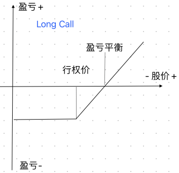
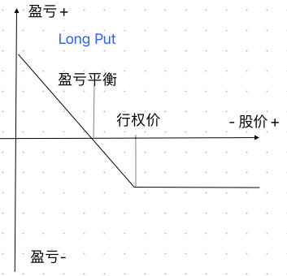
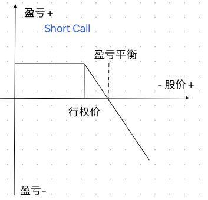

### 期权和期货的区别

期权是单向合约，期权的买方在支付权利金后即取得履行或不履行买卖期权合约的权利，而不必承担义务。 期货合同则是双向合约，交易双方都要承担期货合约到期交割的义务。 如果不愿实际交割，则必须在有效期内对冲。 在期权交易中，买方最大的风险限于已经支付的权利金，故不需要支付履约保证金。

### 期权基本知识（Option）

Calls：看涨期权

puts：看跌期权

Long Calls：买入看涨期权、看涨、**损失有限（权利金）盈利无限**、在行权日及之前以行权价买入股票的权利

Short Calls：卖出看涨期权、看跌、**盈利有限（权利金）损失无限**、到行权日以行权价卖出股票的义务

Long Puts：买入看跌期权、看跌、**损失有限（权利金）盈利最大为股票跌为0**、在行权日及之前以行权价卖出股票的权利

Short Puts：卖出看跌期权、看涨、**盈利有限（权利金）损失最大为股票跌为0**、到行权日以行权价买入股票的义务

           

          

#### 期权的价值（Option Value）

> **期权的价值 = 时间价值 + 内在价值**

等值期权（At The Money Option）：

- 期权行权价刚好等于当前标的物的价格，内在价值为0

实值期权（价内期权 In The Money Option）：*实值期权的价格为内在价值与时间价值之和*

- 看涨期权 ，期权价格小于当前标的物的价格，内在价值为两个价格的差价
- 看跌期权，期权价格大于当前标的物的价格，内在价值为两个价格的差价

虚值期权（价外期权 Out The Money Option）：*虚值期权只有时间价值，没有内在价值*

- 看涨期权 ，期权价格大于当前标的物的价格，内在价值为0
- 看跌期权，期权价格小于当前标的物的价格，内在价值为0

>比如某个标的物当前价格为100，此时的看涨期权的行权价为也为100，则是等值期权，如果行权价小于100，则是实值期权，如果行权价大于100，则是虚值期权

时间价值：时间价值会随着行权时间的接近而流逝，越接近行权日，时间流逝越快。时间价值的流逝对于买来说是亏损的，对于卖家来说是赚取的。时间越长，时间价值越高，所以期权也会越贵。相同行权日的不同行权价格的时间价值是不一样的，越接近当前价格，时间价值越高

> |  行权日  |   行权价   | 期权价值 | 时间价值 | 内在价值 |
> | :------: | :--------: | :------: | :------: | :------: |
> | 11/8/23  | 372（ATM） |   4.37   |   4.37   |    0     |
> | 15/12/23 | 370（ITM） |  23.98   |  21.98   |    2     |
> | 15/12/23 | 371（ITM） |  23.25   |  22.25   |    1     |
> | 15/12/23 | 372（ATM） |  22.69   |  22.69   |    0     |
> | 15/12/23 | 373（OTM） |  22.05   |  21.05   |    0     |
>
> 以QQQ2023年8月7日的股票价格$372的Call Option数据为例
>
> 这么看起来对于卖家来说貌似卖等值期权更划算，因为时间价值高，对于卖家来说貌似实值、虚值更划算，因为时间价值低

#### 隐含波动率（Implied Volatility）

以下都是自己的理解：隐含波动率表示的是股价未来大幅度涨跌的可能性，波动率越高期权越值钱。

- 波动率高对于买家来说未来赚钱的可能性越高，而对于卖家来说未来被行权亏钱的可能性也更高， 所以卖家为了风险提高期权金，而买家因为赚钱的概率也愿意付出更多的期权金。
-  在期权成交的时候，波动率越高
  - 对卖家有利，未来波动率下降，不仅已经收到了高额的期权金，而且期权价值也降低了，未来亏钱被行权的可能性也降低了
  - 对买家不利，未来波动率降低，不仅已经付出了高额的期权金 ，而且持有的期权价值也降低了，因为股价的涨跌而赚钱的概率也减小
- 在期权成交的时候，波动率越低
  - 对卖家不利，未来波动率上升，不仅收取不到高额的期权金，而且期权价值也升高了，因为股价的涨跌亏钱被行权的可能性也升高了
  - 对买家有利，未来波动率上升，不仅没有付出了高额的期权金 ，而且持有的期权价值也升高了，因为股价的涨跌而赚钱的概率也升高了

#### 历史波动率（History Volatility）

历史波动率是波动率的历史平均值，它的意义为：

- IV>HV：当前波动率比历史平均值要高，说明期权价格比历史高，此时卖期权划算
- IV < HV：当前波动率比历史平均值要低，说明期权价格比历史低，此时买期权划算

#### Delta

Delta = 期权价值的变动 / 股票价格的变动。Delta值一般使用0-1之间的数值进行表示，0表示股票的价格变化对期权价格没有任何影响，1则表示期权价格会有和股票价格相同的涨跌。假设股票价格上涨1元，期权的理论价值上涨0.5元，则我们认为该期权的Delta=0.5。

看涨期权的Delta值始终是0至1.00之间的正数，而看跌期权的Delta值始终是0至-1.00之间的负数。

期货合约的Delta值是1.00。 

具体来说，delta的作用主要包括以下几个方面：

1、delta值可用于估算期权在到期日处于时值的可能性，即 **提前预判期权行权的概率** 。

> 如果Delta值为20，说明它成为价内期权的概率为20%。如果期权的Delta值为50，说明它成为价内期权的概率为五五开。
>
> 如果期权的Delta值小于50，可以认为它是价外期权。如果期权的Delta值大于50，可以认为它是价内期权。如果期权的Delta值等于或接近50，可以认为它是平价期权。

2、delta中性的套期保值策略里，将delta值用于用于计算期权头寸的套期保值比例。

> 例如，假设我们卖出八份Delta值为25的看涨期权，那么头寸的Delta值便是-200。 
>
> 为了使Delta值保持中性，我们需要买入两份标的期货合约。 

3、delta值代表了期权价格对于标的物价格的敏感度，可以测算出模拟股票收益所需要的期权具体数量。

> 例如，想要对冲某个股票下跌带来的影响，股票下跌10元，如果detal是0.7的话，那期权价值就会增加7元，所以期权的张数就应该为（1/0.7）* 股票的持有数

### 期权策略

#### 1、Naked Sell Put（卖出看跌期权策略，属于一种加仓策略）

巴菲特老爷子曾经在可口可乐上面的操作策略，**通过卖出认沽期权（行权价低于当前的价格）来达到 ''低吸'' 某个股票的目的。**

特点

- 可以稳稳的收取权利金
- 当股票价格高于行权价时不会被行权，也就是不会交割股票，当股票低于行权价时会被交割接受对应的股票
- 投资者希望通过卖出认沽期权达成“低吸”股票的目的，前提是有足额的保证金和被要求行权资金。
- 卖出认沽策略的缺点在于当标的价格出现大幅下跌，将面临保证金不足风险和较大的亏损。

>1993年4月，巴菲特希望增持可口可乐，但此时可口可乐的市价是40美元左右，而他对可口可乐股票的心理价位是35美元。
>
>于是，他以1.5美元的权利金卖出500万份到期日为1993年12月17日、行权价为35美元的可口可乐认沽期权，通过认沽期权来达到“低吸”可口可乐股票的目的。
>
>**若可口可乐的股价高于35美元，**则卖出的认沽期权为虚值期权，不会被要求行权，那么这份期权就是废纸一张，巴菲特可以获得1.5美元×500万份=750万美元的权利金;
>
>**若可口可乐的股价低于35美元，**则卖出的认沽期权为实值期权，巴菲特就必须按照35美元买入500万股可口可乐股票，综合之前收取的1.5美元期权金，最后巴菲特持有可口可乐股票的实际买入成本为33.5美元/股。
>
>由此可以看出，若可口可乐股价不跌，巴菲特可以赚取权利金;若可口可乐股价大跌，之前收取的权利金等于市场补贴1.5美元去买入可口可乐股票，比巴菲特心理价位还要低。

#### 2、Single Order（单腿策略）

单腿策略就是简单的买入或者卖出认购或者认沽期权：

买入认购期权：风险损失权利金，收益无限大

卖出认购期权：风险损失无限大，收益为权利金

买入认沽期权：风险损失权利金，收益最大为股票跌为0

卖出认沽期权：风险损失最大为股票跌为0，收益为权利金

特点：简单粗暴

#### 3、Covered（Sell） Call（备兑策略，类似于高抛策略）

备兑期权是在持有股票的前提下，同时卖出该股票对应数量的看涨期权（行权价高于当前股价），收取期权金。

备兑期权Covered call的构成：
1，持有股票 （股票多头）
2，卖出看涨期权，即卖call

特点

- 可以稳稳的收取权利金
- 当股价低于行权价的时候，投资者需要承担股价的波动，如果股票价格大跌，持有的股票跟着亏损，但是权利金还是赚取到了
- 当股价高于行权价的时候，投资者需要以行权价把手上的股票交割出去，这时候高于行权价的股票涨幅是享受不到的，最大盈利也就是期权价之前的股票涨股+权利金

单一做期权卖方风险是无限的，卖call，是看跌，如果股票大涨，单一卖call，亏损是无限的。但由于持有相应的股票，则可以对冲风险。不过限制了最大的盈利。

#### 4、Vetical Order（垂直策略）

垂直价差策略指的是同时买入和卖出相同数量、相同类型、相同标的资产、相同日期但不同行权价格的期权合约的策略组合。

1、Buy Call Spread 牛市看涨垂直价差（认购牛市价差、买入看涨垂直价差）

买入价格为x的Call（高权利金）+ 卖出价格为x+n的Call（低权利金）

特点：看涨、需要付出权利金差额，不需要保证金

盈亏平衡点：x + 付出的期权费

理解：买Call看涨的特点是盈利无限（价格无限上涨），最大亏损就是期权费，所以只买Call看涨其实也是可以的。但实际上无限上涨无限盈利只存在理论的可能性，所以为了减少期权费可以卖出一个更高价格的Call，将这个价格之上的利润舍去，换取期权费的收入，达到减少整笔交易期权费的目的。

2、Sell Call Spread 熊市看涨垂直价差（认购熊市价差、卖出看涨垂直价差）

卖出价格为x的Call（高权利金） + 买入价格为x+n的Call（低权利金）

特点：看跌、可以收取权利金差额，保证金为价差 n 

盈亏平衡点：x + 收到的期权费

理解：卖Call看跌的特点是亏损无限（价格无限上涨），最大盈利就是期权费的收入，所以裸卖多会很危险，需要对冲买入更高价格的Call看多，这样当价格下跌时，赚取期权费，当价格上涨时，因为有看多的对冲，亏损也会是有限的

3、Buy Put Spread 熊市看跌垂直价差（认沽熊市价差、买入看跌垂直价差）

买入价格为x的Put（高权利金）+ 卖出价格为x-n的Put（低权利金）

特点：看跌、需要付出权利金差额，不需要保证金

盈亏平衡点：x - 付出的期权费

理解：买Put看跌的特点是盈利无限（标的价格跌为0），最大亏损就是期权费，所以只买Put看跌其实也是可以的。但实际上无限下跌无限盈利只存在理论的可能性，所以为了减少期权费可以卖出一个更低价格的Put，将这个价格之下的利润舍去，换取期权费的收入，达到减少整笔交易期权费的目的。

4、Sell Put Spread  牛市看跌垂直价差（认沽牛市价差、卖出看跌垂直价差）

卖出价格为x的Put（高权利金）+ 买入价格为x-n的Put（低权利金）

特点：看涨、可以收取权利金差额，保证金为价差 n 

盈亏平衡点：x - 收到的期权费

理解：卖Put看涨的特点是亏损无限（标的价格跌为0），最大盈利就是期权费的收入，所以裸卖空会很危险，需要对冲买入更低价格的Put看空，这样当价格上涨时，赚取期权费，当价格下跌时，因为有看空的对冲，亏损也会是有限的

省流：

- 买Call，同时卖出Call，卖出的行权价高则看涨，低则看跌
- 买Put，同时卖出Put，卖出的行权价高则看涨，低则看跌

#### 5、Roll over（转仓策略）

Roll over/up/down就是结束当前的仓位，同时在当前的行权价的位置或之上或之下再开启一个新的仓位。

1. Roll UP

   结束当前的仓位 + 新开仓一个行权价更高的仓位

   - 如果当前仓是Sell Call ， 目前的持仓已经亏损，选择将现在的仓位止损继续开仓继续看跌，期望弥补前面亏损。
   - 如果当前仓是Sell Put，目前的持仓已经盈利，选择将现在的仓位盈利了结继续开新仓继续看涨，期望增加盈利。

2. Roll Dowm

   结束当前仓位 + 新开仓一个行权价更低的仓位

   - 如果当前仓是Sell Call ， 目前的持仓已经盈利，选择将现在的仓位盈利了结继续开新仓继续看跌，期望增加盈利。
   - 如果当前仓是Sell Put，目前的持仓已经亏损，选择将现在的仓位止损继续开仓继续看涨，期望弥补前面亏损。

3. Roll Over

   结速当前的仓位 + 新开仓一个相同行权价的仓位

   - 如果当前仓是Sell Call 且目前仓位已经盈利，说明股价跌了，新开仓相同行权价不如Roll Down，
   - 如果当前仓是Sell Call 且目前仓位已经亏损，说明股价涨了，选择将现在的仓位止损继续开仓继续看跌，期望弥补前面亏损甚至如果股票跌到行权价以下还可以实现盈利。
   - 如果当前仓是Sell Put 且目前仓位已经盈利，说明股价涨了，新开仓相同行权价不如Roll Up。
   - 如果当前仓是Sell Put 且目前仓位已经亏损，说明股价跌了，选择将现在的仓位止损继续开仓继续看涨，期望弥补前面亏损甚至如果股票涨到行权价以上还可以实现盈利。

举例说明：

>当前QQQ的价格为100刀，此时卖出一个月之后9.27号的Put看涨获得期权金10刀，未来QQQ会有涨或者跌
>
>QQQ涨：涨的情况怎么操作其实都是赚钱的
>
>1. 当前的仓位是盈利的，这时候可以选择平仓当前的仓位将盈利落袋，就这么结速。
>2. 在平仓之后，也可以同时在开启一个新的行权价更高的Put继续看涨，这应该就是Roll Up操作
>3. 也可以继续等待到行权日，合约失效，期权金落袋。可以继续开仓。
>
>QQQ跌：涨的情况怎么操作其实都是亏钱的
>
>1. 当前仓位是亏损的，这时候可以选择平仓当前的仓位承担实际亏损，就这么结速。
>2. 在平仓之后，也可以同时在开启一个新的行权价更低的Put继续看涨博反弹，这应该就是Roll Down操作。这算是一种止损的方式，如果之后股价涨，那第二份合约得到的期权金会减少亏损但是不管涨多少都不能实现两份合约最终的盈利（因为只是赚取了权利金，而没有得到股价上涨的盈利，期权金是很难弥补前面亏损的，除非前面亏损的很少很少），如果股价继续跌，那第二份合约也会亏钱，这样亏损就会增加
>3. 也可以继续等待行权日，合约失效，承担实际亏损。这时候可以选择开仓一个行权价更低的Put看涨，这就和2一样，属于Roll Down止损操作，如果开仓一个行权价和前面一样的Put看涨，这应该算是Roll Over操作，和2一样可以减少亏损或增加更多亏损，和2不一样的是，如果股价涨超了行权价的话，那两份合约最终会是盈利的（因为下跌的损失被上涨盈利覆盖了，最终还是能赚取到权利金）。
>
>Roll Down只是弥补亏损，做不到盈利，Roll Over可以有盈利的可能，但是他们的难度是不一样的，比如100跌到80，此时Roll Down的行权价为80，Roll Over的行权价为100，到行权日时，股价只要高于80，那Roll Down就可以拿到全部的权利金，而Roll Over如果股价没有超过100，它是拿不到全部的权利金的，还有一个时间价值的区别，接近当前股价80元的行权价的时间价值是大于100行权价的。Roll Down赚的是时间价值的钱，Roll over赚的是股票上涨的钱。

#### 6、Beta Hedging（锁住当前利润策略）

Beta Hedging通过买入对应的看跌期权卖出对应的看涨期权，来对冲持有资产标的(正股)的风险。

Buy Put（看跌，付出权利金） + Sell Call（看跌，得到权利金）

理解：判断未来行情将会下跌，通过Buy Put 看跌来对冲下跌风险，这时候付出的权利金会比较高，既然已经看空那就再通过Sell Call看空获取一部分的权利金，使得总得看空的权利金成本降低。付出的代价就是如果看错了股价没跌反而涨了，那正股涨幅收益是得不到的，因为Sell Call会将正股收益给亏损掉。

判断未来行情将会下跌，还可以通过直接卖出正股来避免风险，但是对于某些机构、基金、大资金来说不能这么操作，并且大资金的买卖会加大股票价格的波动。

#### 7、Calendan Spread（日历价差策略）

