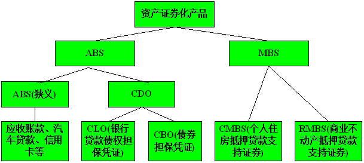

本文主要了解ABS、MBS、CDO、CDS、REITs、PPP的知识

### 一、什么是**MBS**、**ABS**和**CDO**

华尔街有句名言**如果要增加未来的现金流**就把它做成证券。如果想经营风险，就把它做成证券。从本质上来讲，MBS，ABS和CDO都是资产证券化产品。根据美国证券交易委员会（SEC）给出的定义，**资产证券化，指产生这样一种证券，它们主要是由一个特定的应收款资产池或其他金融资产池来支持**(backed)**，**保证偿付。

#### 1、都是资产证券化产品

MBS，即房地产抵押贷款支持证券（Mortgage Backed Securities），指发行人将房地产抵押贷款债权汇成一个资产池（AssetPool），然后以该资产池所产生的现金流为基础所发行的证券（主要是定期还本付息的债券）。贷款所产生的现金流（包括本息偿还款、提前偿还款等）每个月由负责收取现金流的服务机构在扣除相关费用后，按比例分配给投资者。因此，购房者定期缴纳的月供是偿付MBS本息的基础。

ABS，即资产支持证券（Asset Backed Securities），是将房地产抵押贷款债权以外的资产汇成资产池发行的证券，它实际上是MBS技术在其他资产上的推广和应用。

CDO，即担保债务凭证（Collateralized Debt Obligation），是一种新型的ABS，指以抵押债务信用为基础，基于各种资产证券化技术，对债券、贷款等资产进行结构重组，重新分割投资回报和风险，以满足不同投资者需要的创新性衍生证券产品。

CDO的核心设计理念是分级，即在同一个抵押贷款资产池上开发出信用风险不同的各级产品：

- 优先级(SeniorTranches)
- 中间级(MezzanineTranches)
- 股权级(EquityTranches)

各级产品偿还顺序由先到后为优先级、中间级和股权级，即一旦抵押贷款出现违约等造成损失，损失将首先由股权级吸收，然后是中间级，最后是优先级。其中，优先级CDO的购买方包括商业银行、保险公司、共同基金、养老基金等风险偏好程度较低的机构投资者；中间级和股权级CDO的购买者主要是投资银行和对冲基金等追求高风险高收益的机构投资者——这也是危机发生时最先倒下的一类机构投资者。

#### 2、三者的区别

ABS，MBS和CDO的关系如下图所示，三者的区别主要体现在如下三个方面。

**首先，三者的标的资产（即资产池内的资产）不同：**

（1）MBS的资产池是房产抵押贷款债权

（2）ABS（狭义）的资产池是房产抵押贷款以外的债权，如：

- 信用卡应收账款

- 租赁租金

- 汽车贷款债权等

（3）CDO的资产池主要是一些债务工具，如：

- 高收益的债券（HighYieldBonds）
- 新兴市场公司债券（EmergingMarketCorporateDebt）
- 国家债券（SovereignDebt）
- 银行贷款（BankLoans）
- 狭义的ABS
- MBS等

**其次，债务人数量不同：**

（1）MBS或传统的ABS的债权人至少有上千个以上

（2）CDO的债权人约为100~200个左右，甚至少于100个的也常见

**最后，标的资产的相关性要求不同：**

（1）传统MBS或ABS的资产讲究一致性（Homogeneous），其债权性质、到期日皆为相似，甚至希望源自同一个创始者，以对现金流量的形态适度地掌握

（2）CDO的各个债权要求相异性（Heterogeneous)，来源不能相同，同时彼此间的相关性愈小愈好，以达到充分分散风险的要求

### 二、什么是CDS

CDS：大额存单（Certificates of deposit）

CDS：信用违约互换 （Credit Default Swap)

CDS本身是一种保险工具，作用是将某种风险资产的违约风险从合同买方（信用风险资产的投资者）转移到合同卖方（信用风险保险提供者）。合同买方定期向合同卖方支付“保费”（Premium）。

### 三、美国次贷危机的简单逻辑

银行或者贷款机构贷款给购房者，然后它们把房贷打包成MBS卖给一些金融机构，金融机构再混合一些其它的资产做成CDO，然后把CDO卖给投资者，这个过程成功的把房贷风险转移给了CDO的购买者。

这其中CDS起了重要的作用，很多金融机构卖CDS给CDO，这样就是给CDO上了一份保险，原来属于投资者的风险回到了卖CDS金融机构那里，使得大家更加放心的买CDO资产，加速循环。

当危机出现的时候，风险都在CDS卖方金融机构和CDO投资者那里，违约加剧，直接导致参与在里面的金融机构和投资者都损失惨重，破产导致金融危机。

### 四、资产证券化和REITs

资产证券化和REITS是两种不同的金融工具，REITS没有资产转移和风险隔离，与证券化的投资风险是不一样的。

简单的讲，REITS是一种投资基金，这种基金去投资持有房地产资产的公司股权即权益型，也会投抵押贷款证券即抵押贷款型；而资产证券化是把拟证券化的“资产”转移给特殊目的载体（SPV），目的是把资产的风险与原始权益人隔离开，防止原始权益人的债权人追索债务，或防止原始权益人破产时，证券化的资产被列为破产财产，从而损害证券投资人的利益。

### 五、国内的PPP项目

政府和社会资本合作（PPP, Public-Private-Partnership的缩写）模式：指政府通过特许经营权、合理定价、财政补贴等事先公开的收益约定规则，引入社会资本参与城市基础设施等公益性事业投资和运营，以利益共享和风险共担为特征，发挥双方优势，提高公共产品或服务的质量和供给效率

### 参考

[什么是MBS，ABS和CDO](https://www.cnblogs.com/timlong/p/6853484.html)

